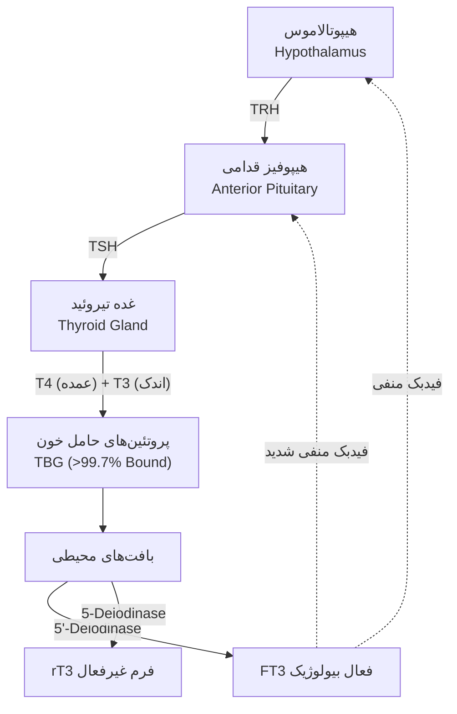
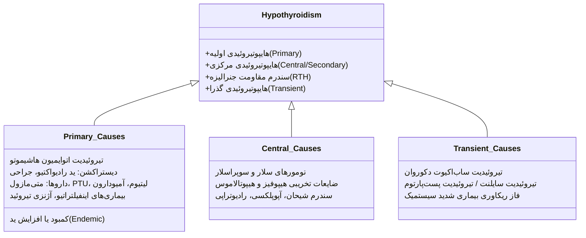
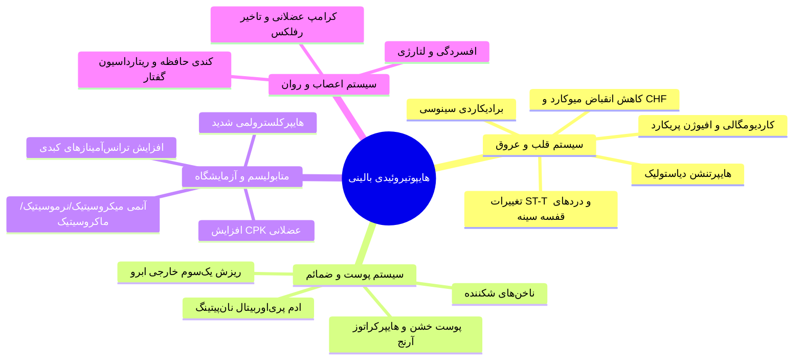
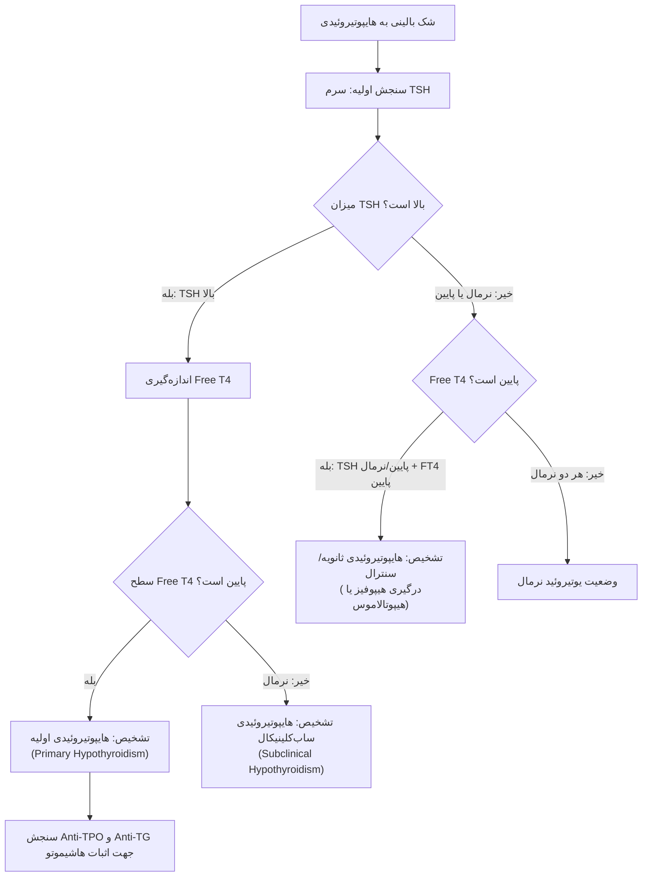
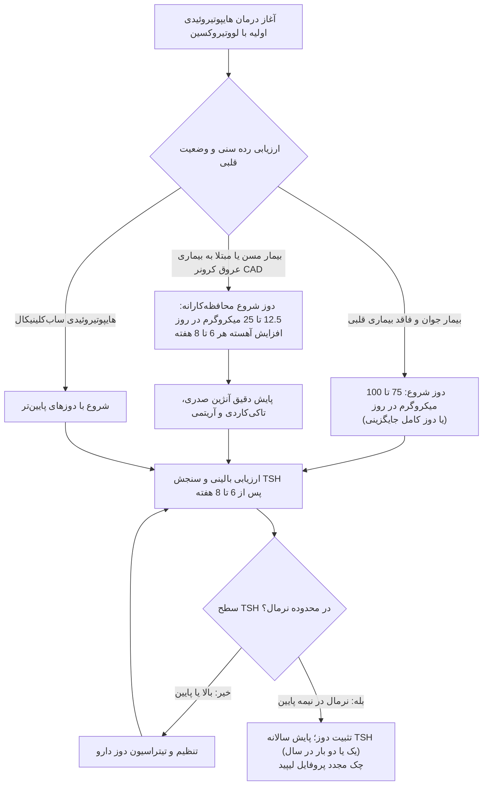
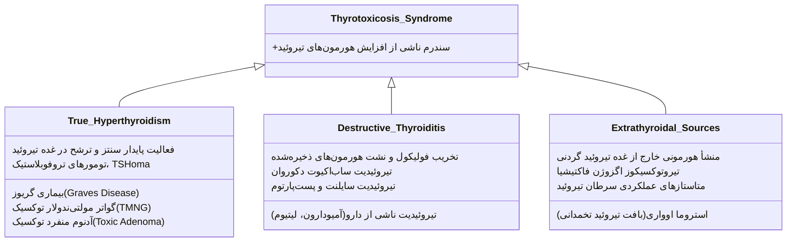
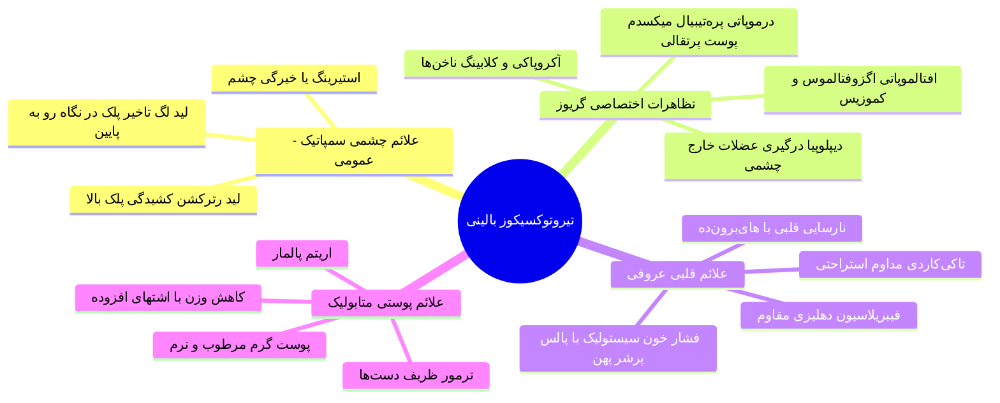
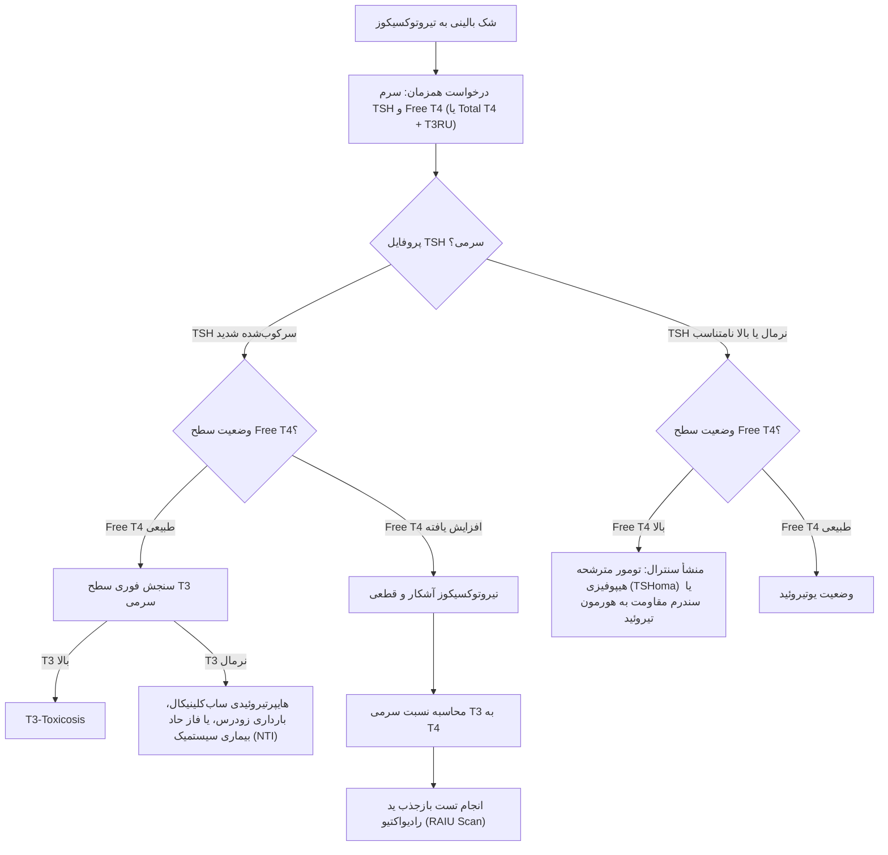
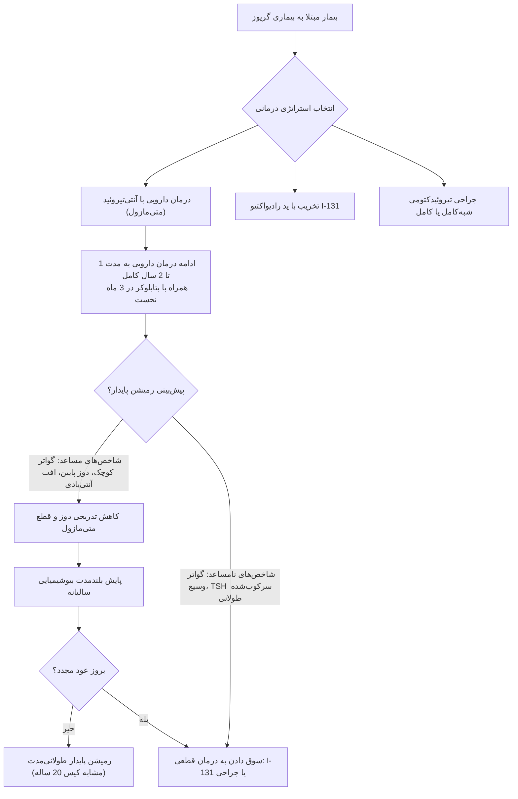

# دایره‌المعارف جامع اختلالات تیروئید: هایپوتیروئیدی و تایروتوکسیکوز

## ۱. اپیدمیولوژی، فیزیولوژی و محور هیپوتالاموس-هیپوفیز-تیروئید

> [!definition] غده تیروئید و محور تیروئیدی (HPT Axis)
> 
> سیستم تنظیمی نورواندوکرین شامل ترشح پپتیدی هورمون رهایش‌کننده تیروتروپین (TRH) از هسته‌های هیپوتالاموس، تحریک ترشح هورمون محرک تیروئید (TSH) از سلول‌های تیروتروف هیپوفیز قدامی، و القای سنتز و ترشح تترایدوتیرونین (T4) و تری‌یدوتیرونین (T3) از تیروئید با مکانیسم فیدبک منفی هومئوستاتیک بر سطوح فوقانی.

### اپیدمیولوژی و شیوع کلی هایپوتیروئیدی

- **میزان بروز (Incidence):** حدود 3.5 در 1000 نفر در سال برای زنان؛ حدود 0.6 در 1000 نفر در سال برای مردان.
    
- **بروز کلی:** میزان بروز هایپوتیروئیدی به مراتب _بیشتر از هایپرتیروئیدی_ است.
    
- **نسبت جنسیتی:** شیوع در زنان **10 برابر** مردان (نسبت 10:1).
    
- **توزیع سنی:** افزایش تصاعدی ریسک ابتلا با افزایش سن، به ویژه در افراد **بالای 40 سال**.
    
- **موقعیت بالینی:** یکی از شایع‌ترین بیماری‌های کلینیکی سیستم غدد درون‌ریز در انسان.
    

### فیزیولوژی سنتز، انتقال و متابولیسم هورمونی

- **تولید هورمونی غده:** هورمون غالب سنتز و رهاشده به جریان خون **T4** (تترایدوتیرونین) است؛ **T3** به میزان کمتری مستقیماً از تیروئید ترشح می‌شود.
    
- **تبدیل محیطی (Peripheral Deiodination):** بخش عمده T3 در بافت‌های محیطی توسط آنزیم‌های دیدیناز از T4 تولید می‌شود.
    
- **اشکال هورمونی:**
    
    - **T3 فعال:** فرم بیولوژیک اصلی هورمون؛ با قدرت بیولوژیکی _چندین برابر قوی‌تر_ از T4.
        
    - **Reverse T3 (rT3):** متابولیت فاقد اثر بیولوژیک هورمون تیروئید (فرم بیوشیمیایی غیرفعال).
        
- **پروتئین‌های حامل پلاسما:** بیش از **99.7%** هورمون‌های T4 و T3 متصل به پروتئین‌های ناقل سرمی گردش می‌کنند:
    
    1. پروتئین اصلی ناقل: گلوبولین متصل‌شونده به تیروکسین (**TBG**).
        
    2. پروتئین‌های کمکی: **ترانستیرتین (Prealbumin)** و **آلبومین**.
        
- **بخش آزاد (Free Hormone):** تنها کسر آزاد هورمون (FT4 و FT3) فعال است؛ هورمون متصل به پروتئین نقش مخزن بافری دارد.
    

## ۲. طبقه‌بندی جامع و اتیولوژی‌های هایپوتیروئیدی

### ۱. علل تخریبی پارانشیم تیروئید (Destructive Causes)

- **تیروئیدیت اتوایمیون (Hashimoto Thyroiditis):** شایع‌ترین علت هایپوتیروئیدی در مناطق غنی از ید.
    
- **پرتودرمانی با ید رادیواکتیو (I-131):** تخریب ایاتروژنیک پس از درمان گریوز یا سرطان تیروئید.
    
- **تیروئیدکتومی جراحی:** برداشتن تمام یا بخشی از غده تیروئید.
    
- **تیروئیدیت تحت‌حاد (Subacute Thyroiditis):** فاز گذار پس از تخلیه ذخایر هورمونی و تیروتوکسیکوز.
    

### ۲. اختلالات بیوسنتز هورمون (Synthesis Defects)

- **اختلالات ید:** **کمبود ید** در مناطق اندمیک جغرافیایی؛ یا **افزایش شدید ید** دریافتی (پدیده ولف-چایکوف طولانی‌مدت).
    
- **نقایص آنزیمی مادرزادی:** اختلالات ترانسپورت ید، آنزیم پراکسیداز یا اتصال هورمونی.
    
- **تداخلات دارویی القاکننده هایپوتیروئیدی:**
    
    - داروهای آنتی‌تیروئید: **متی‌مازول** و **پروپیل‌تیواوراسیل (PTU)**.
        
    - داروهای روان‌پزشکی: **لیتیوم کربنات** (مهار آزادسازی هورمون).
        
    - داروهای ضدآریتمی: **آمیودارون** (به دلیل بار ید بسیار بالا و سمیت بافتی).
        

### ۳. علل سنترال / ثانویه (Central Hypothyroidism)

- درگیری پاتولوژیک بافت هیپوفیز (آدنوم، آپوپلکسی، ریدیشن، شیحان) یا هیپوتالاموس (ضایعات ساقه، تومورها، گرانولوماتوز).
    

## ۳. سمپتوم‌ها و ساین‌های ارگانیک هایپوتیروئیدی

> [!definition] میکسدم (Myxedema)
> 
> حالت بالینی ناشی از فرم‌های طول‌کشیده و شدید هایپوتیروئیدی که به دلیل رسوب و تجمع موکوپلی‌ساکاریدهای هیدروفیلیک (اسید هیالورونیک و کندروایتین سولفات) در بافت همبند بینابینی ایجاد شده و منجر به ادم جنرالیزه غیرگوده‌گذار (Non-pitting) به ویژه در بافت پری‌اوربیتال و اندام‌های تحتانی می‌گردد.

### تظاهرات سیستمیک بر حسب ارگان‌ها

- **علائم عمومی و سیستم عصبی مرکزی (CNS):**
    
    - احساس مداوم _سرما و عدم تحمل سرما_، خستگی مزمن شدید، کاهش سطح انرژی.
        
    - کندی حرکات و گفتار (_Slow-motion speech_ و ریتارداسیون روانی-حرکتی)، لتارژی، افسردگی.
        
    - اختلال شدید حافظه کوتاه‌مدت، گیجی و تغییرات شخصیت.
        
- **سیستم عصبی-عضلانی و اسکلتی (Neuromuscular):**
    
    - ضعف عضلانی ژنرالیزه به ویژه عضلات پروگزیمال.
        
    - کرامپ‌های دردناک عضلانی و دردهای مفصلی (آرترالژی).
        
    - تاخیر در فاز بازگشت رفلکس‌های تاندونی عمقی (_Delayed relaxation of DTR_).
        
- **پوست و ضمائم پوستی (Dermatologic):**
    
    - پوست خشک، خشن، رنگ‌پریده، سرد و ضخیم؛ **هایپرکراتوز مشخص در سطح اکستانسور آرنج‌ها**.
        
    - پافینس و تورم بدون گوده در صورت و پلک‌ها (**ادم پری‌اوربیتال غیرگوده‌گذار**).
        
    - ریزش موی سر به همراه علامت اختصاصی: **ریزش یک‌سوم خارجی ابروها (علامت هرتوگ / Queen Anne sign)**.
        
    - ناخن‌های شکننده و رشد کند ناخن.
        
- **سیستم گوارش و گوش و حلق و بینی (GI & ENT):**
    
    - **یبوست شدید و مقاوم** ناشی از کاهش شدید حرکات دودی روده.
        
    - **خشونت صدا و کلفت شدن تن صدا (Deep/Hoarse voice):** ناشی از ادم موکوپلی‌ساکاریدی تارهای صوتی.
        
    - **افت شنوایی:** ناشی از ادم موکوییدی لوله‌های استاش و تجمع مایع در گوش میانی.
        
- **تظاهرات ژنیکولوژیک و باروری (Reproductive):**
    
    - در زنان سنین باروری: **افزایش حجم و مدت خونریزی ماهانه (منوراژی)** و بی‌نظمی سیکل‌ها.
        
    - کاهش میل جنسی (Libido) در هر دو جنس مذکر و مونث.
        
    - **کاهش قدرت باروری (Infertility)** و افزایش آمار سقط‌های مکرر خودبه‌خودی.
        

### تغییرات اختصاصی همودینامیک و قلبی‌عروقی

- **برادیکاردی سینوسی:** افت مستقیم ضربان قلب.
    
- **فشار خون دیاستولیک بالا:** افزایش مقاومت عروق محیطی (PVR) ⇦ ایجاد نبض باریک (Narrow Pulse Pressure).
    
- **کاردیومگالی و افیوژن پریکارد:** تجمع مایع غنی از پروتئین در فضای پریکارد در فرم‌های شدید بدون تامپوناد حاد.
    
- **کاهش میوکوردیال اکسیژن دیمند:** تطابق با سطح پایین متابولیسم پایه بدن.
    
- **تغییرات الکتروکاردیوگرام (ECG):** ولتاژ پایین کمپلکس‌های QRS، برادیکاردی، پهن‌شدن یا معکوس‌شدن موج T و تغییرات غیراختصاصی قطعه ST.
    

## ۴. کرتینیسم (Congenital Hypothyroidism) و کمای میکسدم

> [!definition] هایپوتیروئیدی مادرزادی (Congenital Hypothyroidism / Cretinism)
> 
> سندرم ناشی از فقدان یا تکامل ناکافی هورمون‌های تیروئید در دوران جنینی و نوزادی که در صورت عدم تشخیص و درمان فوق‌سریع در ماه‌های ابتدایی پس از زایمان، منجر به عقب‌ماندگی ذهنی غیرقابل برگشت و اختلال تکاملی-اسکلتی مادام‌العمر می‌گردد.

### علائم زنگ خطر تشخیصی در دوره نوزادی (Alarm Signs)

1. **خواب‌آلودگی مفرط و پایدار:** خوابیدن بدون وقفه در طول روز و طول شب (برخلاف الگوی بیداری شبانه فیزیولوژیک نوزادان نرمال).
    
2. **زردی طول‌کشیده نوزادی (Prolonged Neonatal Jaundice):** تاخیر در بلوغ آنزیم گلوکورونیل ترانسفراز کبد.
    
3. **فتق نافی (Umbilical Hernia):** به علت شلی شدید عضلات جدار شکم.
    
4. **یبوست شدید دوران نوزادی:** کاهش حرکات روده از بدو تولد.
    
5. **ویژگی‌های ظاهری متعاقب در سنین شیرخواری:** پل بینی فرورفته، گوش‌های کوچک، پوست شدیداً خشک، ماکروگلوسی (بزرگی زبان) و گریه با صدای خشن.
    

> [!warning] پنجره‌های زمانی حیاتی در پیشگیری از آسیب غیرقابل برگشت
> 
> - **پنجره کمتر از ۲ تا ۳ ماهگی:** عدم شروع درمان تا پیش از پایان ماه دوم تا سوم پس از تولد ⇦ **بروز نقایص دائمی و غیرقابل برگشت بهره هوشی (Mental Retardation)**.
>     
> - **پنجره کمتر از ۲ سالگی:** عدم درمان دارویی پیش از ۲ سالگی ⇦ **اختلال رشد طولی استخوان‌ها و کوتاهی قد دائمی شدید (Short Stature)**.
>     
> - **سیستم غربالگری کشوری:** ارزیابی قطره خون پاشنه پای نوزاد در بدو تولد شیوع این معضل را در بسیاری از جوامع ریشه‌کن نموده است.
>     

### تحلیل کیس آموزشی: دختر ۱۷ ساله با کرتینیسم تشخیص داده‌نشده

- **تظاهرات:** قد بسیار کوتاه، چاقی، عقب‌ماندگی ذهنی عمیق (سن عقلی معادل کودک ۳ تا ۵ ساله)، چهره میکسدماتو با پافینس صورت، آمنوره اولیه، تکامل پستانی نرمال اما **فقدان کامل رویش موهای پوبیک**.
    
- **نتیجه مداخله در ۱۷ سالگی:** شروع لووتیروکسین به بهبود نسبی منتیشن و هوشیاری منجر شد، اما **هیچ‌گونه افزایش قدی رخ نداد** و نقص تکاملی مغزی هرگز به وضعیت نرمال برنگشت.
    

> [!definition] کمای میکسدم (Myxedema Coma)
> 
> شدیدترین وضعیت تهدیدکننده حیات در هایپوتیروئیدی پیشرفته که با افت شدید و کشنده فعالیت سیستم‌های حیاتی بدن به دنبال یک عامل مستعدکننده ثانویه تظاهر می‌یابد.

### ویژگی‌های بالینی و درمانی کمای میکسدم

- **عوامل محرک و تسریع‌کننده:** مواجهه شدید با سرما (فصل زمستان)، عفونت‌های حاد تنفسی یا سیستمیک، جراحی، تروما، و تجویز داروهای آرام‌بخش و بیهوشی.
    
- **پنتاد بالینی کلاسیک:**
    
    1. کاهش شدید سطح هوشیاری، لتارژی پیشرونده و **کما**.
        
    2. **هایپوترمی شدید:** دمای بدن زیر ۳۵ درجه سانتی‌گراد.
        
    3. برادیکاردی شدید و کاردیومگالی با افیوژن پریکارد.
        
    4. هایپوونتیلاسیون، احتباس دی‌اکسید کربن و هایپوکسی.
        
    5. پوست بسیار خشن و ضخیم نان‌پیتینگ.
        
- **پروفایل آزمایشگاهی:** T4 و T3 بسیار پایین همراه با TSH فوق‌العاده بالا؛ هایپوناترمی رقتاری و هایپوگلایسمی.
    
- **پیش‌آگهی و مورتالیتی:** در صورت تاخیر در درمان، مورتالیتی به **50%** می‌رسد.
    
- **پروتکل درمانی اورژانس:**
    
    - تجویز **لووتیروکسین وریدی (IV)** یا تجویز T3 از طریق لوله بینی-معده‌ای (**NG Tube**).
        
    - همراهی الزامی با گلوکوکورتیکوئید وریدی (هیدروکورتیزون) جهت مهار همزمان نارسایی احتمالی محور آدرنال.
        
    - اقدامات حمایتی، بازتوانی تنفسی و گرم کردن تدریجی و پاسیو بدن.
        

## ۵. رویکرد آزمایشگاهی، بیومارکرها و الگوریتم تشخیصی هایپوتیروئیدی

### تفسیر بیومارکرهای آزمایشگاهی

- **TSH سرمی:** **حساس‌ترین و نخستین مارکر بیوشیمیایی** برای تشخیص هایپوتیروئیدی اولیه؛ اولین پارامتری که با افت عملکرد سلولی صعود می‌کند.
    
- **Free T4 (FT4):** در مراحل خفیف نرمال بوده و با پیشرفت هایپوتیروئیدی به زیر دامنه نرمال سقوط می‌کند.
    
- **T3 سرمی (Total/Free T3):** در اکثریت بیماران مبتلا به هایپوتیروئیدی خفیف یا متوسط به دلیل افزایش ناشی از تحریک TSH بر دیدینازها **در محدوده نرمال باقی می‌ماند** و صرفاً در فرم‌های شدید کاهش می‌یابد؛ بنابراین _سنجش T3 برای رد هایپوتیروئیدی فاقد ارزش است_.
    
- **اتوآنتی‌بادی‌ها:** **Anti-TPO** و **Anti-Thyroglobulin (Anti-TG)** تاییدی قطعی بر ماهیت اتوایمیون تیروئیدیت هاشیموتو.
    
- **شاخص‌های کمکی اتصالی:** در صورت شک به تغییرات پروتئین‌های ناقل سرمی، بهره‌گیری از **T3 Resin Uptake (T3RU)** و شاخص **Free Thyroxine Index (FTI)**.
    
- **تست جذب ید رادیواکتیو (RAIU):** در پارانشیم تیروئید در تمامی فرم‌های هایپوتیروئیدی **کاهش‌یافته** است.
    
- **سرم rT3:** به دلیل کاهش سنتز جنرالیزه غده، سطح rT3 سرمی نیز **کاهش می‌یابد**.
    

### اختلالات بیوشیمیایی همراه در خون

- **پروفایل لیپید:** هایپرکلسترولمی شدید (افزایش بارز Total Cholesterol و LDL-C) به علت کاهش کلیرانس گیرنده‌های کبدی LDL؛ در مواردی افزایش تری‌گلیسرید.
    
- **آنزیم‌های عضلانی:** **افزایش سطح سرمی CPK** ناشی از تغییر در نفوذپذیری غشای فیبرهای عضلانی.
    
- **آنزیم‌های کبدی:** افزایش خفیف تا متوسط ترانس‌آمینازها (AST و ALT).
    
- **پروفایل هماتولوژی:** بروز آنمی که می‌تواند به اشکال **نرموسیتیک** (شایع‌ترین)، **ماکروسیتیک** (ناشی از کمبود فولات/B12 و بیماری پرنیسیوز همراه)، یا **میکروسیتیک** (ناشی از منوراژی و فقر آهن) ظاهر شود.
    
- **سرانجام بیوشیمیایی:** تمامی اختلالات آنزیمی، چربی و خونی فوق با **درمان مکفی لووتیروکسین کاملاً برگشت‌پذیر** هستند.
    

## ۶. اصول درمان، فارماکوکینتیک لووتیروکسین و تداخلات دارویی

### پروتکل جایگزینی با لووتیروکسین (T4 Replacement)

- **داروی انتخابی استاندارد:** **لووتیروکسین سدیم خوراکی** به دلیل نیمه‌عمر طولانی فیزیولوژیک (**حدود ۷ روز**)، پایداری سرمی بالا، تبدیل فیزیولوژیک درون‌بافتی به T3، و امکان تجویز یک‌بار در روز.
    
- **دستور مصرف الزامی:** مصرف روزانه **صبح ناشتا با معده خالی**، حداقل **نیم ساعت (۳۰ دقیقه)** پیش از صرف صبحانه همراه با آب خالص.
    
- **زمان‌بندی تیتراسیون و مانیتورینگ:** رسیدن به فاز پایدار یوتیروئید نیازمند **8 تا 16 هفته (2 تا 4 ماه)** زمان است؛ سنجش TSH هر **6 تا 8 هفته** تا زمان پایدار شدن سطح نرمال تکرار می‌شود.
    
- **هدف آزمایشگاهی TSH:** حفظ TSH در محدوده طبیعی و ترجیحاً در **نیمه تحتانی دامنه نرمال (Lower normal range)**.
    
- **پایش دوره‌ای پس از تثبیت دوز:** اندازه‌گیری سالیانه سطح TSH به میزان **1 یا 2 بار در سال**.
    

> [!warning] تمایز مانیتورینگ هایپوتیروئیدی اولیه از ثانویه (سنترال)
> 
> - در هایپوتیروئیدی اولیه: بیومارکر پایش و تنظیم دوز دارو منحصراً **سطح سرمی TSH** است.
>     
> - در هایپوتیروئیدی مرکزی (Central): به دلیل اختلال ذاتی در هیپوفیز، TSH همواره سرکوب‌شده یا غیرقابل اتکا است؛ بنابراین مانیتورینگ درمان **اکیداً و منحصراً بر اساس سطح سرمی Free T4** و وضعیت بهبود بالینی بیمار صورت می‌گیرد.
>     

### اندیکاسیون‌های تجویز لووتیروکسین وریدی (IV Levothyroxine)

1. **کمای میکسدم** به دلیل اورژانس تهدیدکننده حیات و اختلال جذب روده‌ای.
    
2. **سندرم‌های سوءجذب شدید دستگاه گوارش:** بیماران با بای‌پاس روده (Jejunoileal bypass)، سندرم روده کوتاه (Short bowel syndrome)، انسداد روده، فیستول‌های گوارشی و جراحی‌های وسیع سیستم گوارش.
    

### شرایط تغییردهنده نیاز روزانه به دوز لووتیروکسین

- **بارداری (Pregnancy):** جذب روده کاهش و کلیرانس و غلظت TBG افزایش می‌یابد؛ نیاز به دوز دارو **افزایش قابل‌توجه** می‌یابد (نیازمند افزایش فوری دوز به منظور صیانت از تکامل سیستم عصبی جنین).
    
- **سالمندی (Aging):** کاهش نرخ متابولیسم و توده عضلانی منجر به **کاهش نیاز به دوز روزانه** می‌گردد.
    

### تداخلات دارویی با متابولیسم و جذب لووتیروکسین

1. **داروهای مهارکننده جذب گوارشی (نیازمند ایجاد فاصله زمانی حداقل 2 تا 3 ساعت):**
    
    - رزین‌های شلاتور صفراوی: **کلستیرامین** و **کلستیپول**.
        
    - املاح معدنی: **مکمل‌های آهن (فروس سولفات)**.
        
    - ترکیبات تغذیه‌ای: فرمولاسیون‌های حاوی **سویا (Soybean)**.
        
    - آنتی‌اسیدها: **آلومینیوم هیدروکسید**.
        
    - مهارکننده‌های پمپ پروتون (PPI): **امپرازول** و **پنتوپرازول** (با مهار اسید معده مانع حل‌شدن بهینه قرص می‌گردند).
        
2. **داروهای تسریع‌کننده متابولیسم کبدی (القاکننده‌های آنزیم سایتوکروم P450):**
    
    - داروهای ضدصرع: **فنی‌توئین**، **فنوباربیتال** و **کاربامازپین**.
        
    - داروهای ضدسل: **ریفامپین**.
        
    - سایر داروها: **آمیودارون** و **سرترالین** (نیاز بیمار به دوز لووتیروکسین را به شدت افزایش می‌دهند).
        

> [!warning] عوارض تجویز نامتناسب دوز جایگزینی (Over vs Under Replacement)
> 
> - **جایگزینی بیش از حد (Over-replacement / تیروتوکسیکوز ایاتروژنیک):**
>     
>     - _سیستم اسکلتی:_ تسریع بازجذب استخوان، افت دانسیته مواد معدنی (BMD) و تشدید شدید خطر **استئوپروز**.
>         
>     - _سیستم قلبی‌عروقی:_ تاکی‌کاردی، فیبریلاسیون دهلیزی (**AF**)، القای آریتمی، بدتر شدن آنژین صدری و انفارکتوس میوکارد در سالمندان.
>         
> - **جایگزینی ناکافی (Under-replacement):**
>     
>     - تداوم خستگی و علائم سیستمیک، تشدید عوارض ارگانیک و **پایداری هایپرکلسترولمی آتروژنیک**.
>         

## ۷. تعاریف، اتیولوژی‌ها و پاتوفیزیولوژی تیروتوکسیکوز و هایپرتیروئیدی

> [!definition] تیروتوکسیکوز در برابر هایپرتیروئیدی (Thyrotoxicosis vs Hyperthyroidism)
> 
> - **تیروتوکسیکوز:** سندرم بالینی، بیوشیمیایی و فیزیولوژیک ناشی از مواجهه هر بافت هدف با مقادیر مازاد هورمون‌های تیروئید در گردش؛ این ترم یک تشخیص اتیولوژیک اختصاصی نیست و هرگونه منشأ اندوژن، تخریبی یا اگزوژن را شامل می‌شود.
>     
> - **هایپرتیروئیدی:** زیرمجموعه‌ای اختصاصی از تیروتوکسیکوز که در آن افزایش پایدار سنتز و ترشح هورمون‌ها مستقیماً توسط _خود بافت غده تیروئید_ صورت می‌پذیرد.
>     

### سبب‌شناسی جامع تیروتوکسیکوز

1. **هایپرتیروئیدی با فعالیت پایدار ترشحی غده تیروئید:**
    
    - بیماری خودایمنی **گریوز (Graves Disease)**.
        
    - ندول‌های خودمختار اتونوم: **گواتر مولتی‌ندولار توکسیک (TMNG / Plummer Disease)** و **آدنوم توکسیک سولیتر**.
        
    - بیماری‌های تروفوبلاستیک با ترشح بالای hCG: **کوریوکارسینوما** و **حاملگی مولار** (به دلیل هومولوژی ساختاری hCG با TSH و اتصال به رسپتور TSH).
        
    - هایپرترمی بارداری و استفراغ شدید (**Hyperemesis Gravidarum**).
        
    - نئوپلاسم آدنوهیپوفیز مترشحه نابجای تیروتروپین (**TSHoma**).
        
    - سندرم مقاومت انتخابی هیپوفیز به هورمون تیروئید (PRTH).
        
    - هایپرتیروئیدی اتوزومال غالب غیراتوایمیون.
        
2. **تیروتوکسیکوز با نشت هورمونی بدون هایپرتیروئیدی (تیروئیدیت‌ها):**
    
    - **تیروئیدیت تحت حاد (Subacute Thyroiditis):** همراه با درد و تندرنس تیروئید.
        
    - **تیروئیدیت خاموش (Silent Thyroiditis)** و **تیروئیدیت پس از زایمان (Postpartum Thyroiditis)**: ناشی از پدیده ریباند اتوایمیونیتی ظرف ۳ تا ۶ ماه پس از زایمان.
        
    - القاشده با سایتوکاین‌ها و داروها: درمان با **اینترلوکین-2 (IL-2)** و **اینترفرون آلفا (IFN-alpha)**.
        
3. **تیروتوکسیکوز ناشی از منابع خارج تیروئیدی:**
    
    - دریافت اگزوژن نابجا یا مصرف دوز بالای لووتیروکسین (**Thyrotoxicosis Factitia**).
        
    - تومور درموئید تراتوم تخمدانی حاوی بافت تیروئیدی فعال (**Struma Ovarii**).
        
    - توده‌های متاستاتیک وسیع کارسینومای فولیکولار تیروئید با تمایز بالا.
        

## ۸. تظاهرات سیستمیک، علائم اختصاصی چشمی و درموپاتی گریوز

### سمپتوم‌ها و ساین‌های بالینی تیروتوکسیکوز ژنرالیزه

- **تظاهرات نروپسیستیک:** اضطراب شدید، تحریک‌پذیری، بی‌خوابی، بی‌قراری حرکتی، هایپررفلکسی تاندونی.
    
- **متابولیسم و ترموژنز:** **کاهش وزن واضح علی‌رغم اشتهای نرمال یا افزایش‌یافته**، تعریق فراوان، **عدم تحمل گرما**.
    
- **دستگاه حرکتی:** **ترومور ظریف انتهاها (Fine Tremor)** در انگشتان دست حین اکستنشن؛ میوپاتی و ضعف پروگزیمال عضلات.
    
- **پوست و عروق محیطی:** پوست کاملاً گرم، مرطوب و نرم (Smooth)؛ اریتم کف دستی (**Palmar Erythema**).
    
- **سیستم باروری:** اختلالات قاعدگی در زنان به فرم اولیگومنوره یا آمنوره؛ خستگی مزمن در هر دو جنس.
    
- **تظاهرات قلبی‌عروقی:**
    
    - تاکی‌کاردی سینوسی مداوم (حتی در زمان خواب و استراحت) و تپش قلب شدید (Palpitation).
        
    - **هایپرتنشن سیستولیک مجزا (Isolated Systolic Hypertension):** بالا رفتن فشار خون سیستولیک همزمان با حفظ یا افت فشار دیاستولیک ⇦ **افزایش پهنای نبض (Wide Pulse Pressure)**.
        
    - سوفل‌های جریان خون با برون‌ده بالا بر روی قلب و تیروئید.
        

### علائم چشمی در تیروتوکسیکوز: تمایز نشانه‌های جنرال از اختصاصی گریوز

> [!important] نشانه‌های عمومی چشمی ناشی از تحریک سمپاتیک (حاضر در تمامی اتیولوژی‌های تیروتوکسیکوز)
> 
> این نشانه‌ها صرفاً به علت هایپرتونیسیته سیستم سمپاتیک و اسپاسم عضله مولر پلک پدید می‌آیند و نشانه گریوز نیستند:
> 
> 1. **خیرگی چشم (Staring Gaze):** رویت واضح سفیدی اسکلرا در بالای لیمبوس قرنیه در نگاه مستقیم.
>     
> 2. **عقب‌کشیدگی پلک (Lid Retraction).**
>     
> 3. **تاخیر پلک (Lid Lag / Von Graefe Sign):** عدم حرکت همزمان و جا ماندن پلک فوقانی به سمت بالا هنگامی که نگاه بیمار از بالا به آهستگی به سمت پایین می‌آید.
>     

> [!warning] افتالموپاتی اختصاصی بیماری گریوز (Graves' Ophthalmopathy / Exophthalmos)
> 
> منحصراً در بیماری اتوایمیون گریوز مشاهده می‌شود؛ ناشی از تحریک فیبروبلاست‌های مداری و رسوب گلیکوزآمینوگلیکان‌ها، ادم و افزایش بافت چربی و عضلانی رترواوربیتال (تاییدشده در CT Scan).
> 
> - **پروپتوزیس / اگزوفتالموس حقیقی:** بیرون‌زدگی فیزیکی یک‌طرفه یا دوطرفه، قرینه یا غیرقرینه کره چشم.
>     
> - **دوبینی (Diplopia):** ناشی از فیبروز و به دام افتادن عضلات اکسترااکولار (به ویژه رکتوس تحتانی و مدیال).
>     
> - **کموزیس (Chemosis) و پرخونی:** ادم و التهاب شدید عروق ملتحمه.
>     
> - **تهدیدات پایدار بینایی:** زخم قرنیه ناشی از عدم بسته شدن کامل پلک‌ها (Exposure Keratopathy) و **نوروپاتی فشاری عصب اپتیک (Compressive Optic Neuropathy)** که اورژانس مطلق پزشکی جهت نجات دید چشم است.
>     

### درموپاتی ناشی از گریوز (Graves' Dermopathy / Pretibial Myxedema)

- **ماهیت بافتی:** رسوب اتوایمیون موکوپلی‌ساکاریدها در لایه درم پوست.
    
- **محل شایع:** پوست ناحیه قدام ساق پا (**ناحیه پره‌تیبیال**).
    
- **سیر مورفولوژیک:**
    
    1. ادم غیرگوده‌گذار (Non-pitting) متقارن در مچ و ساق پا.
        
    2. ضخیم، هایپرکراتوتیک و زبر شدن پوست به همراه نمای دندانه‌دار و **پوست پرتقالی (Peau d'orange)**.
        
    3. ایجاد ندول‌ها و پلاک‌های ارغوانی یا قهوه‌ای برجسته.
        
    4. در موارد فوق‌العاده پیشرفته: تغییر شکل ناهنجار پا مشابه **الفانتیازیس (Elephantiasis)**.
        

## ۹. آنالیز جامع موارد تشخیصی، نسبت T3/T4 و اسکن ایزوتوپ

### محدودیت‌ها و ملاحظات آزمایش‌های سنجش هورمونی

1. بالا بودن سطح سرمی Total T4 یا T3 لزوماً معادل تیروتوکسیکوز نیست؛ به عنوان مثال افزایش TBG در حاملگی، مصرف قرص‌های جلوگیری از بارداری (OCP)، اعتیاد به متادون یا هپاتیت حاد سطح تام هورمون را بدون اختلال بالینی بالا می‌برد.
    
2. در مراحل زودرس، هورمون‌های محیطی هنوز از آستانه ماکزیمم نرمال تجاوز نکرده‌اند اما در نیمه فوقانی بوده و TSH سرمی سرکوب شده است.
    
3. تجویز برخی داروها (پروپرانولول در دوز بالا، مواد کنتراست یددار رادیولوژی) با مهار تبدیل T4 به T3 سبب افزایش ایزوله سطح T4 سرمی بدون تیروتوکسیکوز واقعی می‌گردد.
    

> [!important] شاخص تشخیصی نسبت سرمی هورمون‌های تیروئید (T3 to T4 Ratio Clue)
> 
> هنگامی که غلظت T3 سرم بر حسب _نانوگرم در دسی‌لیتر (ng/dL)_ و غلظت T4 تام بر حسب _میکروگرم در دسی‌لیتر (mcg/dL)_ سنجیده شود:
> 
> - **نسبت T3 به T4 بزرگتر از 20 (T3/T4 > 20):** دلالت قاطع بر **هایپرتیروئیدی اولیه واقعی** (تحریک سنتز دونوو با غلبه T3؛ نظیر بیماری گریوز، گواتر توکسیک مولتی‌ندولار، آدنوم توکسیک).
>     
> - **نسبت T3 به T4 کمتر از 15 (T3/T4 < 15):** دلالت بر **تخریب سلولی و رهایش ذخایر تیروگلوبولین غنی از T4** یا تجویز دارویی خارجی (نظیر فاز حاد انواع تیروئیدیت‌ها، تیروتوکسیکوز القاشده با ید، یا مصرف قرص لووتیروکسین).
>     

## ۱۰. جداول تحلیلی و افتراقی بیماری‌های تیروئید

### جدول ۱: مقایسه جامع اتیولوژی‌های اصلی تیروتوکسیکوز

| **پارامتر بالینی و آزمایشگاهی** | **بیماری گریوز (Graves' Disease)**                | **گواتر مولتی‌ندولار توکسیک (TMNG)**                | **آدنوم منفرد توکسیک (Toxic Adenoma)**                | **تیروئیدیت تحت‌حاد / خاموش (Thyroiditis)**          |
| ------------------------------- | ------------------------------------------------- | --------------------------------------------------- | ----------------------------------------------------- | ---------------------------------------------------- |
| **مکانیسم پاتوفیزیولوژی**       | آنتی‌بادی محرک گیرنده TSH (TRAb/TSI)              | پیدایش اتونومی خودمختار در ندول‌ها طی سالیان        | موتاسیون فعال‌کننده در یک ندول منفرد خودمختار         | تخریب مکانیکی فولیکول‌ها و نشت هورمون به خون         |
| **معاینه فیزیکی تیروئید**       | بزرگی یکنواخت و منتشر، بدون گره، لمس نرم          | گواتر بزرگ، ندولار متعدد با قوام متغیر              | لمس یک ندول مجزا و منفرد و نرمی بافت زمینه            | تیروئیدیت دکوروان دردناک و حساس؛ سایلنت بدون درد     |
| **علائم اختصاصی چشم و پوست**    | **مثبت** (اگزوفتالموس حقیقی، درموپاتی پره‌تیبیال) | **منفی** (فقط علائم آدرنرژیک نظیر لیدلگ)            | **منفی** (صرفاً علائم ناشی از افزایش تون سمپاتیک)     | **منفی** (فاقد هرگونه علائم اختصاصی خارج‌تیروئیدی)   |
| **الگوی اسکن تیروئید (RAIU)**   | **افزایش منتشر و یکنواخت بازجذب ید**              | **جذب ناهمگن، لکه‌لکه و غیریکنواخت**                | **جذب بسیار بالا در ندول داغ؛ سرکوب کامل سایر نواحی** | **کاهش شدید یا نزدیک به صفر بازجذب ید**              |
| **نسبت سرمی T3 به T4**          | **بزرگتر از 20** (غلبه ترشح مستقیم T3)            | **بزرگتر از 20** (تولید ترجیحی T3 در ندول‌ها)       | **بزرگتر از 20** (ترشح اتونوم شدید هورمون T3)         | **کمتر از 15** (آزادسازی محتویات فولیکولی غنی از T4) |
| **رویکرد درمانی قطعی نهایی**    | داروی آنتی‌تیروئید، ید رادیواکتیو، یا جراحی       | **درمان قطعی جراحی یا ید رادیواکتیو** (دارو بی‌اثر) | **تخریب با ید رادیواکتیو یا لوبکتومی جراحی**          | **خودمحدودشونده**؛ بتا‌بلوکر جهت سمپتوم‌ها و NSAID   |

> [!important] چرایی ناکارآمدی داروهای آنتی‌تیروئید در گواتر مولتی‌ندولار و آدنوم توکسیک
> 
> در گواتر مولتی‌ندولار توکسیک و آدنوم خودمختار، نقص ناشی از جهش پایدار و اتونومی بافتی است؛ بنابراین برخلاف بیماری اتوایمیون گریوز، **داروهای آنتی‌تیروئید هرگز قادر به القای بهبودی دائمی (Remission) در این بیماران نبوده** و قطع دارو با عود قطعی همراه است. لذا داروهای متی‌مازول یا PTU در این ضایعات صرفاً نقش کنترل موقت پیش از درمان قطعی با جراحی یا ید رادیواکتیو را دارند.

### جدول ۲: مقایسه پروفایل بیوشیمیایی نارسایی‌های هورمونی تیروئید

| **وضعیت بیوشیمیایی / بالینی**      | **سطح هورمون TSH**                  | **سطح سرمی Free T4**        | **سطح سرمی Free/Total T3** | **تفسیر فیزیوپاتولوژیک و جایگاه بالینی**                        |
| ---------------------------------- | ----------------------------------- | --------------------------- | -------------------------- | --------------------------------------------------------------- |
| **هایپوتیروئیدی اولیه (آشکار)**    | **بسیار بالا**                      | **پایین‌تر از نرمال**       | نرمال یا پایین             | نقص ذاتی در پارانشیم غده تیروئید؛ شایع‌ترین سناریو کلینیکی      |
| **هایپوتیروئیدی ساب‌کلینیکال**     | **بالاتر از نرمال**                 | **کاملاً طبیعی**            | کاملاً طبیعی               | فرم زودهنگام و ملایم نارسایی؛ بیمار عمدتاً کم‌علامت یا بی‌علامت |
| **هایپوتیروئیدی سنترال (مرکزی)**   | **پایین، نرمال، یا مختصراً بالا**   | **پایین‌تر از نرمال**       | پایین‌تر از نرمال          | نارسایی سلول‌های تیروتروف هیپوفیز قدامی یا کمبود ترشح TRH       |
| **سندرم بیماری غیرتیروئیدی (NTI)** | سرکوب در فاز حاد؛ **صعود در نقاهت** | نرمال یا پایین در موارد حاد | **افت شدید و زودهنگام**    | پاسخ تطابقی بدن به بیماری شدید بالینی در بیماران بستری ICU      |

### جدول ۳: فارماکولوژی داروهای تیروتوکسیکوز و ترکیبات کمکی

| **دسته و نام دارو**           | **مکانیسم اثر سلولی و بیوشیمیایی**           | **جایگاه درمانی و ارجحیت‌های بالینی**              | **عوارض و نکات اختصاصی امتحانی**                               |
| ----------------------------- | -------------------------------------------- | -------------------------------------------------- | -------------------------------------------------------------- |
| **متی‌مازول (Methimazole)**   | مهار آنزیم TPO؛ بلوک سنتز هورمون‌ها          | **داروی خط اول قطعی** در بالغین مبتلا به گریوز     | تراتوژنیسیته در سه ماهه اول بارداری (آپلازیا کوتیس)            |
| **پروپیل‌تیواوراسیل (PTU)**   | مهار TPO + **مهار تبدیل محیطی T4 به T3**     | **خط اول در سه‌ماهه اول بارداری** و طوفان تیروئیدی | سمیت حاد و نارسایی برق‌آسای کبدی (Fulminant Hepatitis)         |
| **پروپرانولول (Propranolol)** | مهار گیرنده‌های بتا + کاهش تبدیل محیطی T4/T3 | کنترل فوری تاکی‌کاردی، ترمور، تعریق و اضطراب       | تشدید برونکواسپاسم در بیماران مبتلا به آسم فعال                |
| **محلول ید (Lugol / SSKI)**   | اثر ولف-چایکوف: مهار آزادسازی حاد هورمون     | بحران طوفان تیروئیدی و **آماده‌سازی پیش از جراحی** | تجویز حتماً باید _حداقل یک ساعت پس از داروی آنتی‌تیروئید_ باشد |
| **لیتیوم کربنات (Lithium)**   | مهار دگرانولاسیون و ترشح هورمون‌ها به پلاسما | خط دوم در موارد بروز عوارض متی‌مازول و PTU         | پنجره درمانی بسیار باریک و سمیت کلیوی-عصبی                     |

## ۱۱. استراتژی‌های درمانی در بیماری گریوز و تحلیل کیس‌های بالینی

### شاخص‌های پیش‌گویی‌کننده القای رمیشن پایدار با داروهای آنتی‌تیروئید

- **فاکتورهای بالینی به نفع پاسخ عالی به متی‌مازول:** اندازه کوچک گواتر در شروع بیماری، علائم بالینی خفیف، تیترهای پایین آنتی‌بادی گیرنده تیروتروپین (TRAb)، نیاز به دوزهای کم دارو جهت یوتیروئید شدن، بازگشت سریع TSH به رنج نرمال، و کاهش محسوس حجم گواتر طی درمان.
    
- **فاکتورهای دال بر شکست دارویی و عود حتمی:** بیماری شدید بالینی اولیه، گواتر بسیار بزرگ و منتشر، نیاز به دوزهای بسیار بالای متی‌مازول یا PTU، و باقی ماندن سطح TSH در فاز سرکوب‌شده به مدت طولانی.
    

> [!tip] نکات آماده‌سازی پیش از جراحی در بیماری گریوز
> 
> 1. بیمار حتماً باید پیش از انتقال به اتاق عمل توسط متی‌مازول یا PTU به وضعیت بیوشیمیایی کاملاً **یوتیروئید** برسد تا از خطر تحریک و رهایش فاجعه‌بار هورمون‌ها (طوفان تیروئیدی حین عمل) جلوگیری شود.
>     
> 2. تجویز **محلول ید (لوگول)** به مدت ۷ تا ۱۰ روز پیش از جراحی الزامی است؛ این اقدام با کاهش جریان خونرسانی و مهار ترشح، عروق تیروئید را منقبض کرده و سبب کاهش چشمگیر شکنندگی (Friability) بافت و افت خونریزی حین جراحی می‌گردد.
>     

### تحلیل کیس‌های بالینی مرجع درس دکتر همت‌آبادی

> [!important] تحلیل کیس ۱: مرد ۷۰ ساله با هایپوتیروئیدی ثانویه به ید رادیواکتیو و هایپرکلسترولمی
> 
> - **شرح اولیه:** مرد ۷۰ ساله با علائم تیروتوکسیکوز شدید (بی‌خوابی، تپش قلب، لرزش، پوست گرم، تعریق، اگزوفتالموس و گواتر بزرگ) ناشی از بیماری گریوز. دریافت دوز درمانی **20 میلی‌کوری ید رادیواکتیو (I-131)**.
>     
> - **رخداد ۶ ماه بعد:** بروز کم‌کاری تیروئید با صعود TSH به 50 mIU/mL ناشی از فیبروز ایاتروژنیک پس از اشعه؛ آغاز لووتیروکسین و رسیدن به یوتیروئید کامل با لیپید پروفایل نرمال (کلسترول 170، HDL 58، LDL 106).
>     
> - **رخداد ۲.۵ سال بعد:** بازگشت علائم خستگی، یبوست، صورت پافی، پوست خشک و صعود مجدد کلسترول و LDL بالا به دلیل قطع خودسرانه لووتیروکسین طی ۶ ماه گذشته.
>     
> - **نکات کلیدی:**
>     
>     1. تخریب تیروئید با I-131 یک فرآیند **دائمی و مادام‌العمر (Permanent)** است و هورمون جایگزین هرگز نباید قطع شود.
>         
>     2. دیس‌لیپیدمی مستقیماً ثانویه به کمبود تیروکسین بوده و **صرفاً با شروع مجدد لووتیروکسین و بدون نیاز به استاتین کاملاً اصلاح گردید**.
>         

> [!important] تحلیل کیس ۲: خانم ۳۸ ساله مبتلا به بیماری گریوز توأم با روماتیک هارت دیزیز (RHD)
> 
> - **شرح اولیه:** بیمار با تنگی دریچه آئورت (AS)، تپش قلب، پالس ۱۱۰ منظم، عدم تحمل گرما، ترمور، بی‌قراری، گواتر ۴۵ گرمی، TSH سرکوب‌شده و FTI بالا.
>     
> - **پروتکل درمانی:** آغاز همزمان **متی‌مازول و پروپرانولول**. بهبود علائم طی ۳ تا ۴ ماه ⇦ قطع پروپرانولول در ماه سوم ⇦ **ادامه متی‌مازول به مدت ۲ سال کامل** به منظور جلوگیری قطعی از عود و القای رمیشن طولانی‌مدت.
>     
> - **سیر درازمدت:** پیگیری ۲۰ ساله (۱۹۹۲ تا ۲۰۱۲) نشان داد بیمار در تمام این دو دهه **در رمیشن بیوشیمیایی کامل باقی ماند**؛ گواتر پسرفت کرد و بیمار ۲ سال پس از شروع درمان توانست تحت عمل جراحی قلب باز (تعویض دریچه آئورت) در شرایط یوتیروئید قرار گیرد.
>     

## ۱۲. جمع‌بندی استراتژیک نکات امتحانی و تله‌های تشخیصی

1. **طیف بیماری‌های اتوایمیون تیروئید:** بیماری گریوز و تیروئیدیت هاشیموتو دو قطب مخالف یک طیف پیوسته بیولوژیک هستند؛ یک بیمار مبتلا به گریوز ممکن است در گذر زمان با تخریب پیشرونده اتوایمیون به سمت هاشیموتو و هایپوتیروئیدی پیش برود و برعکس (به ندرت).
    
2. **پایش بارداری در مصرف هورمون‌ها:** به دلیل افزایش غلظت TBG و مهار نسبی جذب، دوز لووتیروکسین در بارداری باید **افزایش** یابد؛ عدم تنظیم دوز مادر را در معرض خطرات بارداری و جنین را در معرض نارسایی تکامل مغزی قرار می‌دهد.
    
3. **تله تشخیصی فاز بهبودی نان‌تایروئیدال ایلنس (NTI):** در بیماران بستری در بخش‌های مراقبت‌های ویژه، TSH در فاز حاد سرکوب است؛ در فاز نقاهت سطح TSH به صورت فیزیولوژیک بالا می‌رود تا کمبود بافتی را جبران کند و نباید با هایپوتیروئیدی اولیه اشتباه گرفته شود.
    
4. **توالی افت چشمی:** لیدلگ و خیرگی ناشی از تون سمپاتیک بوده و با درمان دارویی یا بتابلوکر برطرف می‌شوند؛ اما **اگزوفتالموس و کموزیس ناشی از پروسه ایمونولوژیک فیبروبلاست‌ها در اربیت هستند** و ارتباط مستقیمی با سطح هورمون سرمی ندارند.
    
5. **ارزیابی هایپوتیروئیدی در توده‌های آدرنال:** آغاز درمان جایگزینی هورمون تیروئید پیش از جایگزینی گلوکوکورتیکوئید در بیمارانی که همزمان کمبود آدرنال دارند، می‌تواند منجر به تسریع متابولیسم کورتیزول و بروز **بحران کشنده آدرنال (Adrenal Crisis)** گردد.