# دیابت ملیتوس: طبقه‌بندی، پاتوژنز، ارزیابی آزمایشگاهی و مدیریت بالینی

## ۱. تعاریف بنیادین، اپیدمیولوژی جهانی و سیمای بیماری در ایران

> [!definition] دیابت ملیتوس (Diabetes Mellitus)
> 
> سندرم متابولیک مزمن ناشی از اختلال مطلق یا نسبی در ترشح انسولین، اختلال در عملکرد زیستی انسولین و یا همپوشانی هر دو پدیده؛ تظاهریافته با هایپرگلایسمی پایدار، برهم‌خوردن هومئوستاز سوخت‌وساز کربوهیدرات‌ها، لیپیدها و پروتئین‌ها، و مستعدکننده بیمار به ایجاد اختلالات ساختاری و نارسایی عملکردی در ارگان‌های هدف.

### شاخص‌های اپیدمیولوژیک جهانی (IDF Atlas 2019)

- **جمعیت درگیر جهانی:** ابتلای بالغ بر **463 میلیون نفر** در گروه سنی 20 تا 79 سال به دیابت نوع 2.
    
- **نرخ شیوع جمعیتی:** ابتلای **1 نفر از هر 11 فرد بالغ** در سرتاسر جهان.
    
- **مورتالیتی وابسته به زمان:** وقوع **1 مورد مرگ در هر 6 تا 8 ثانیه** در سطح کره زمین ناشی از عوارض متابولیک و عروقی دیابت.
    
- **بار اقتصادی جهانی دیابت:** تخصیص بالغ بر **10% از کل بودجه نظام سلامت جهان** معادل با **760 بیلیون دلار آمریکا**.
    
- **سیمای اپیدمیولوژیک منطقه خاورمیانه و شمال آفریقا (MENA):** واجد بالاترین نرخ شیوع جهانی دیابت؛ با نرخ رشد تخمینی **100% (دو برابر شدن شیوع)** تا افق سال 2045.
    

### سیمای اپیدمیولوژی و روند شیوع در ایران

- **مطالعه ملی سال 2005 (انتشار در Diabetes Care 2008):** شیوع **7.7%** در جمعیت 25 تا 64 سال (معادل حدود **2 میلیون نفر** مبتلای قطعی).
    
- **مطالعه پیگیری سال 2011 (بررسی ترند ملی):** افزایش شیوع به **11.3%** در گروه سنی 25 تا 70 سال.
    
- **توزیع زیرگروه‌های جمعیتی:** شیوع به مراتب بالاتر در **افراد مسن**، **زنان** و **ساکنان جوامع شهری** نسبت به مناطق روستایی.
    

### ریسک نسبی و بار عوارض ارگانیک دیابت

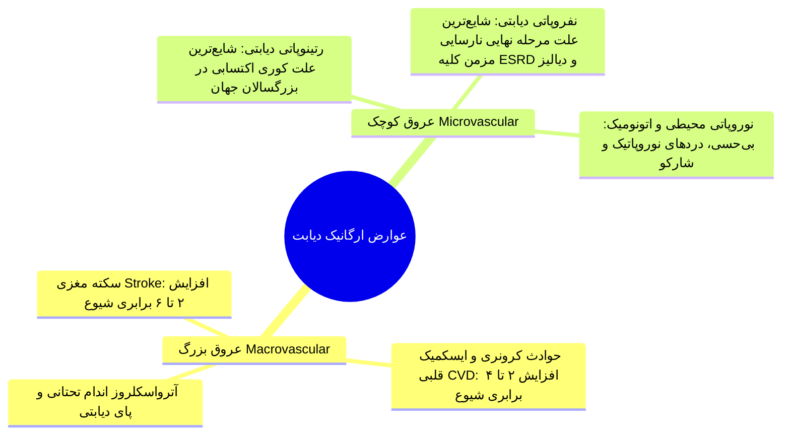

## ۲. رده‌بندی چهارگانه دیابت و مقایسه بنیادین نوع ۱ و نوع ۲

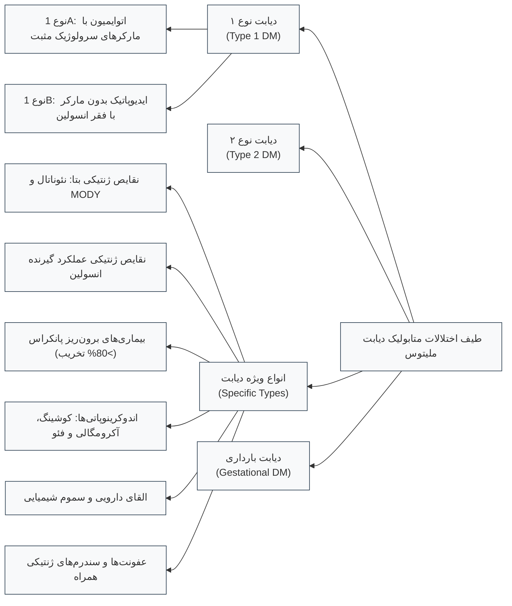

> [!important] چرخش مفهومی در ملاک‌های طبقه‌بندی دیابت
> 
> در دهه‌های گذشته دسته‌بندی بر اساس **سن شروع** (Juvenile vs Adult-onset) یا **نیاز به درمان** (IDDM vs NIDDM) استوار بود. در سیستم طبقه‌بندی نوین، تقسیم‌بندی **منحصراً بر پایه پاتوژنز اولیه و مکانیسم مولکولی ایجاد بیماری** صورت می‌پذیرد؛ چرا که دیابت اتوایمیون می‌تواند در سنین بالای 30 سال رخ دهد (5% تا 10% موارد بزرگسالان) و دیابت نوع 2 نیز به دنبال اپیدمی چاقی در کودکان و نوجوانان شیوع بالایی یافته است.

| **پارامتر مقایسه‌ای**            | **دیابت نوع ۱ (Type 1 DM)**                           | **دیابت نوع ۲ (Type 2 DM)**                            |
| -------------------------------- | ----------------------------------------------------- | ------------------------------------------------------ |
| **مکانیسم اصلی پاتوژنز**         | تخریب اتوایمیون سلول‌های بتا و **کمبود مطلق انسولین** | **مقاومت به انسولین** + نقص پیشرونده ترشح بتا          |
| **سن شایع تظاهر بالینی**         | عمدتاً سنین کمتر از 30 سالگی (امکان بروز در هر سنی)   | غالباً سنین میانسالی و کهنسالی (رو به رشد در نوجوانان) |
| **سرعت آغاز علائم**              | **حاد، ناگهانی و پر سر و صدا** (طی چند روز تا هفته)   | **خزنده، تدریجی و بی‌سر و صدا** (طی سال‌ها)            |
| **وضعیت نمایه توده بدنی (BMI)**  | عموماً لاغر، کاهش وزن شدید قبل از تظاهر بالینی        | **بیش از 90% موارد همراه با اضافه وزن یا چاقی**        |
| **استعداد به کتواسیدوز (DKA)**   | **بسیار بالا**؛ تظاهر شایع بدو تشخیص                  | پایین؛ بروز عمدتاً در استرس‌های فوق‌العاده شدید        |
| **همراهی با سیستم آنتی‌ژنی HLA** | **همبستگی قوی با ژن‌های HLA کلاس ۲**                  | **فاقد هرگونه همبستگی با سیستم HLA**                   |
| **مارکرهای اتوآنتی‌بادی سرمی**   | **مثبت در بدو تشخیص (Anti-GAD, IA-2, IAA, ZnT8)**     | **منفی** (یا بسیار نادر و نامرتبط)                     |
| **استراتژی درمانی خط اول**       | **انسولین‌درمانی مادام‌العمر از روز نخست**            | اصلاح سبک زندگی + داروهای خوراکی (متفورمین)            |

## ۳. دایره‌المعارف اتیولوژی‌های ویژه دیابت (Specific Types of DM)

### ۱. دیابت‌های مونوژنیک سلول بتا (MODY و دیابت نئوناتال)

- **ویژگی‌های بالینی MODY:** شیوع در **کمتر از 5% کل جمعیت دیابتی**؛ بروز در **سنین کمتر از 25 سالگی**؛ الگوی توارثی **اتوزومال غالب**؛ واجد نارسایی اولیه در ترشح انسولین با حفظ حساسیت محیطی به انسولین.
    

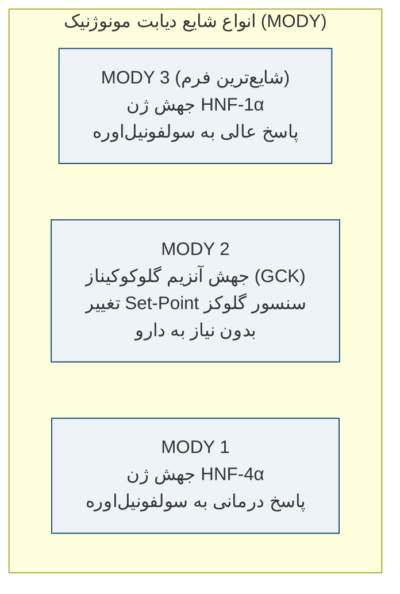

> [!important] ارزش بالینی و مقرون‌به‌صرفه بودن تشخیص ژنتیکی MODY
> 
> 1. **جهش آنزیم گلوکوکیناز (MODY 2):** آنزیم GCK سنسور اولیه بتا است. نقص آن ست‌پوینت تحریک انسولین را به قندهای بالاتر شیفت می‌دهد؛ بیمار هایپرگلایسمی ملایم ناشتا دارد اما عوارض میکروواسکولار رخ نمی‌دهد و **بیمار به هیچ دارویی (حتی انسولین) نیاز ندارد**.
>     
> 2. **جهش فاکتورهای HNF-1α و HNF-4α (MODY 3 و MODY 1):** این بیماران دچار نقص ترشحی وابسته به محرک هستند. در صورت اشتباه با دیابت نوع 1، سال‌ها انسولین بیهوده دریافت می‌کنند؛ در حالی که **درمان انتخابی و بسیار مؤثر آن‌ها دوزهای پایین قرص خوراکی سولفونیل‌اوره** است.
>     

- **دیابت نئوناتال (Neonatal Diabetes Mellitus):** بروز در سنین نوزادی؛ ناشی از جهش در زیرواحدهای کانال حساس به ATP پتاسیم شامل ژن **KCNJ11** و ژن **ABCC8**. عدم بسته شدن کانال مانع ورود کلسیم و مهار ترشح انسولین می‌شود؛ درمان اختصاصی نجات‌بخش با **دوزهای بالای سولفونیل‌اوره خوراکی به جای انسولین** است.
    

### ۲. نقایص ژنتیکی عملکرد و انتقال سیگنال انسولین

- بیماری‌های فوق‌العاده نادر طب اطفال ناشی از موتاسیون گیرنده انسولین:
    
    1. **سندرم مقاومت شدید نوع A به انسولین (Type A Insulin Resistance)**.
        
    2. **لپرکونیسم (Leprechaunism / Donohue Syndrome)**.
        
    3. **سندرم رابسون-مندنهال (Rabson-Mendenhall Syndrome)**.
        
    4. **دیابت‌های لیپوآتروفیک (Lipoatrophic Diabetes)**.
        

### ۳. بیماری‌های بخش برون‌ریز پانکراس (Exocrine Pancreatic Defects)

- **قانون سرانگشتی درگیری بافتی:** برای القای هایپرگلایسمی و دیابت ثانویه به پاتولوژی‌های اگزوکرین، **تخریب بیش از 80% بافت کل لوزالمعده** الزامی است.
    
- اتیولوژی‌ها: پانکراتیت مزمن عودکننده، تروما یا پانکراتکتومی توتال/ساب‌توتال، نئوپلاسم‌های منتشر، هموکروماتوز و **سیستیک فایبروزیس (Cystic Fibrosis)**.
    

> [!warning] نکات انحصاری دیابت وابسته به سیستیک فایبروزیس (CFRD)
> 
> - **پاتوژنز:** ناشی از تخریب پیشرونده بافت غدد اندوکرین به دنبال فیبروز بخش اگزوکرین؛ شیوع **20% در نوجوانان** و **40% تا 50% در بالغین** مبتلا به CF.
>     
> - **تله تشخیصی غربالگری:** ارزیابی هموگلوبین A1C در مبتلایان به سیستیک فایبروزیس فاقد حساسیت لازم بوده و **اکیداً نباید به کار رود**؛ غربالگری روتین الزامی با **تست تحمل گلوکز خوراکی (2h-OGTT 75g)** انجام می‌شود.
>     
> - **پروتکل پایش:** انجام سالیانه تست OGTT در تمامی بیماران مبتلا به سیستیک فایبروزیس **از سن 10 سالگی به بعد**.
>     
> - **پروتکل درمانی:** خط اول و قطعی درمان منحصراً **انسولین‌درمانی** است؛ غربالگری سالیانه عوارض از **5 سال پس از تشخیص** آغاز می‌گردد.
>     

### ۴. اندوکرینوپاتی‌ها و ترشح هورمون‌های متقابل انسولین (Counter-regulatory)

- **سندرم کوشینگ:** ترشح مازاد کورتیزول و تحریک گلوکونئوژنز.
    
- **آکرومگالی:** اثرات مستقیم آنتی‌انسولینی غلظت بالای هورمون رشد (GH).
    
- **گلوکاگونوما:** ترشح اتونوم گلوکاگون از تومور سلول‌های آلفا.
    
- **فئوکروموسیتوما:** مهار ترشح انسولین و تحریک گلیکوژنولیز به واسطه کاتکول‌آمین‌ها.
    
- **هایپرتیروئیدی شدید:** تسریع جذب گوارشی گلوکز و افزایش کلیرانس انسولین.
    

### ۵. دیابت ناشی از پیوند اعضا (PTDM / NODAT)

- بروز در **تا 90% دریافت‌کنندگان پیوند کلیه** طی هفته‌های ابتدایی پس از جراحی پیوند.
    
- مکانیسم: آسیب ایسکمیک بافت پیوندی در کنار سمیت بافتی و اثر دیابتوژنیک داروهای سرکوب‌کننده ایمنی (به ویژه کورتیکواستروئیدها، تاکرولیموس و سیکلوسپورین).
    
- **پروتکل تشخیصی:** رد هرگونه استرس حاد جراحی؛ انجام تست **2h-OGTT** پس از رسیدن بیمار به شرایط بیولوژیک کاملاً پایدار.
    
- **اصل طلایی بالینی:** داروهای ایمونوساپرسیو پیوند به علت پیدایش دیابت **هرگز نباید قطع شوند**.
    

### ۶. داروها، سموم و عوامل شیمیایی القاکننده دیابت

- **پنتامیدین (Pentamidine):** سمیت انتخابی و لیز حاد سلول‌های بتا.
    
- **نیکوتینیک اسید (نیاسین):** القای مقاومت شدید کبدی به انسولین.
    
- **سم واکور (Vacor - رادنتی‌ساید/سم موش):** تخریب اختصاصی و برق‌آسای جزایر بتا.
    
- **گلوکوکورتیکوئیدها با دوز بالا:** مهار مصرف گلوکز در عضله و فعال‌سازی گلوکونئوژنز کبد.
    
- **هورمون‌های تیروئیدی، دی‌آزوکساید و دیورتیک‌های تیازیدی**.
    
- **آگونیست‌های بتا آدرنرژیک و داروهای آنتی‌سایکوتیک آتیپیک**.
    

### ۷. عفونت‌های ویروسی و سندرم‌های ژنتیکی همراه با دیابت

- **عفونت‌های القاکننده:** سیتومگالوویروس (CMV)، سرخجه مادرزادی (Congenital Rubella)، کوکساکی ویروس B و پدیده‌های نوروایمونولوژیک مانند _سندرم مرد سخت (Stiff-Person Syndrome)_.
    
- **سندرم‌های ژنتیکی با استعداد بالا به دیابت:**
    
    1. ناهنجاری‌های کروموزومی: **سندرم داون (تریزومی 21)**، **سندرم کلاین‌فلتر (XXY)**، **سندرم ترنر (XO)**.
        
    2. اختلالات نورودژنراتیو و میوپاتی‌ها: **آتاکسی فریدریش**، **کره هانتینگتون**، **دیستروفی میوتونیک**.
        
    3. بیماری‌های مولتی‌سیستمیک نادر: **سندرم ولفرام (DIDMOAD)**، **پورفیری**، **سندرم پرادر-ویلی** و **سندرم لارنس-مون-بیدل**.
        

## ۴. دیابت بارداری (Gestational Diabetes Mellitus - GDM)

> [!definition] دیابت دوران بارداری (GDM)
> 
> هرگونه اختلال در تحمل گلوکز که برای اولین بار طی دوران حاملگی شناخته یا بروز نماید؛ بدون احتساب زنانی که پیش از لقاح دچار دیابت آشکار تشخیص داده‌نشده بوده‌اند (Pre-GDM).

### پاتوفیزیولوژی، همه‌گیری‌شناسی و خطرات مامایی

- **پاتوژنز:** بروز مقاومت به انسولین در **نیمه دوم بارداری** به دنبال ترشح هورمون‌های ضدانسولینی جفت (_لاکتوژن جفتی انسان hPL، پروژسترون، کورتیزول و پرولاکتین_).
    
- **اپیدمیولوژی:** درگیری **به طور متوسط 7% کل حاملگی‌ها** (دامنه بین‌المللی بین 1% تا 14%)؛ تشکیل‌دهنده **90% از کل اختلالات تحمل گلوکز در بارداری**.
    
- **پیامدهای مادری و جنینی:** افزایش چشمگیر نیاز به **سزارین**، ریسک بروز **هایپرتنشن بارداری و پره‌اکلامپسی**، ماکروزومی جنین، ترومای زایمانی و هایپوگلایسمی نوزادی.
    
- **پیش‌آگهی درازمدت:** ابتلای **حدود 50% از مادران مبتلا به GDM** به دیابت ملیتوس آشکار در طول زندگی.
    

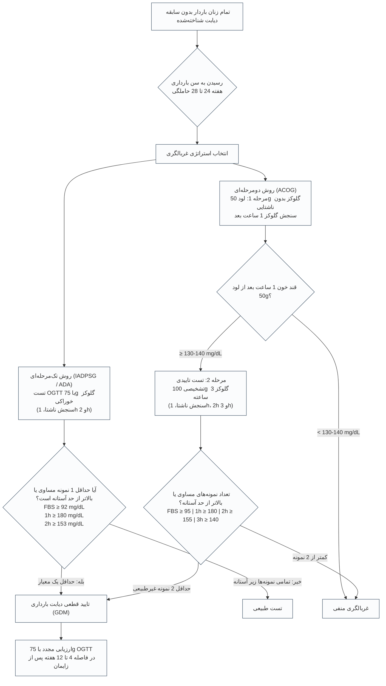

> [!important] تله‌های تشخیصی پروتکل‌های غربالگری GDM
> 
> 1. **تفاوت بنیادین روش تک‌مرحله‌ای و دومرحله‌ای:** در روش 1 مرحله‌ای (75 گرمی)، غیرطبیعی بودن **تنها 1 نمونه از 3 نمونه** برای اثبات GDM کفایت می‌کند. در روش 2 مرحله‌ای (100 گرمی)، اثبات بیماری منوط به غیرطبیعی بودن **حداقل 2 نمونه از 4 نمونه** است.
>     
> 2. **پایش بعد از زایمان:** تمامی مادران مبتلا به GDM باید در فاصله **6 هفته (یا 4 تا 12 هفته) پس از زایمان** مجدداً تحت تست تحمل گلوکز 75 گرم خوراکی قرار گیرند و در صورت طبیعی بودن، **حداقل هر 3 سال یک‌بار** به صورت مادام‌العمر غربالگری شوند.
>     

## ۵. معیارهای آزمایشگاهی تشخیص دیابت و پیش‌دیابت (ADA Criteria)

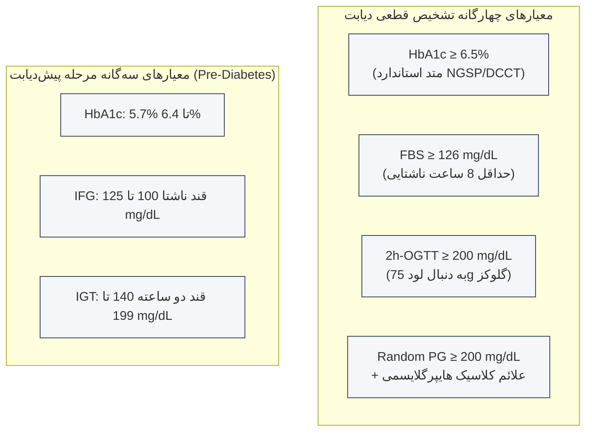

### تغییرپذیری زیستی (Biological Variability) و قواعد تکرار آزمایش

- **تغییرات بیولوژیک روزمره در یک فرد (Intra-individual variability):** نوسان طبیعی **5.7% تا 8.3%** در قند خون یک فرد از روزی به روز دیگر (برای قند مرزی 126 mg/dL، دامنه فاصله اطمینان 95% بین **112 تا 140 mg/dL** متغیر است).
    
- **تغییرات بین افراد مختلف جامعه (Inter-individual variability):** نوسان فیزیولوژیک تا **12.5%**.
    
- **تغییرپذیری هموگلوبین A1c:** کمترین نوسان بیولوژیک معادل **3.6%** (در مقایسه با 5.7% قند ناشتا و **16.6% قند 2 ساعت پس از غذا**).
    
- **گلیکولیز برون‌تنی (In-vitro Glycolysis):** تاخیر در جداسازی سرم در لوله آزمایش موجب افت گلوکز با نرخ **5% تا 7% در هر یک ساعت** در دمای اتاق می‌شود (نمونه 126 mg/dL پس از 2 ساعت به 110 mg/dL کاهش می‌یابد).
    

> [!warning] قانون طلایی برخورد با نتایج نامنطبق آزمایشگاهی (Discordant Results)
> 
> 1. در غیاب هایپرگلایسمی حاد علامت‌دار، تشخیص نیازمند **دو نتیجه آزمایش غیرطبیعی** است (از یک نمونه واحد یا در دو روز مجزا).
>     
> 2. اگر دو تست متفاوت (نظیر FPG و A1C) همزمان درخواست شود و یکی طبیعی و دیگری غیرطبیعی باشد، **آزمایش غیرطبیعی باید فوراً تکرار گردد**؛ تصمیم بالینی بر مبنای تکرار تست غیرطبیعی اولیه خواهد بود.
>     

## ۶. بیوشیمی هموگلوبین A1c، کینتیک گلایکیشن و خطاهای مداخله‌گر

### سینتیک واکنش گلایکیشن غیرآنزیمی

- اتصال گلوکز به آمین انتهایی والین زنجیره بتای هموگلوبین طی واکنشی کند، غیرآنزیمی و غیرقابل برگشت.
    
- انعکاس‌دهنده میانگین قند خون طی طول عمر اریتروسیت‌ها (**120 روز / 2 تا 3 ماه گذشته**).
    
- **توزیع وزنی کینتیک گلایکیشن (روند غیرخطی):**
    
    - **50% کل گلایکیشن هموگلوبین در 30 روز پایانی عمر RBC رخ می‌دهد**.
        
    - تنها **25% گلایکیشن در 60 روز نخست زندگی گلبول قرمز شکل می‌گیرد**.
        

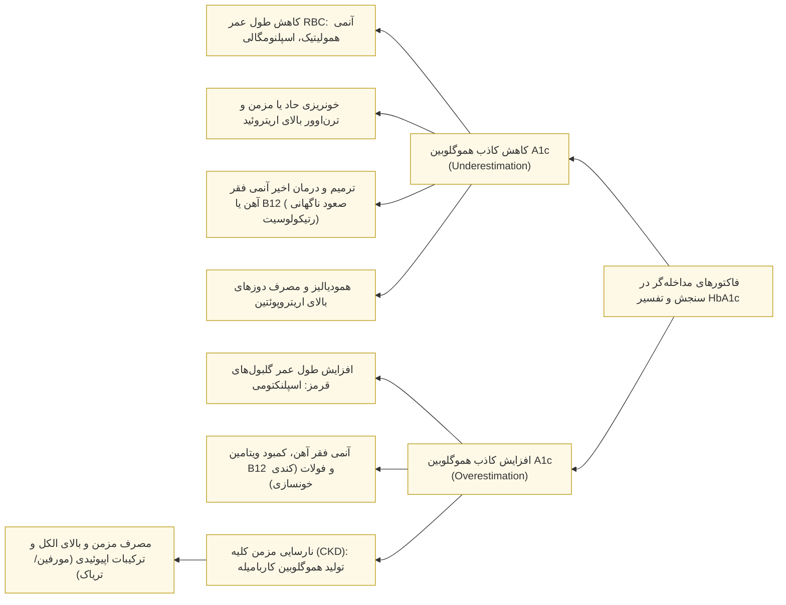

## ۷. اندیکاسیون‌های غربالگری دیابت در افراد فاقد علامت بالینی

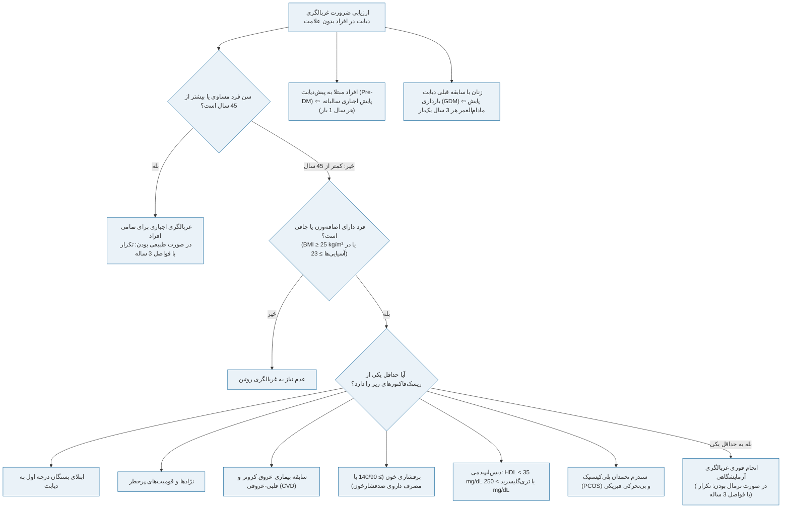

## ۸. بیوسنتز انسولین، مکانیسم مولکولی ترشح و آبشار پیام‌رسانی سلولی

### ساختار و پردازش مولکولی انسولین

- سنتز اولیه به فرم پلی‌پپتید غیرفعال **Preproinsulin** در شبکه آندوپلاسمیک خشن.
    
- برش توالی هدایت‌گر و تبدیل به **Proinsulin** درون دستگاه گلژی.
    
- هیدرولیز اندوپپتیدازی و خروج پپتید اتصال‌دهنده موسوم به **C-Peptide**.
    
- ساختار نهایی انسولین: **زنجیره A با 21 اسید آمینه** و **زنجیره B با 30 اسید آمینه** که توسط **دو پیوند دی‌سولفیدی بین‌زنجیره‌ای** به یکدیگر پیوند یافته‌اند.
    

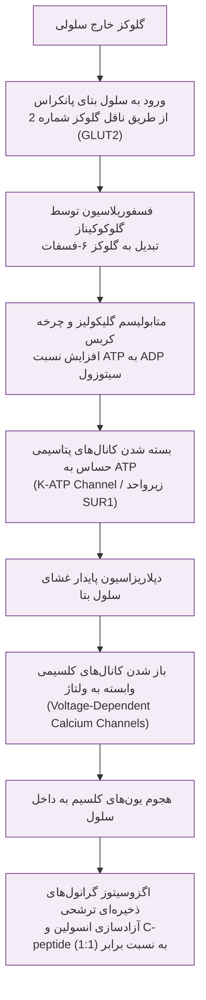

### آبشار پس از اتصال به گیرنده در بافت‌های هدف

1. اتصال به گیرنده هتروتترامر تیروزین کیناز در سطح سلول‌های عضلانی، کبدی و چربی.
    
2. اتوفسفوریلاسیون تیروزین و فعال‌سازی پروتئین‌های بستر گیرنده انسولین (**IRS-1 و IRS-2**).
    
3. فعال‌سازی آنزیم فسفاتیدیل اینوزیتول ۳-کیناز (**PI3-Kinase**).
    
4. ترنسلوکاسیون وزیکول‌های حاوی **ناقل گلوکز شماره 4 (GLUT4)** به غشای سلول عضله و چربی ⇦ ورود گلوکز به درون سلول و افت قند خون.
    
5. کلیرانس هورمونی: عبور انسولین ترشح‌شده از مسیر ورید پورت و **برداشت 50% از آن توسط کبد در اولین گذر (First-pass)**.
    

## ۹. پاتوژنز و سیر طبیعی دیابت نوع ۱

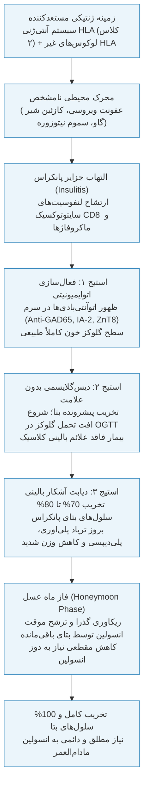

> [!important] بیولوژی ایمونولوژی و ژنتیک دیابت نوع ۱
> 
> - **نقش همبستگی سیستم HLA:** سیستم آنتی‌ژنی لکوسیت انسانی مسئول **40% تا 50% استعداد ژنتیکی** ابتلا است. بیش از **90% مبتلایان دارای آلل‌های HLA-DR3-DQ2 یا HLA-DR4-DQ8** هستند. الل‌های **HLA-DQA1 و DQB1 محافظت‌کننده (Protective)** شناخته می‌شوند.
>     
> - **میانجی‌های تخریب بافتی:** مکانیسم اولیه تخریب ناشی از **ایمنی سلولی (Cell-mediated)** توسط سایتوکاین‌های _اینترفرون گاما (IFN-γ)، اینترلوکین ۱ بتا (IL-1β) و TNF-α_ از مسیر آنزیم‌های جانوس کیناز (JAK/STAT) و سایتوکینازهای آپوپتوتیک است؛ ایمنی هومورال و اتوآنتی‌بادی‌ها خود عامل تخریب نبوده بلکه **بیومارکرهای تشخیصی ناشی از مواجهه** هستند.
>     
> - **ریسک فامیلیال ابتلا:** در دوقلوهای تک‌تخمکی نرخ تطابق **40% تا 60%** (اثبات نقص مطلق ژنتیکی نبودن)؛ احتمال ابتلای فرزند والد مبتلا **6%** و احتمال ابتلای خواهر/برادر بیمار **5%** (در مقایسه با شیوع 0.4% جمعیت عادی).
>     

## ۱۰. پاتوژنز دیابت نوع ۲: پدیده آمینوس آکتت، اینکرتین‌ها و سمپاتیک بافتی

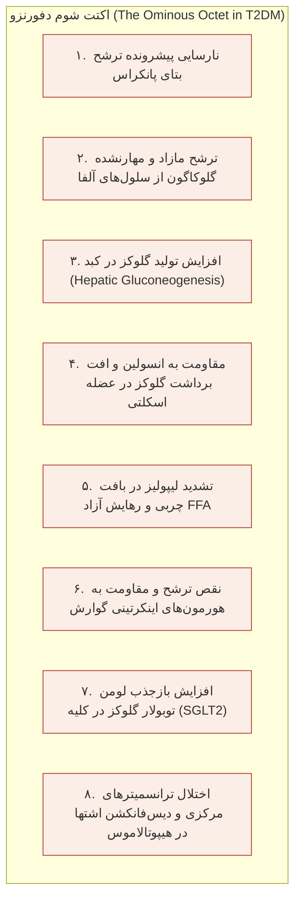

### بار ژنتیکی در برابر عوامل محیطی در دیابت نوع ۲

- **میزان تطابق ژنتیکی:** در دوقلوهای تک‌تخمکی نرخ تطابق به **70% تا 90%** می‌رسد (نقش وراثت به مراتب پررنگ‌تر از نوع 1). ابتلای هر دو والد، ریسک ابتلای فرزند را به **40%** می‌رساند.
    
- **ژن‌های شاخص:** پلی‌مورفیسم در ژن **TCF7L2** (قوی‌ترین استعداد ژنتیکی)، **PPARG**، کانال پتاسیم **KCNJ11**، انتقال‌دهنده زینک **SLC30A8** و **IRS-1**.
    
- **تعامل ژن-محیط (شواهد سرخپوستان پیما - Pima Indians):** زندگی سرخپوستان پیما در مناطق سنتی مکزیک همراه با شیوع ناچیز دیابت؛ در حالی که مهاجرت به ایالات متحده و تغییر سبک زندگی به چاقی مفرط و **افزایش خیره‌کننده و فاجعه‌بار شیوع دیابت** در هر دو جنس منجر گردید.
    

### محور اینکرتین و آزمایش تاریخی گلوکز خوراکی در برابر وریدی

- **اثر اینکرتین (Incretin Effect):** در یک فرد سالم، تجویز خوراکی گلوکز موجب ترشح انسولینی تا **4 برابر بیشتر** از انفوزیون وریدی همان دوز گلوکز می‌گردد (توجیه‌کننده **70% از ترشح انسولین بعد از غذا**).
    
- **هورمون‌های میانجی:** پپتید شبه گلوکاگون شماره ۱ (**GLP-1**) ترشح‌شده از سلول‌های L روده باریک و پلی‌پپتید انسولینوتروپیک وابسته به گلوکز (**GIP**) از سلول‌های K.
    
- **کلیرانس فوق‌سریع:** هورمون درون‌زاد GLP-1 ظرف **2 تا 3 دقیقه** توسط آنزیم **DPP-4 (دی‌پپتیدیل پپتیداز ۴)** هیدرولیز و غیرفعال می‌گردد.
    

> [!definition] سمیت گلوکز و سمیت لیپید (Glucose Toxicity & Lipotoxicity)
> 
> - **گلوکوز توکسیسیتی:** هایپرگلایسمی شدید مزمن به طور مستقیم عملکرد ترشحی سلول‌های باقیمانده بتا را فلج و سرکوب می‌نماید؛ با کنترل سریع قند از طریق رژیم، ورزش یا داروها، اثرات سمی برداشته شده و بتا سل‌ها ریکاوری ترشحی پیدا می‌کنند.
>     
> - **لایپوتوکسیسیتی:** مقاومت به انسولین در آدیپوسیت‌ها منجر به هجوم مقادیر انبوه اسیدهای چرب آزاد (FFA) به کبد و پانکراس می‌شود؛ رسوب چربی سبب مهار ترشح انسولین، القای کبد چرب غیرالکلی (NAFLD) و دیس‌لیپیدمی اختصاصی دیابت (**تری‌گلیسرید بالا، HDL پایین و تجمع ذرات آتروژنیک Small-Dense LDL**) می‌گردد.
>     

## ۱۱. مداخله غیردارویی: اصول MNT، ایندکس و لود گلایسمیک و ورزش

### درمان تغذیه‌ای پزشکی (Medical Nutrition Therapy - MNT)

- **نسبت کل درشت‌مغذی‌ها:** حدود **50% کل کالری از کربوهیدرات‌های پیچیده**، **20% پروتئین** و حدود **30% چربی‌ها** (با غلبه چربی‌های غیراشباع PUFA و MUFA در قالب _رژیم مدیترانه‌ای_ و اسید چرب امگا ۳).
    
- **کربوهیدرات‌های ساده:** تخصیص تا 10% کالری به قندهای ساده در صورت عدم برهم زدن کنترل مجاز است؛ اولویت مطلق با غلات کامل، حبوبات و فیبر غذایی فراوان است.
    

> [!definition] شاخص گلایسمیک (GI) و بار گلایسمیک (GL)
> 
> - **Glycemic Index (GI):** سنجش سرعت صعود قند خون پس از مصرف 50 گرم کربوهیدرات یک ماده غذایی در مقایسه با 50 گرم ماده استاندارد (گلوکز خالص یا نان سفید)؛ طبقه‌بندی: پایین (< 55)، متوسط (55 تا 70)، بالا (> 70).
>     
> - **Glycemic Load (GL):** حاصل‌ضرب شاخص گلایسمیک در گرم کربوهیدرات موجود در یک سهم مشخص از غذا تقسیم بر 100؛ شاخص ارزیابی بار واقعی قند؛ طبقه‌بندی: پایین (< 10)، متوسط (10 تا 19)، بالا (≥ 20).
>     
> - _مثال کلاسیک هندوانه:_ هندوانه دارای GI بالا معادل **72** است؛ اما به علت محتوای اندک کربوهیدرات در هر قاچ (حدود 5 گرم)، بار گلایسمیک آن **3.6** (بسیار پایین و زیر 10) خواهد بود.
>     

### پروتکل و خطوط راهنمای فعالیت بدنی

- **کودکان و نوجوانان دیابتی:** حداقل **60 دقیقه در روز فعالیت هوازی متوسط تا شدید** به همراه تمرینات مقاومتی حداقل **3 روز در هفته**.
    
- **بزرگسالان:** حداقل **150 دقیقه در هفته فعالیت هوازی با شدت متوسط** (پخش در حداقل 3 تا 5 روز بدون فاصله بیش از دو روز) یا **75 دقیقه در هفته ورزش هوازی شدید**.
    
- **اصول پایش گلوکز حین تمرین:**
    
    - در صورت قند خون **کمتر از 100 mg/dL** پیش از تمرین: مصرف اجباری اسنک کربوهیدراتی جهت پیشگیری از هایپوگلایسمی.
        
    - در صورت قند خون **بالاتر از 250 mg/dL** (به ویژه در حضور کتون): **ممنوعیت مطلق ورزش** تا زمان کنترل متابولیک.
        
    - در ورزش‌های طولانی‌مدت: بررسی قند **هر 30 دقیقه** و پرهیز از تزریق انسولین در عضله تحت تمرین فعال.
        

## ۱۲. کارآزمایی‌های بالینی مرجع در اثبات کنترل فشرده قند خون

| **پارامترهای مطالعه**    | **کارآزمایی دیابت نوع ۱ (DCCT Study)**                                        | **کارآزمایی دیابت نوع ۲ (UKPDS Study)**                   |
| ------------------------ | ----------------------------------------------------------------------------- | --------------------------------------------------------- |
| **جمعیت و طراحی مطالعه** | 1441 بیمار دیابتی نوع 1 (پیگیری میانگین 6.5 تا 7 سال)                         | 5102 بیمار تازه تشخیص‌داده دیابت نوع 2 (پیگیری 10 سال)    |
| **پروتکل‌های درمانی**    | گروه کنترل سنتی (A1c میانگین 9.2%) در برابر تایت کنترل (A1c 7.2%)             | درمان معمول کانونشنال در برابر درمان فشرده دارویی/انسولین |
| **دستاورد کاهش عوارض**   | **کاهش 50% تا 70% عوارض میکروواسکولار** (رتینوپاتی، نفروپاتی و نوروپاتی)      | **کاهش معنادار عوارض میکروواسکولار** و رتینوپاتی          |
| **بقای عمر درازمدت**     | **تضمین 15 سال افزایش امید به زندگی (Life-saving)**                           | پایداری منافع در پیگیری‌های درازمدت 20 تا 30 ساله         |
| **عوارض سوء مداخله**     | افزایش **3 برابری ریسک هایپوگلایسمی شدید** + افزایش وزن (میانگین 4.5 کیلوگرم) | افزایش دوره‌های هایپوگلایسمی و افزایش وزن ناشی از دارو    |

## ۱۳. دایره‌المعارف فارماکولوژی داروهای کاهنده قند خوراکی

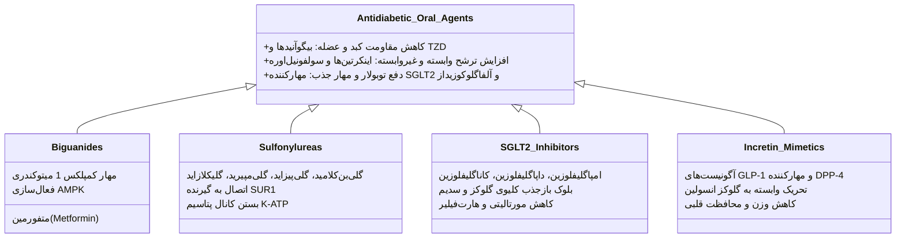

### ۱. متفورمین (بیگوآنیدها - مشتق از گیاه Galega officinalis)

- **مکانیسم سلولی:** مهار انتخابی **کمپلکس ۱ زنجیره تنفسی میتوکندری** هپاتوسیت‌ها ⇦ افت تولید ATP و افزایش غلظت AMP سلولی ⇦ تحریک کیناز سنسور انرژی سلول (**AMPK**) ⇦ **سرکوب گلوکونئوژنز و کاهش تولید گلوکز کبد (HGP)** در کنار بهبود حساسیت محیطی عضلات بدون تحریک ترشح انسولین.
    
- **دوزاژ:** شروع با 500 یا 850 میلی‌گرم یک‌بار در روز همراه غذا؛ تیتراسیون هر 2 تا 3 هفته به حداکثر دوز اثربخش **2000 تا 2550 میلی‌گرم در روز**.
    
- **عوارض و تله‌های بالینی:** شایع‌ترین عارضه گوارشی (اسهال، تهوع و کرامپ شکمی)؛ عارضه نادر ولی کشنده **اسیدوز لاکتیک (Lactic Acidosis)**.
    
- **موارد منع مصرف قطعی:** نارسایی شدید کلیه با **eGFR < 30 mL/min/1.73m²**، حالات هیپوکسی شدید سیستمیک، شوک، نارسایی پیشرفته کبدی و سپسیس. قطع موقت 48 ساعت قبل و بعد از تصویربرداری با تزریق ماده حاجب یددار.
    

### ۲. سولفونیل‌اوره‌ها و مگلیتینیدها (محرک‌های ترشح انسولین)

- **مکانیسم:** اتصال اختصاصی به زیرواحد **SUR1** در کانال‌های پتاسیمی حساس به ATP غشای سلول بتا ⇦ القای دپلاریزاسیون و ترشح اگزوسیتوزی مداوم انسولین.
    
- **نمایندگان:** گلی‌بن‌کلامید (Glibenclamide)، گلی‌پیزاید (Glipizide)، گلی‌مپیرید (Glimepiride) و گلیکلازاید (Gliclazide).
    
- **تفاوت بافت‌های هدف:** گیرنده‌های گلی‌بن‌کلامید با کانال‌های مشابه در عضلات صاف میوکارد قلب اینتراکشن دارند؛ اما **گلی‌مپیرید و گلیکلازاید سلکتیویتی بالاتری برای گیرنده بتای پانکراس دارند**.
    
- **مگلیتینیدها (رپاگلیناید - Repaglinide):** شروع اثر فوق‌سریع و نیمه‌عمر بسیار کوتاه (حذف طی 1 ساعت)؛ تجویز بلافاصله قبل از وعده غذا؛ داروی انتخابی دوران روزه‌داری (**رمضان دراگ**) به علت حداقل بودن خطر هایپوگلایسمی در فاز ناشتایی و ایمنی نسبی در نارسایی خفیف کلیه.
    

### ۳. تیازولیدین‌دیون‌ها (TZDs / گلیتازون‌ها)

- **مکانیسم:** آگونیست انتخابی گیرنده هسته‌ای **PPAR-γ (پراکسی‌زوم پرولیفراتور اکتیویتد رسپتور گاما)**؛ القای نسخه برداری ژن ناقلین GLUT4 و فعال‌سازی آنزیم لیپوپروتئین لیپاز (LPL).
    
- **نمایندگان:** پیوگلیتازون (Pioglitazone) و روزیگلیتازون.
    
- **عوارض:** احتباس سدیم و آب، ایجاد **ادم محیطی شدید و افزایش وزن**؛ افزایش ریسک شکستگی استخوان در زنان.
    
- **منع مصرف:** بیماران دچار **نارسایی احتقانی قلب علامت‌دار (CHF کلاس ۳ و ۴ نیویورک NYHA)**.
    

### ۴. مهارکننده‌های آلفا گلوکوزیداز (آکاربوز - Acarbose)

- مهار رقابتی آنزیم‌های هیدرولیزکننده نشاسته در پرزهای روده باریک (Brush border).
    
- تاخیر در تجزیه الیگوساکاریدها و مسطح‌سازی پیک قند پس از غذا (Postprandial Hyperglycemia).
    
- فاقد اثر بر وزن و ترشح هورمون؛ عوارض اصلی گوارشی ناشی از تخمیر قند در کولون (نفخ، اسهال و دردهای شکمی). منع مصرف در **بیماری‌های التهابی روده (IBD)** و نارسایی پیشرفته کلیه.
    

### ۵. اینکرتین‌تراپی خوراکی: مهارکننده‌های DPP-4 (گلیپتین‌ها)

- مهار ترانسفر آنزیمی دی‌پپتیدیل پپتیداز ۴ ⇦ افزایش طول عمر و رساندن هورمون بومی GLP-1 به سطوح فیزیولوژیک.
    
- **نمایندگان:** سیتاگلیپتین (Sitagliptin)، لیناگلیپتین (بدون نیاز به تنظیم دوز کلیوی)، ویلداگلیپتین.
    
- مزیت: پایداری بر وزن بدن (Weight-neutral) و فاقد خطر هایپوگلایسمی در تجویز مونوتراپی.
    

### ۶. مهارکننده‌های SGLT2 (گلیفلوزین‌ها - مشتقات پوست درخت سیب Phlorizin)

- **مکانیسم نوین کلیوی:** مهار ترانسپورتر سدیم-گلوکز شماره ۲ در توبول پروگزیمال کلیه ⇦ مسدودسازی بازجذب گلوکز ⇦ دفع ادراری 70 تا 100 گرم گلوکز در روز به همراه دفع اسموتیک سدیم (نتری‌یورزیس).
    
- **نمایندگان:** امپاگلیفلوزین (Empagliflozin)، داپاگلیفلوزین، کاناگلیفلوزین و ارتوگلیفلوزین.
    
- **شواهد کارآزمایی EMPA-REG OUTCOME:** کاهش چشمگیر مرگ‌ومیر قلبی‌عروقی، **کاهش خیره‌کننده بستری ناشی از نارسایی قلبی (HHF)** و کند کردن سیر نارسایی مزمن کلیه و دفع آلبومینوری.
    
- **عوارض ناخواسته:** عفونت‌های قارچی تناسلی-مخاطی (کاندیدیازیس)، عفونت ادراری و خطر نادر **کتواسیدوز دیابتی یوتوگلایسمیک (Euglycemic DKA)** در شرایط استرس شدید جراحی.
    

## ۱۴. درمان‌های تزریقی: آگونیست‌های گیرنده GLP-1 در برابر انسولین

> [!important] چرایی ارجحیت تزریق آگونیست GLP-1 بر انسولین در دیابت نوع ۲
> 
> مطابق گایدلاین نوین ADA، هنگامی که بیمار دیابتی نوع 2 علی‌رغم مصرف داروهای خوراکی به هدف A1C نمی‌رسد، **اولین داروی انتخابی تزریقی، آگونیست گیرنده GLP-1 (نظیر لیراگلوتاید) است نه انسولین**، به 3 دلیل قاطع علمی:
> 
> 1. **کاهش قدرتمند وزن:** مهار اشتهای مرکزی در هیپوتالاموس و تاخیر تخلیه معده (در برابر افزایش وزن توسط انسولین).
>     
> 2. **حداقل بودن خطر هایپوگلایسمی:** ترشح انسولین با این دارو منحصراً در شرایط گلوکز خون بالاتر از حد نرمال تحریک می‌شود.
>     
> 3. **کاهش اثبات‌شده مرگ‌ومیر قلبی-عروقی (MACE):** بر اساس نتایج انقلابی کارآزمایی بالینی **LEADER** با لیراگلوتاید.
>     

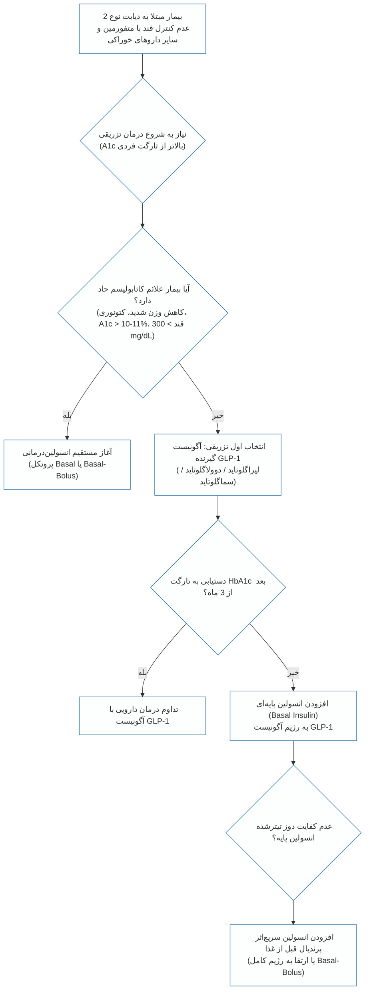

## ۱۵. طبقه‌بندی جامع فرآورده‌های انسولین و پروتکل‌های تزریقی

### کینتیک و ویژگی‌های مولکولی انواع انسولین

- **انسولین‌های فوق‌سریع آنالوگ (Rapid-acting Analogs):**
    
    - **لیسپرو (Lispro):** جابجایی دو اسید آمینه پرولین و لیزین در انتهای زنجیره B؛ ممانعت از تشکیل دایمر و هگزامر؛ شروع اثر در **15 دقیقه**، پیک **30 تا 90 دقیقه**، طول اثر **2 تا 4 ساعت**.
        
    - **آسپارت (Aspart) و گلولیزین (Glulisine):** کینتیک مشابه با جذب فوری جهت پوشش کربوهیدرات وعده غذا.
        
- **انسولین کوتاه اثر انسانی (Short-acting Regular):** ساختار بومی؛ شروع اثر **30 تا 60 دقیقه**، پیک **2 تا 3 ساعت**، دوام اثر **6 ساعت**.
    
- **انسولین متوسط‌اثر (Intermediate-acting NPH):** سوسپانسیون کریستالی نوترال پورفین هاگدورن؛ پیک **4 تا 12 ساعت**، دوام اثر **10 تا 18 ساعت**.
    
- **انسولین‌های آنالوگ پایه و بدون پیک (Long-acting Basal Analogs):**
    
    - **گلارژین (Glargine):** اتصال 2 اسید آمینه آرژینین به انتهای زنجیره بتا و جایگزینی آسپاراژین با گلایسین در زنجیره آلفا؛ محلول در **pH اسیدی معادل 4**. با تزریق در بافت زیرجلدی که دارای pH خنثی است، رسوب (Precipitate) کرده و به آهستگی و یکنواخت طی **24 ساعت** بدون هیچ پیکی آزاد می‌شود؛ حداقل خطر هایپوگلایسمی شبانه. اشکال دارویی: غلظت 100 واحد (U-100) و 300 واحد (U-300).
        
    - **دتمیر (Detemir):** اتصال اسید چرب 14 کربنه (میریستیک اسید) جهت پیوند با آلبومین بینابینی و ایجاد پروفایل طولانی‌اثر.
        
    - **دگلودک (Degludec):** تشکیل مالتی‌هگزامرهای طویل در زیر جلد با طول اثر فراتر از **42 ساعت**.
        

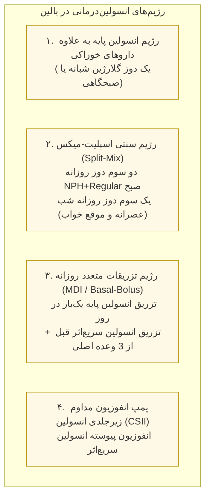

> [!tip] تکنیک صحیح تزریق انسولین
> 
> - **زاویه ورود سوزن:** زاویه **90 درجه** در بافت‌های دارای چربی کافی؛ زاویه **45 درجه** در افراد لاغر یا کودکان جهت پرهیز از تزریق عضلانی.
>     
> - **سایت‌های تزریق:** دیواره شکم (سریع‌ترین نرخ جذب)، بازوها، بخش قدامی ران و باسن؛ ضرورت گردش منظم موضع تزریق (Rotation) جهت جلوگیری از پدیده لیپودیستروفی و جذب غیرقابل پیش‌بینی انسولین.
>     

## ۱۶. درخت تصمیم‌گیری الگوریتم درمانی در دیابت نوع ۲

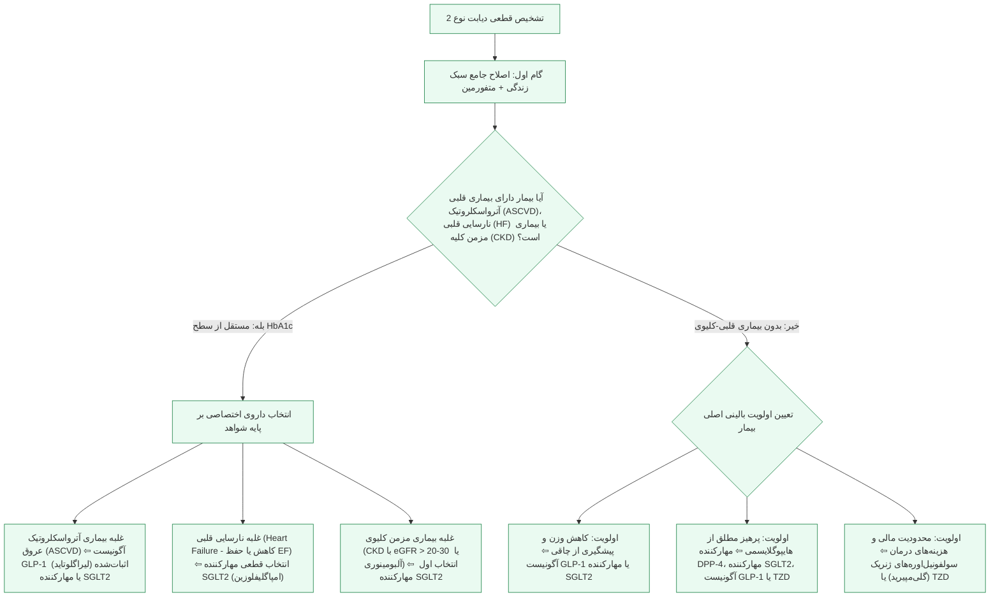

## ۱۷. استراتژی فردی‌سازی اهداف درمانی (Individualized HbA1c Targets)

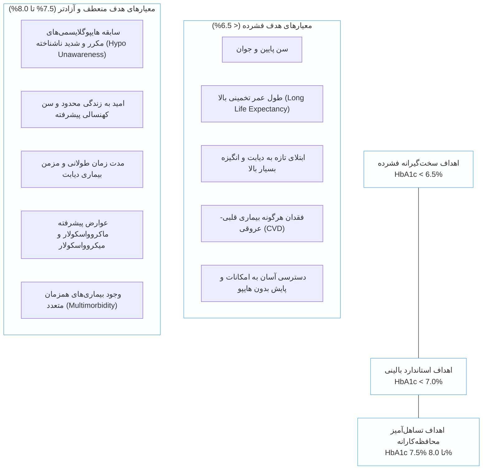

## ۱۸. جمع‌بندی استراتژیک تله‌های تستی و نکات امتحانی

1. **ارزیابی در حضور بیماری‌های غیرتیروئیدی و سندرم‌های خونی:** هر عاملی که طول عمر گلبول قرمز را کوتاه کند، هموگلوبین A1c را **به طور کاذب پایین** نشان می‌دهد؛ فقر آهن، نارسایی کلیه (افزایش کاربامیلاسیون هموگلوبین) و الکل سطح آن را **به طور کاذب بالا** می‌برند.
    
2. **پایش در پیوند و فیبروز کیستیک:** هم در ترنسپلنت (PTDM) و هم در سیستیک فایبروزیس (CFRD)، ابزار طلایی غربالگری **تست 2h-OGTT 75g** است و هموگلوبین A1c ارزش ارزیابی ندارد.
    
3. **درمان انتخابی اولیه در دیابت بارداری:** مداخله تغذیه‌ای و اصلاح لایف‌استایل است؛ در صورت عدم دستیابی به اهداف گلوکز، خط اول دارویی منحصراً **انسولین انسانی** است.
    
4. **شروع دومرحله‌ای متفورمین:** اگر در زمان تشخیص، هموگلوبین A1c بیمار **1.5% فراتر از حد هدف فردی** باشد، آغاز همزمان **دو داروی مهارکننده قند** از همان روز اول درمان مجاز و توصیه‌شده است.
    
5. **شروع مستقیم انسولین در دیابت نوع ۲:** در شرایط کاتابولیک شدید، کاهش وزن پیشرونده، قند خون تصادفی **بیش از 300 mg/dL** یا هموگلوبین A1c **بیش از 10% تا 11%**، آغاز مستقیم **انسولین‌درمانی** از بدو تشخیص اجباری است.
