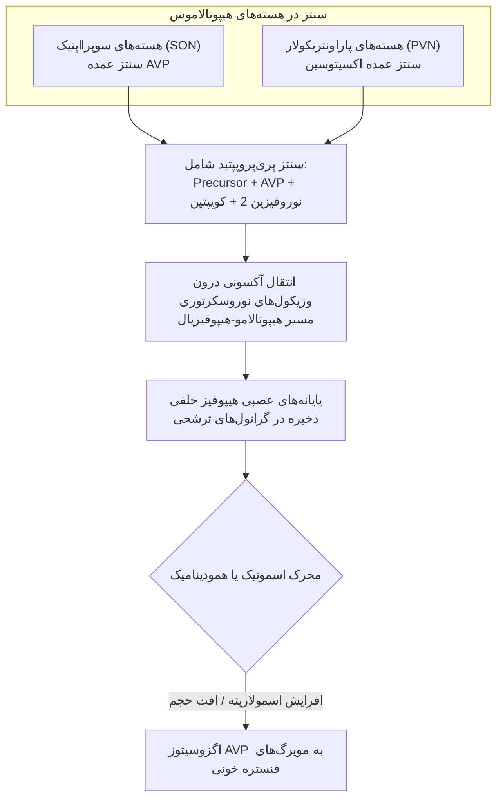
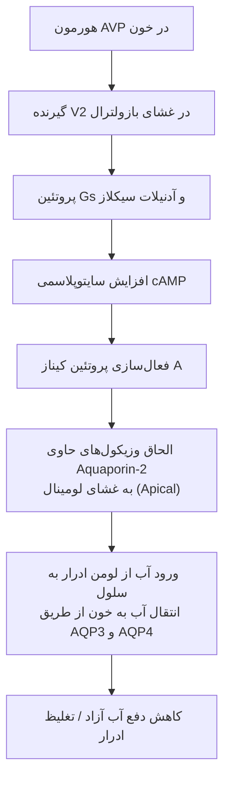
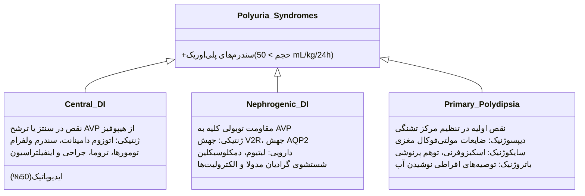
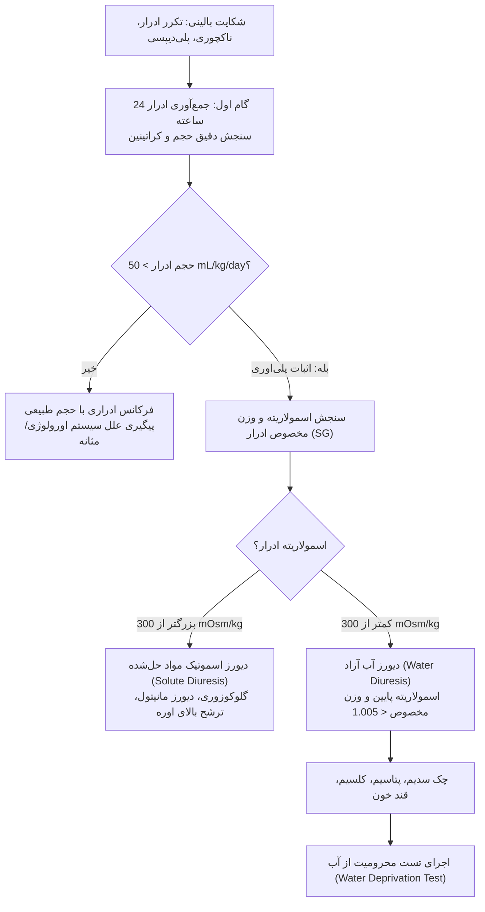
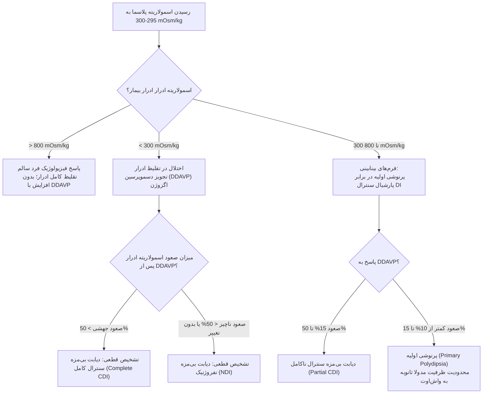
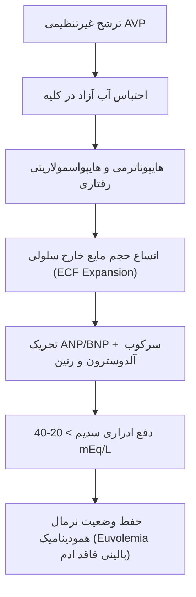
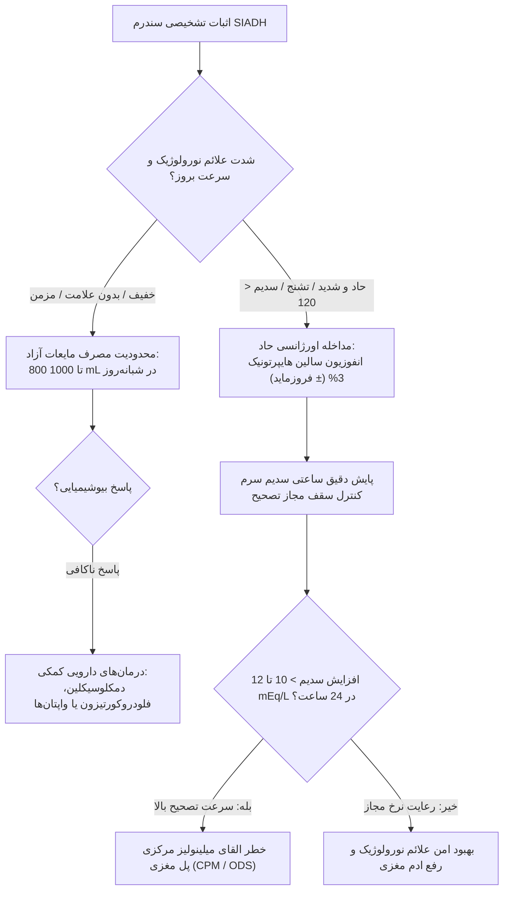

# هیپوفیز خلفی: وازوپرسین، دیابت بی‌مزه و SIADH

## ۱. آناتومی تکاملی، نوروبیولوژی و بیوسنتز هورمون‌های نوروهیپوفیز

> [!definition] هیپوفیز خلفی (نوروهیپوفیز / Neurohypophysis)
> 
> ساختار عصبی با منشأ جنینی از کف بطن سوم مغز؛ متشکل از پایانه‌های آکسونی فاقد میلین نورون‌های مگوسلولار ترشحی مستقر در هسته‌های هیپوتالاموس که نقش ترشح و مخزن هورمونی را ایفا می‌کند.

### تمایز بنیادین آدنوهیپوفیز و نوروهیپوفیز

- **آدنوهیپوفیز (قدامی):** منشأ اندودرمال/اکتودرمال دهانی (کیسه راتکه)؛ ساختار سلولی اپیتلیال آندوکرین حقیقی؛ سنتز و ترشح مستقل هورمونی تحت کنترل عروق پورتال هیپوتالاموس.
    
- **نوروهیپوفیز (خلفی):** خاستگاه نوروانکتودرمال مغزی (امتداد مستقیم بافت مغز)؛ فاقد سلول‌های ترشحی آندوکریتی اولیه؛ ساختار عصبی ذخیره‌سازی و رهایش نوروپپتیدها.
    

### نوروهورمون‌های ترشحی و خاستگاه سلولی

1. **اکسیتوسین (Oxytocin):** سنتز در نورون‌های هسته _پاراونتریکولار (PVN)_؛ القای انقباض عضلات صاف میومتر رحم حین زایمان؛ القای انقباض سلول‌های میواپیتلیال مجاری پستان و رفلکس خروج شیر (_Milk Letdown_).
    
2. **هورمون ضدادراری (ADH / AVP / Arginine Vasopressin):** سنتز عمده در هسته‌های _سوپرااپتیک (SON)_ و پاراونتریکولار هیپوتالاموس؛ تنظیم بازجذب آب آزاد در کلیه و مهار دهیدراسیون.
    

> [!important] بیومارکرهای بیوسنتز وازوپرسین
> 
> وازوپرسین به صورت یک پلی‌پپتید پیش‌ساز مشترک به همراه **نوروفیزین ۲ (Neurophysin II)** و **کوپپتین (Copeptin)** سنتز و درون وزیکول‌ها به قطعات فعال شکسته می‌شود. کوپپتین پایدارتر از AVP بوده و به عنوان نشانگر معادل ترشح هورمون در بالین ارزیابی می‌شود.

## ۲. فیزیولوژی تنظیم اسمولاریته، گیرنده‌های AVP و مرکز تشنگی

### اسمورسپتورها و آستانه ترشح هورمون

- **اسمورسپتورهای هیپوتالاموس:** حسگرهای حساس در دیواره قدامی بطن سوم؛ تشخیص تغییرات بسیار ریز فشار اسمزی موثر پلاسما.
    
- **آستانه تحریک ترشحی (Set Point):** حدود **280 mOsm/kg** پلاسما؛ تحت کنترل ساختار ژنتیکی فرد.
    
- **اسمولاریته موثر در برابر غیرموثر:** کاتیون **سدیم پلاسما** تعیین‌کننده اصلی اسمولاریته موثر است؛ اوره و گلوکز در شرایط فیزیولوژیک آزادانه از غشا عبور کرده و اسمولیت غیرموثر هستند (مگر در موارد هایپرگلیسمی شدید یا اورمی پیشرفته).
    

فرمول اسمولاریته سرم:

$$\text{Osmolality} = 2[\mathrm{Na}^+] + \frac{\mathrm{Glucose}}{18} + \frac{\mathrm{BUN}}{2.8}$$

فرمول اسمولاریته موثر (Effective Osmolality / Tonicity):

$$\text{Effective Osmolality} \approx 2[\mathrm{Na}^+]$$

### مقایسه عملکردی گیرنده‌های وازوپرسین (V1 در برابر V2)

| **پارامتر فیزیولوژیک**     | **گیرنده V1a (Vascular)**                              | **گیرنده V2 (Renal)**                                              |
| -------------------------- | ------------------------------------------------------ | ------------------------------------------------------------------ |
| **مکان استقرار بافتی**     | عضلات صاف جدار عروق سیستمیک                            | غشای قاعده‌ای-جانبی (_Basolateral_) سلول‌های اصلی توبول جمع‌کننده  |
| **سیستم پیام‌رسان ثانویه** | فسفولیپاز C و یون کلسیم внутри‌سلولی (_IP₃ / DAG_)     | آدنیلات سیکلاز و افزایش **cAMP** درون سلول                         |
| **اثر بیولوژیک نهایی**     | انقباض عروقی (_Vasoconstriction_) و بالا بردن فشار خون | جابجایی وزیکول‌ها و الحاق کانال‌های **آکواپورین ۲ (AQP2)** به لومن |
| **محرک فیزیولوژیک آغازگر** | کاهش شدید حجم داخل عروقی، افت بارورفلاکس‌ها و شوک      | افزایش اسمولاریته موثر پلاسما به مقادیر فراتر از **280 mOsm/kg**   |

### طیف توان تقلیظ و ترقیق ادرار توسط کلیه

- **حداکثر اثر هورمون AVP:** کاهش حجم ادرار تا **0.35 mL/min**؛ افزایش اسمولاریته ادرار تا مرز **1200 mOsm/kg**.
    
- **غیاب کامل هورمون AVP:** افزایش حجم ادرار تا **0.2 mL/kg/min** (حجم روزانه تا **20 لیتر در روز**)؛ سقوط اسمولاریته ادرار تا **50 mOsm/kg**؛ افت وزن مخصوص ادرار (_Specific Gravity_) به سطح **1.000 تا 1.002**.
    

### مرکز تشنگی و رابطه دینامیک با AVP

- **موقعیت مرکز تشنگی:** ناحیه ونترومدیال هیپوتالاموس (_Anteromedial Hypothalamus_).
    
- **اختلاف ست‌پوینت (Set Point Offset):** آستانه تحریک مرکز تشنگی حدود **5% بالاتر** از آستانه ترشح هورمون وازوپرسین تنظیم شده است.
    
- **توالی خطوط دفاعی در دهیدراسیون:**
    
    1. ابتدا اسمولاریته به **280 mOsm/kg** می‌رسد ⇦ فعال‌سازی حداکثری ترشح هورمون AVP و احتباس آب توسط کلیه.
        
    2. در صورت پیشرفت کم‌آبی و عبور اسمولاریته از **285 mOsm/kg** ⇦ تحریک قوی مرکز تشنگی و آغاز پرنوشی برای جبران آب آزاد.
        

## ۳. تعریف، طبقه‌بندی و پاتوفیزیولوژی دیابت بی‌مزه (DI)

> [!definition] دیابت بی‌مزه (Diabetes Insipidus / DI)
> 
> سندرم بالینی دفع مقادیر مفرط ادرار فاقد گلوکز، هیپوتونیک، رقیق و کم‌سدیم، ناشی از نقص در سنتز/ترشح AVP یا نقص در پاسخ سلول‌های توبول کلیه به AVP. واژه Insipidus به معنی بی‌مزه (فاقد قند، در تمایز تاریخی با Mellitus شیرین) است.

### تعریف کمّی و تشخیصی پلی‌اوری (Polyuria)

- **شاخص استاندارد بالینی:** دفع حجم ادرار بیش از **50 mL/kg در ۲۴ ساعت** (معادل دفع بیش از **3500 mL در شبانه‌روز** در یک فرد بالغ ۷۰ کیلوگرمی).
    
- **علائم همودینامیک و مجاری ادراری:** فرکانس بالای ادرار (_Frequency_)، شب‌ادراری (_Enuresis_)، و بیدار شدن مکرر شبانه جهت دفع ادرار (_Nocturia_).
    
- **مکانیسم تعادلی:** ظهور پلی‌دیپسی ثانویه؛ تا زمان حفظ هوشیاری و دسترسی آزاد به مایعات، دهیدراسیون تهدیدکننده رخ نخواهد داد.
    

## ۴. آنالیز جامع اتیولوژی‌های دیابت بی‌مزه و پرنوشی اولیه

### ۱. دیابت بی‌مزه مرکزی (Central DI / Neurogenic)

- **ایدیوپاتیک:** مسئول **50% کل موارد** دیابت بی‌مزه سنترال بدون علت آناتومیک مشخص.
    
- **فرم‌های ارثی و ژنتیکی:**
    
    - اتوزومال غالب: نقص در ژن پیش‌ساز _AVP-Neurophysin II_؛ بروز تدریجی علائم از ماه‌ها یا سال‌ها پس از تولد توأم با اختلال در رشد و تکامل نوزاد (**Failure to Thrive / FTT**).
        
    - اتوزومال مغلوب: **سندرم ولفرام (Wolfram Syndrome / DIDMOAD)**؛ تتراد بالینی شامل:
        
        1. **DI:** دیابت بی‌مزه سنترال.
            
        2. **DM:** دیابت ملیتوس زودرس.
            
        3. **OA:** آتروفی پیشرونده عصب بینایی (_Optic Atrophy_).
            
        4. **D:** ناشنوایی حسی-عصبی دوجانبه (_Sensorineural Deafness_).
            
- **علل اکتسابی (Acquired):**
    
    - تومورهای اولیه یا متاستاتیک (متاستاز سرطان‌های پستان و کولورکتال به هیپوفیز).
        
    - بیماری‌های ارتشاحی و گرانولوماتوز: **سارکوئیدوز**، **گرانولوماتوز با پلی‌آنژئیت (وگنر)** و **هیستیوسیتوز سلول لانگرهانس (Histiocytosis X)**.
        
    - ضایعات عروقی، ترومای جمجمه و جراحی‌های ترانس‌اسفنوئیدال یا هیپوتالاموس.
        
    - دیابت بی‌مزه بارداری (_Gestational DI_): ناشی از ترشح بیش از حد آنزیم جفتی وازوپرسیناز که موجب هیدرولیز سریع AVP در گردش خون می‌گردد.
        

### ۲. پرنوشی اولیه (Primary Polydipsia)

- **فرم دیپسوژنیک (Dipsogenic):** افت پاتولوژیک آستانه تشنگی در هیپوتالاموس ناشی از بیماری‌های ارگانیک مولتی‌فوکال مغزی نظیر **نوروسارکوئیدوز**، **مننژیت سلی (TB)** و **مولتیپل اسکلروزیس (MS)**.
    
- **فرم سایکوژنیک (Psychogenic):** پرنوشی وسواسی و هذیانی در زمینه بیماری‌های روانپزشکی به ویژه اسکیزوفرنی.
    
- **فرم یاتروژنیک (Iatrogenic):** پرنوشی ناشی از توصیه‌های اشتباه غذایی برای آشامیدن مقادیر مفرط آب به منظور ارتقای سلامت.
    

### ۳. دیابت بی‌مزه کلیوی (Nephrogenic DI)

- **نقص‌های ژنتیکی مادرزادی:**
    
    - وابسته به کروموزوم X (حدود 90% موارد): موتاسیون غیرفعال‌کننده ژن گیرنده _V2R_.
        
    - اتوزومال مغلوب (حدود 10% موارد): جهش ژن سازنده کانال پروتئینی _Aquaporin-2_.
        
- **سمیت‌های دارویی اختصاصی:** مصرف داروی **لیتیوم کربنات** (با ورود از طریق کانال ENaC غشای لومینال و مهار آبشار داخل سلولی cAMP)؛ دمکلوسیکلین و آمفوتریسین B.
    
- **اختلالات الکترولیتی القاکننده مقاومت کلیوی:** **هایپوکالمی** شدید مزمن و **هایپرکلسمی**.
    
- **پدیده شستشوی گرادیان غلظت مدولا (Medullary Washout):** پولی‌اوری به هر علتی می‌تواند هایپرتونیسیته بینابینی مغز کلیه را بشوید؛ شایع‌ترین سناریو در **فاز نقاهت نارسایی حاد کلیه (Recovery phase of AKI)**؛ دفع شدید ادرار رقیق ظرف ۲۴ تا ۴۸ ساعت (احتیاط بالینی: ممانعت از دهیدراسیون شدید و ایجاد مجدد AKI).
    

## ۵. مقایسه جامع تظاهرات بالینی اتیولوژی‌های پلی‌اوری و پلی‌دیپسی

| **شاخص بالینی**               | **دیابت بی‌مزه سنترال (CDI)**                      | **دیابت بی‌مزه نفروژنیک (NDI)**           | **پرنوشی اولیه (سایکوژنیک)**                  |
| ----------------------------- | -------------------------------------------------- | ----------------------------------------- | --------------------------------------------- |
| **شروع بالینی علائم**         | **ناگهانی و دقیق** (بیمار روز شروع را به یاد دارد) | تدریجی یا مرتبط با شروع دارو              | بسیار تدریجی و مبهم در طول زمان               |
| **تمایل ویژه به نوع مایع**    | **ولع شدید به مصرف آب یخ و سرد**                   | بدون ترجیح اختصاصی مایعات                 | بدون تمایل ویژه به دمای آب                    |
| **پلی‌اوری و ناکچوری شبانه**  | **پایدار و شدید در طول شب**                        | **پایدار و مداوم در طول شب**              | **فقدان ناکچوری** (در زمان خواب آب نمی‌نوشند) |
| **ارتباط با استرس‌های روانی** | عدم وابستگی به سطح استرس                           | عدم وابستگی به سطح استرس                  | **تشدید بارز علائم در مواجهه با استرس**       |
| **سطح سدیم پایه پلاسما**      | در محدوده طبیعی متمایل به بالا (High-normal)       | در محدوده طبیعی متمایل به بالا            | در محدوده طبیعی متمایل به پایین (Low-normal)  |
| **سابقه دارویی و ارگانیک**    | ترومای سر، جراحی مغز، تومور هیپوفیز                | **مصرف لیتیوم**، نارسایی کلیه، هایپرکلسمی | بیماری‌های سایکیاتریک، اسکیزوفرنی             |

## ۶. گام‌های تشخیصی، آزمون محرومیت از آب و تست دسموپرسین

### ارزیابی اولیه و اثبات ماهیت پلی‌اوری

> [!tip] شاخص ارزیابی صحت جمع‌آوری ادرار ۲۴ ساعته
> 
> به منظور اطمینان از جمع‌آوری دقیق ادرار شبانه‌روز، دفع کراتینین محاسبه می‌شود (مستقل از میزان نوشیدن آب و صرفاً وابسته به توده عضلانی):
> 
> - **در خانم‌ها:** 15 تا 20 میلی‌گرم به ازای هر کیلوگرم وزن بدن.
>     
> - **در آقایان:** 20 تا 25 میلی‌گرم به ازای هر کیلوگرم وزن بدن.
>     

### پروتکل اجرایی آزمون محرومیت از آب (Miller-Moses Protocol)

1. **شرایط اجرا:** بستری در بیمارستان تحت نظارت دقیق بالینی برای پیشگیری از دهیدراسیون شدید.
    
2. **پایش ساعتی متغیرها:** وزن بیمار، فشار خون، نبض، سطح سرمی سدیم، اسمولاریته سرم، اسمولاریته ادرار و وزن مخصوص (_SG_).
    
3. **شاخص‌های خاتمه فاز محرومیت:**
    
    - پایدار شدن اسمولاریته ادرار (افزایش کمتر از 5% در ۲ تا ۳ نمونه ساعتی متوالی).
        
    - یا صعود اسمولاریته پلاسما به مرز **295 تا 300 mOsm/kg** (معادل سدیم سرم **145 mEq/L** یا بالاتر).
        
    - یا افت بیش از 3% تا 5% وزن پایه بدن به دلیل کم‌آبی.
        
4. **مداخله دارویی تشخیصی:** تزریق زیرجلدی یا تجویز عضلانی/مخاطی **2 تا 4 میکروگرم دسموپرسین (DDAVP)** و ثبت اسمولاریته ادرار ۳۰، ۶۰ و ۱۲۰ دقیقه بعد.
    

### تفسیر بیوشیمیایی نتایج آزمون محرومیت از آب

> [!important] نقطه روشن هیپوفیز خلفی در MRI (Bright Spot)
> 
> در تصاویر وزن‌یافته T1 هیپوفیز نرمال، تجمع فسفولیپیدها و گرانول‌های ذخیره‌ای وازوپرسین در هیپوفیز خلفی نمایی هایپراینتنس یا **نقطه درخشان (Bright Spot)** ایجاد می‌کند.
> 
> - **رویت Bright Spot:** دیابت بی‌مزه سنترال به صورت قاطع **رد می‌شود** (به نفع پرنوشی اولیه).
>     
> - **فقدان Bright Spot:** به تنهایی ارزش تشخیصی ندارد؛ زیرا در حدود 10% افراد کاملاً نرمال نیز ممکن است دیده نشود.
>     

### تحلیل کیس آموزشی بالینی مرجع درس

- **مشخصات بیمار:** مرد ۴۵ ساله، وزن ۵۲ کیلوگرم، مراجعه با شکایت پلی‌اوری و پلی‌دیپسی مداوم از ۱ ماه پیش، ولع شدید به مصرف آب سرد و یخ، بیدار شدن مکرر با ناکچوری؛ بدون سابقه ترومای سر، فاقد سابقه خانوادگی و دارویی.
    
- **ارزیابی آزمایشگاهی اولیه:** حجم ادرار ۲۴ ساعته: **10 لیتر**؛ وزن مخصوص: **کمتر از 1.004**؛ اسمولاریته ادرار: **140 mOsm/kg**؛ سدیم پلاسما، پتاسیم، کلسیم و گلوکز همگی در محدوده طبیعی.
    
- **روند آزمون محرومیت از آب:** پس از ۴ ساعت محرومیت از آب، سدیم پلاسما به **145 mEq/L** صعود کرد اما وزن مخصوص ادرار بدون هیچ‌گونه تغلیظ در سطح **1.004** باقی ماند.
    
- **تست چالش دسموپرسین:** بلافاصله پس از تجویز دسموپرسین، وزن مخصوص ادرار بیمار از **1.004 به 1.024 صعود کرد** (پاسخ تشخیصی دراماتیک بیش از ۵۰ درصد ⇦ اثبات نقص ترشح مرکزی هورمون و **تایید سنترال DI**).
    

## ۷. استراتژی‌های جامع درمانی انواع دیابت بی‌مزه

### ۱. پروتکل درمان دیابت بی‌مزه مرکزی (CDI)

- **داروی انتخابی استاندارد:** **دسموپرسین (DDAVP)**؛ آگونیست صناعی انتخابی گیرنده V2 بدون فعالیت بر گیرنده‌های فشاری V1a.
    
- **اشکال دارویی مصرفی:** اسپری داخل بینی (_Nasal Spray_)، قرص‌های حل‌شونده تحت زبانی (_Sublingual Melt_)، قرص خوراکی، و آمپول تزریقی (وریدی/زیرجلدی).
    
- **هدف تیتراسیون دوز:** رفع ناکچوری شبانه و تنظیم حجم ادرار روزانه؛ احتیاط در تجویز مقادیر بالا به منظور جلوگیری از احتباس مایع و هایپوناترمی رقتاری.
    

### ۲. رویکرد به پرنوشی اولیه (Primary Polydipsia)

- **پروتکل اصلی:** **محدودیت مصرف آب** و مشاوره رفتاری/روانپزشکی جهت مهار رفتارهای وسواسی.
    

> [!warning] خطای مرگبار تجویز دسموپرسین در پرنوشی اولیه
> 
> تجویز DDAVP در مبتلایان به پرنوشی اولیه اکیداً **ممنوع** است. از آنجا که محرک نوشیدن آب در این بیماران وسواس یا اختلال مرکزی است، تجویز وازوپرسین دفع آب را مسدود کرده، آب در گردش خون حبس شده و بیمار به سرعت دچار **مسمومیت کشنده با آب (Water Intoxication)**، هایپوناترمی شدید و ادم مغزی می‌گردد.

### ۳. استراتژی درمان دیابت بی‌مزه کلیوی (NDI)

- رویکرد به دلیل مقاومت گیرنده‌های توبولی بسیار چالش‌برانگیز است:
    
    1. **رژیم غذایی کم‌سدیم و کم‌پروتئین:** کاهش بار محلول‌های دفعی ادرار به منظور تقلیل اجباری حجم ادرار نهایی.
        
    2. **دیورتیک‌های تیازیدی (هیدروکلروتیازید):** مهار انتقال سدیم-کلر در توبول دیستال ⇦ القای تخلیه نسبی سدیم ⇦ افت ملایم حجم موثر داخل عروقی ⇦ بازجذب جبرانی آب و سدیم در توبول پروگزیمال کلیه ⇦ کاهش ورود مایع به لوله‌های جمع‌کننده و افت پلی‌اوری تا 50%.
        
    3. **آمیلوراید (Amiloride):** **پادزهر اختصاصی نفروپاتی ناشی از لیتیوم**؛ بلوک مستقیم کانال‌های سدیمی لومینال اپیتلیال (ENaC) ⇦ ممانعت فیزیکی از ورود لیتیوم به داخل سیتوپلاسم سلول‌های توبول جمع‌کننده.
        
    4. **مهارکننده‌های سنتز پروستاگلاندین (NSAIDs نظیر ایندومتاسین):** مهار پروستاگلاندین‌های کلیوی (پروستاگلاندین‌ها آنتاگونیست طبیعی AVP هستند) ⇦ تقویت عملکرد باقیمانده هورمون بر بازجذب آب.
        

## ۸. سندرم ترشح نابجای هورمون ضدادراری (SIADH)

> [!definition] سندرم ترشح نابجای هورمون ضدادراری (SIADH)
> 
> ترشح مداوم، خودمختار و غیرفیزیولوژیک هورمون وازوپرسین علی‌رغم کاهش اسمولاریته سرم و در حضور حجم موثر داخل عروقی طبیعی؛ با احتباس آب آزاد، هایپوناترمی رقتاری، هایپواسمولاریتی پلاسما، و ترشح متناقض ادرار غلیظ تظاهر می‌یابد.

### پاتوفیزیولوژی و فازهای تعادل آب و الکترولیت در SIADH

### علل و اتیولوژی‌های زمینه‌ای القاکننده SIADH

1. **بیماری‌های نئوپلاستیک (تولید اکتوپیک هورمون):** **سرطان ریه سلول کوچک (SCLC)** (شایع‌ترین بدخیمی)، تومورهای سر و گردن.
    
2. **ضایعات و تروماهای ریوی:** پنومونی‌های باکتریایی و ویروسی، آبسه ریه، توبرکولوز و نارسایی تنفسی.
    
3. **اختلالات سیستم عصبی مرکزی (CNS):** سکته مغزی ایسکمیک یا هموراژیک، تروماهای مغزی، مننژیت، آنسفالیت، ساب‌آراکنوئید هموریج.
    
4. **داروهای القاکننده:** داروهای ضدتشنج (**کاربامازپین**)، ضدافسردگی‌ها (SSRIs، ضدافسردگی‌های سه‌حلقه‌ای)، داروهای شیمی‌درمانی (وین‌کریستین، سیکلوفسفامید)، داروهای ضدالتهاب غیراستروئیدی (NSAIDs).
    
5. **سایر علل سیستمیک:** ابتلا به ویروس **HIV** و استرس‌های ماژور حاد فیزیکی.
    

## ۹. تظاهرات بالینی، خطرات ادم مغزی و معیارهای تشخیصی بارتر-شوارتز

### پاتولوژی ادم سلول‌های مغزی در مواجهه با هایپواسمولاریتی

- سلول‌های قشر مغز در محیط هایپواسمولار پلاسما به دلیل اسمولاریته درونی بالاتر، دچار هجوم اسموتیک آب به درون سلول و **ادم سایتوتوکسیک داخل جمجمه‌ای** می‌شوند.
    
- **سرعت افت سدیم:** متغیر کلیدی تظاهر بالینی؛ در موارد حاد (کمتر از ۴۸ ساعت) فرصت تطابق با خروج اسمولیت‌های سلولی وجود نداشته و ریسک **فتق مغزی، کما و تشنج** بالاست.
    
- **طیف بالینی:** از سردرد، تهوع، بی‌اشتهایی و استفراغ در موارد خفیف تا تحریک‌پذیری، لتارژی، حوادث تشنجی، استوپور و مرگ در هایپوناترمی حاد و شدید.
    

### معیارهای استاندارد تشخیصی بارتر-شوارتز (Bartter-Schwartz Criteria)

1. **هایپوناترمی هیپوتونیک حقیقی:** غلظت سدیم سرم **کمتر از 134 mEq/L** همراه با اسمولاریته سرم **کمتر از 280 mOsm/kg**.
    
2. **تغلیظ نامتناسب ادرار:** اسمولاریته ادرار **بیش از 100 mOsm/kg** (معمولاً فراتر از 300 mOsm/kg؛ وزن مخصوص بالاتر از 1.005) در مواجهه با هیپواسمولاریتی شدید خون.
    
3. **وضعیت حجم مایعات بالینی یوبولمیک (Euvolemic):** فقدان هرگونه شواهد دهیدراسیون بالینی (ارتواستاتیسم، افت تورگور) و نبود شواهد افزایش حجم خارج سلولی (ادم ژنرالیزه، آسیت، رال ریوی).
    
4. **دفع بالای سدیم ادراری:** غلظت سدیم ادرار **بیشتر از 20 تا 40 mEq/L** در حضور مصرف طبیعی نمک.
    
5. **عملکرد طبیعی سایر غدد و ارگان‌ها:** سلامت کامل عملکرد بافت کلیه (کراتینین و اوره طبیعی یا پایین به علت همودیلوشن)، سلامت کامل غده آدرنال (رد نارسایی آدرنال با کورتیزول طبیعی) و عملکرد نرمال غده تیروئید.
    

## ۱۰. جدول تشخیصی افتراقی انواع هایپوناترمی

> [!important] شایع‌ترین اختلال الکترولیتی بیماران بستری
> 
> هایپوناترمی شایع‌ترین اختلال بیوشیمیایی در بخش‌های بستری بیمارستانی است؛ تفکیک بالینی حجم داخل عروقی (Volume Status) رکن اصلی تشخیص اتیولوژی به شمار می‌رود.

| **نوع هایپوناترمی بر پایه حجم**            | **مکانیسم ایجاد اختلال**                     | **شاخص‌های بیوشیمیایی و ادراری**                                | **شایع‌ترین بیماری‌ها و اتیولوژی‌ها**                           |
| ------------------------------------------ | -------------------------------------------- | --------------------------------------------------------------- | --------------------------------------------------------------- |
| **هایپوناترمی هایپوولمیک (Hypovolemic)**   | اتلاف همزمان آب و سدیم (با اتلاف بیشتر نمک)  | سدیم ادرار < 20 در علل خارج‌کلیوی؛ سدیم ادرار > 20 در علل کلیوی | دهیدراسیون، استفراغ، اسهال، دیورتیک‌ها، کمبود مینرالوکورتیکوئید |
| **هایپوناترمی هایپروولمیک (Hypervolemic)** | اتساع حجم کل آب بدن فراتر از نمک توأم با ادم | سدیم ادرار معمولاً < 20 mEq/L (احتباس واکنشی شدید کلیه)         | **نارسایی احتقانی قلب (CHF)**، **سیروز کبدی**، سندرم نفروتیک    |
| **هایپوناترمی یوبولمیک (Euvolemic)**       | اتساع آب آزاد بدون تجمع ادم محیطی            | **سدیم ادرار بالاتر از 20 تا 40 mEq/L**؛ اسمولاریته ادرار بالا  | **سندرم SIADH**، کمبود ثانویه آدرنال، هایپوتیروئیدی پیشرفته     |

## ۱۱. الگوریتم مداخله بالینی و پروتکل درمانی SIADH

### جزئیات خطوط درمانی دارویی در موارد مزمن

- **دمکلوسیکلین (Demeclocycline):** آنتی‌بیوتیک از خانواده تتراسایکلین؛ مهار مستقیم پاسخ سلول‌های توبول کلیه به AVP با القای تعمدی دیابت بی‌مزه نفروژنیک ملایم.
    
- **فلودروکورتیزون (Fludrocortisone):** افزایش بازجذب سدیم در توبول کلیوی و اتساع ملایم حجم داخل عروقی جهت کاهش ترشح وازوپرسین.
    
- **آنتاگونیست‌های گیرنده V2 وازوپرسین (واپتان‌ها / Vaptans):** شامل **کانی‌واپتان (Conivaptan)** وریدی و **تول‌واپتان (Tolvaptan)** خوراکی؛ بلوک مستقیم گیرنده‌های کلیوی هورمون و القای ترشح خالص آب بدون الکترولیت (_Aquaresis_).
    

> [!warning] تله امتحانی و بحران کشنده: سندرم میلینولیز مرکزی پل مغزی (CPM / ODS)
> 
> تصحیح با سرعت بالا و کنترل‌نشده سدیم در بیماران مبتلا به هایپوناترمی مزمن منجر به کم‌آبی حاد، چروکیدگی ناگهانی نورون‌ها و وقوع **سندرم دمیلیناسیون اسموتیک (ODS / Central Pontine Myelinolysis)** می‌گردد.
> 
> - **تظاهرات بالینی برگشت‌ناپذیر:** کوادری‌پلژی فلج‌کننده و اسپاستیک (_Quadriparesis_)، فلج عضلات بولبار، آتاکسی، سندرم قفل‌شدگی (_Locked-in syndrome_) و مرگ دائمی.
>     
> - **قانون سقف طلایی تصحیح سدیم:** افزایش سطح سرمی سدیم پلاسما **اکیداً نباید از مرز 8 تا 12 mEq/L در ۲۴ ساعت** تجاوز نماید.
>     
> - _مثال بالینی استاد:_ اگر سدیم پلاسما **110 mEq/L** باشد، در پایان ۲۴ ساعت اول رسیدن به سدیم حداکثر **120 تا 122 mEq/L** مجاز است؛ رساندن ناگهانی سدیم به حد نرمال (135) جنایت درمانی محسوب می‌شود.
>     

## ۱۲. جمع‌بندی استراتژیک نکات امتحانی و تله‌های تشخیصی

1. **تمایز پاتوژنز هیپوفیز قدامی و خلفی:** هیپوفیز قدامی غده اپیتلیال آندوکرین مستقل است؛ در حالی که هیپوفیز خلفی امتداد مستقیم فیبرهای عصبی هیپوتالاموس بوده و صرفاً نقش ذخیره و آزادسازی هورمون‌های ساخته‌شده در هیپوتالاموس را داراست.
    
2. **تشخیص افتراقی فرکانس ادراری از پلی‌اوری واقعی:** تکرر ادرار بدون افزایش حجم دفعی شبانه‌روز (زیر 50 mL/kg/24h) منشأ ژنیتواوریناری و مثانه داشته و نیاز به ورک‌آپ غدد ندارد.
    
3. **عدم سودمندی دسموپرسین در دیابت بی‌مزه بارداری:** در دیابت بی‌مزه حاملگی به علت تخریب آنزیمی توسط وازوپرسیناز جفتی، دسموپرسین به دلیل مقاومت در برابر آنزیم وازوپرسیناز داروی انتخابی بوده و برعکس هورمون بومی AVP به سرعت تخریب نمی‌شود.
    
4. **تله سنجش اسمولاریته در پلی‌اوری:** اسمولاریته ادراری بالاتر از 300 mOsm/kg نشان‌دهنده اتلاف ادراری املاح (نظیر گلوکز در کتواسیدوز دیابتی، اوره یا مانیتول) بوده و دیابت بی‌مزه را رد می‌کند؛ تشخیص DI منوط به ثبت اسمولاریته زیر 300 mOsm/kg است.
    
5. **ارزیابی محورهای همراه در هایپوناترمی:** پیش از الصاق قطعی برچسب SIADH، عملکرد طبیعی غدد آدرنال (اثبات نرمال بودن سطح کورتیزول صبحگاهی) و غده تیروئید الزامی است؛ زیرا کمبود گلوکوکورتیکوئید و هایپوتیروئیدی شدید تقلیدکننده دقیق هایپوناترمی با نمای SIADH هستند.