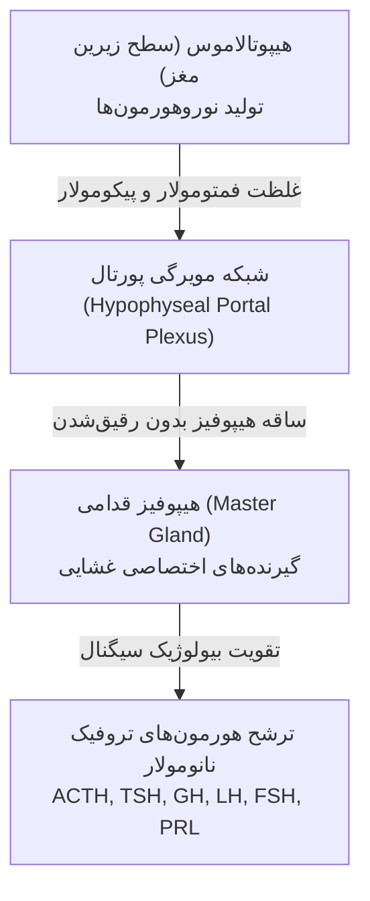
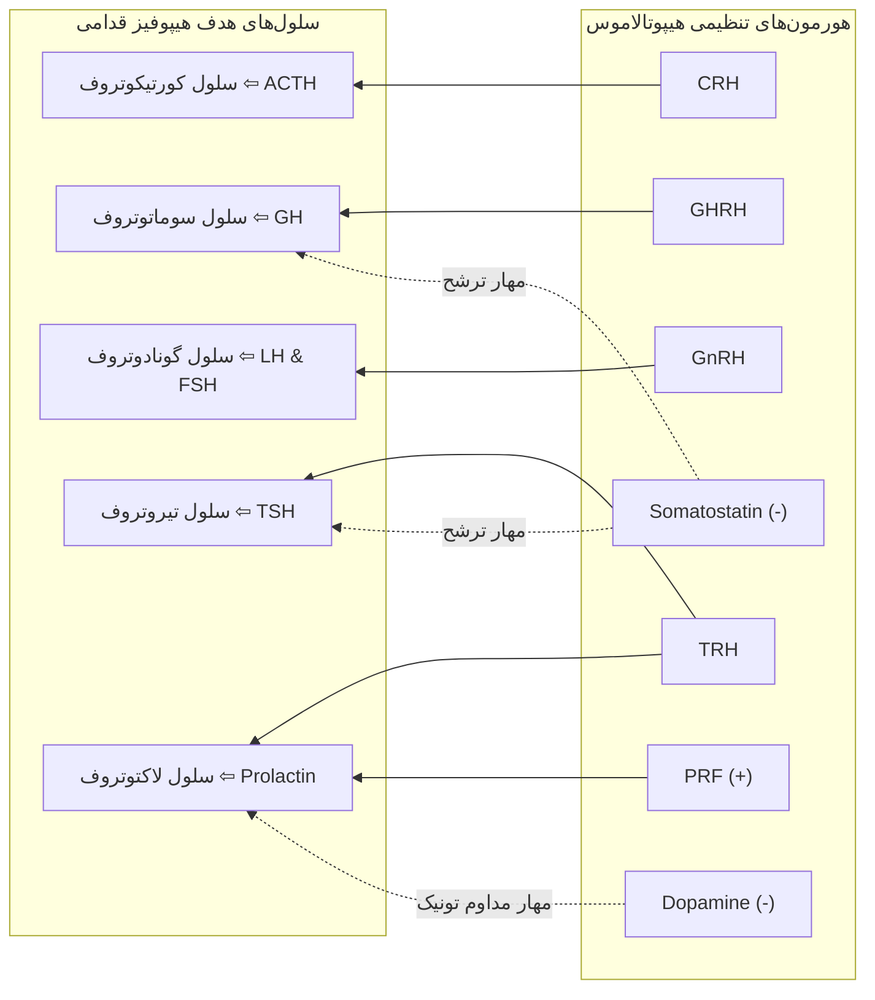
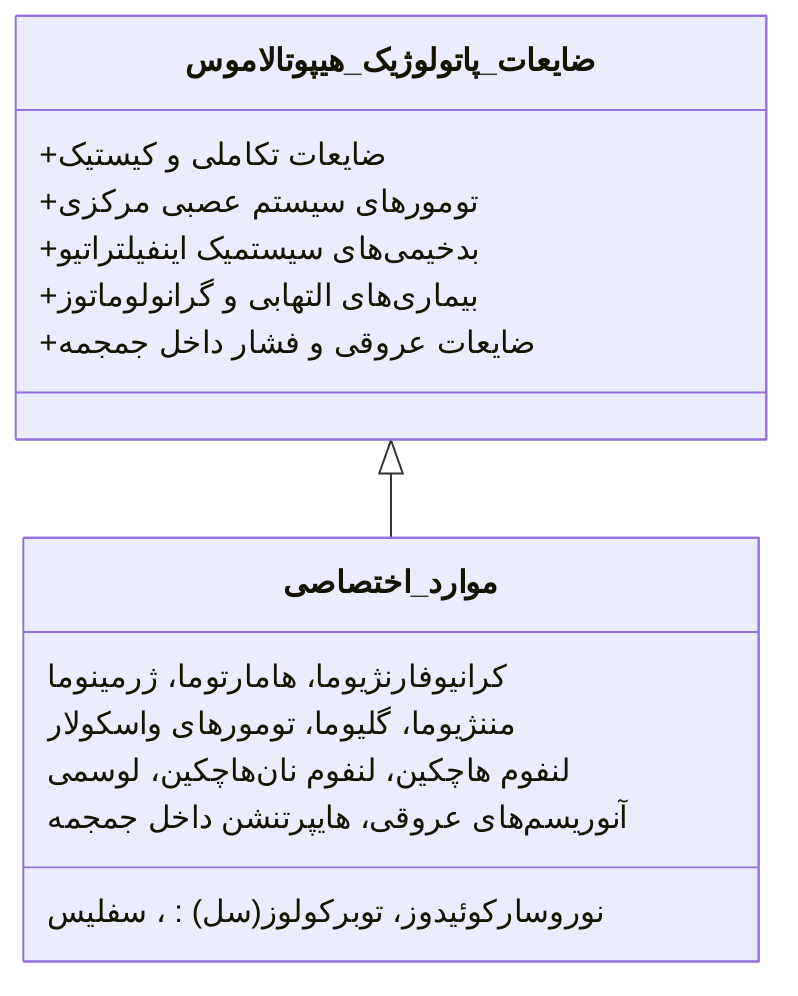
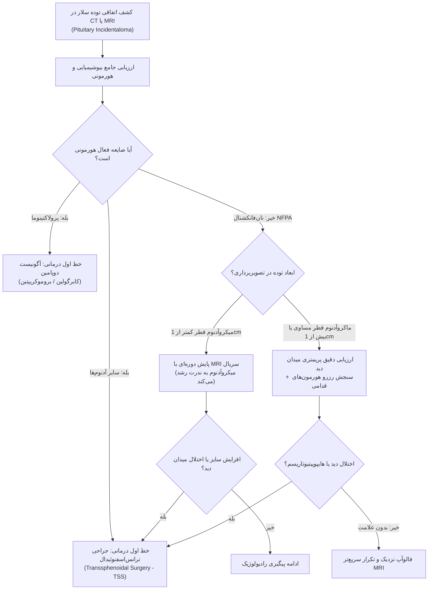
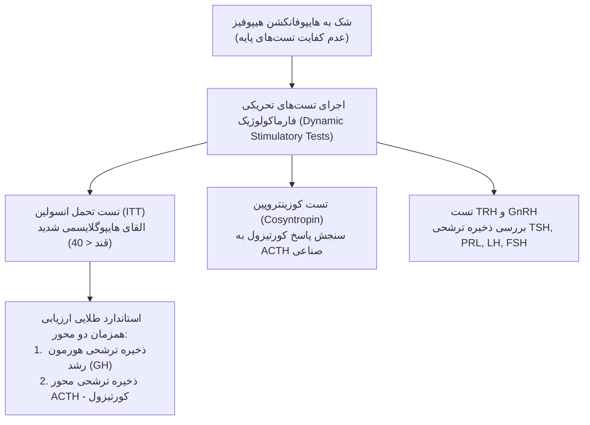
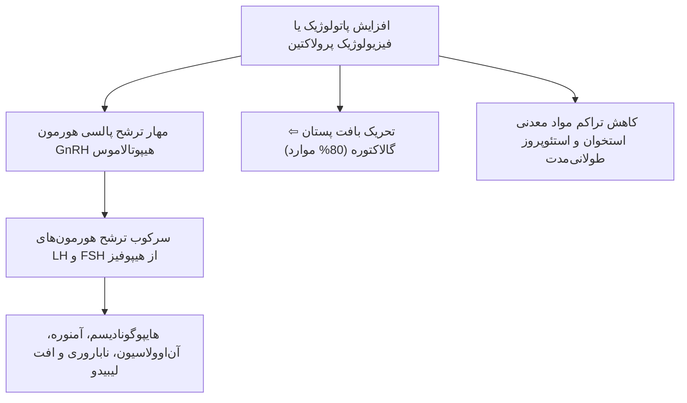
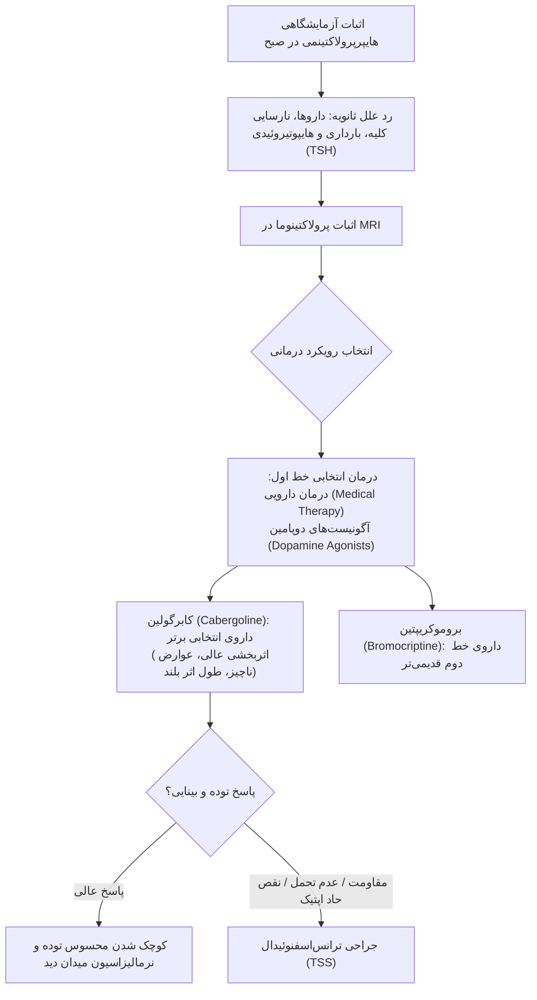
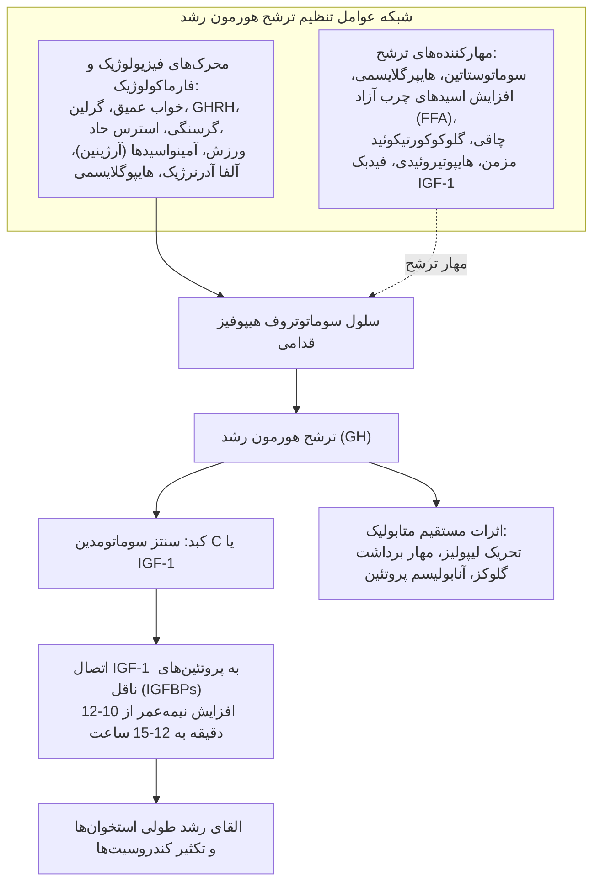
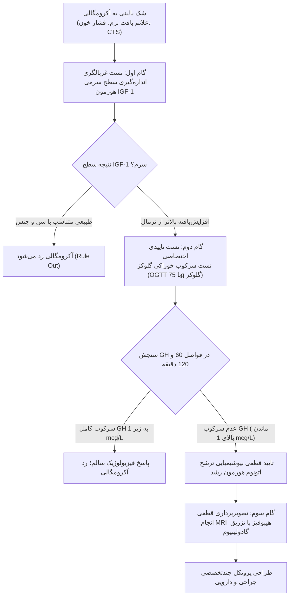
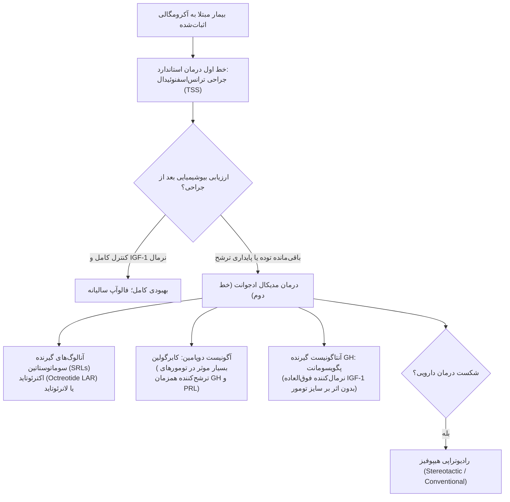

# نورواندوکرینولوژی بالینی: اختلالات هیپوفیز و هیپوتالاموس

## ۱. آناتومی بالینی، عروقی، اینترفیس هیپوتالاموس-هیپوفیز و ریتم‌های بیولوژیک

> [!definition] غده هیپوفیز (Pituitary Gland / Hypophysis)
> 
> ساختار بیضی‌شکل نورواندوکرین با وزن تقریبی 600 میلی‌گرم مستقر درون حفره استخوانی سلا تورسیکا (Sella Turcica)؛ مجزا از فضای زیر عنکبوتی و سایر بخش‌های مغز توسط پرده سخت‌شامه‌ای موسوم به دیافراگم سلا (Diaphragma Sellae).

### مجاورات و روابط توپوگرافیک

- **موقعیت طرفی (Lateral):** مجاورت مستقیم با دو سینوس کاورنوس؛ حاوی شریان کاروتید داخلی و اعصاب مغزی کرانیال 3، 4، شاخه‌های چشمی و فکی فوقانی عصب پنج (V1, V2) و عصب 6.
    
- **موقعیت فوقانی (Superior):** مجاورت بلاواسطه با ساقه هیپوفیز (Infundibulum / Pituitary Stalk) و تقاطع بینایی (Optic Chiasm).
    
- **موقعیت تحتانی (Inferior):** مجاورت با سینوس اسفنوئید؛ بستر و مدخل طلایی جراحی‌های ترانس‌اسفنوئیدال (TSS).
    

### خون‌رسانی و شبکه مویرگی پورتال

- **شریان‌های تغذیه‌کننده:** شریان‌های _هایپوفیزیال سوپریور_ و _هایپوفیزیال اینفریور_ (برخاسته از کاروتید داخلی).
    
- **شبکه پورتال هیپوتالاموس-هیپوفیز (Portal Plexus):** منبع اصلی تغذیه خونی لوب قدامی هیپوفیز (Adenohypophysis)؛ انتقال بی‌واسطه نوروهورمون‌های پپتیدی رهایش‌کننده و مهاری از هیپوتالاموس به آدنوهیپوفیز بدون رقیق شدن در گردش خون عمومی.
    
- **هیپوتالاموس:** واقع در سطح زیرین مغز (Under-surface of brain)، زیر تالاموس و بالای غده هیپوفیز؛ برقراری اتصال عملکردی از طریق ساقه هیپوفیز.
    

> [!important] فواید بیولوژیک اینترفیس هیپوتالاموس-هیپوفیز
> 
> 1. **تقویت بیولوژیک سیگنال (Biological Amplification):** تبدیل غلظت‌های بی‌نهایت اندک فمتومولار و پیکومولار هیپوتالاموسی به غلظت‌های موثر نانومولار در هیپوفیز قدامی (نظیر تقویت CRH به ترشح انبوه ACTH).
>     
> 2. **تعدیل دینامیک ریتم ترشح:** تعدیل پالس‌های سریع اولترادین هیپوتالاموس به الگوهای ملایم‌تر سیرکادین در گردش خون عمومی.
>     

### طیف ریتم‌های بیولوژیک ترشح هورمونی

- **ریتم اولترادین (Ultradian):** چرخه‌های متعدد ترشحی تکرارشونده طی کمتر از 24 ساعت شبانه‌روز.
    
- **ریتم سیرکادین (Circadian):** چرخه ترشحی مشخص طی یک شبانه‌روز (24 ساعت)؛ الگوی کلاسیک: ترشح _ACTH و کورتیزول_.
    
- **ریتم اینفرادین (Infradian):** طول دوره هر سیکل فراتر از 24 ساعت (چندین روز تا یک ماه کامل)؛ نظیر نوسانات ترشح هورمون‌های _FSH و LH_ طی چرخه ماهانه تخمدانی زنان.
    

## ۲. فیزیولوژی هورمون‌های هیپوتالاموس و شبکه‌های فیدبک هومئوستاتیک

> [!important] قاعده طلایی کنترل پرولاکتین
> 
> بر خلاف تمامی هورمون‌های هیپوفیز قدامی که تحت کنترل تحریکی غالب هیپوتالاموس قرار دارند، ترشح پرولاکتین تحت **مهار تونیک مداوم** است. میانجی مهارکننده اصلی **دوپامین** است. آسیب ساقه یا قطع ارتباط هیپوتالاموس سبب سقوط سایر هورمون‌ها و **افزایش ترشح پرولاکتین** می‌گردد. هورمون سوماتوستاتین نیز مهارکننده مشترک ترشح هورمون رشد و TSH است.

### ساختار لوپ‌های فیدبک منفی اصلی

1. **محور تیروئید:** TRH هیپوتالاموس ⇦ تحریک ترشح TSH هیپوفیز قدامی ⇦ ترشح هورمون‌های تیروئید (T3 و T4) ⇦ اعمال فیدبک منفی هورمون‌های تیروئید بر سلول‌های تیروتروف هیپوفیز و هسته‌های هیپوتالاموس (با مشارکت مهارکنندگی سوماتوستاتین).
    
2. **محور گنادال مردانه:** GnRH هیپوتالاموس ⇦ تحریک ترشح LH و FSH هیپوفیز ⇦ تاثیر بر بافت بیضه ⇦ ترشح **تستوسترون** از سلول‌های لیدیگ و ترشح **اینهیبین** از سلول‌های سرتولی ⇦ اعمال فیدبک بازدارنده منفی دوگانه تستوسترون و اینهیبین بر سطوح هیپوفیز و هیپوتالاموس.
    

## ۳. نشانه‌ها، علائم تومورهای هیپوتالاموس و اینسیدنتالوما

### اندیکاسیون‌های ارزیابی تشخیصی بالینی محور

1. سندرم‌های بالینی هایپوسکرشن (کاهش ترشح) یا هایپرسکرشن (افزایش ترشح اتونوم) هورمونی.
    
2. نقص میدان بینایی (Visual Field Defect) ناشی از اثر فشاری مستقیم بر کیاسمای اپتیک.
    
3. کشف اتفاقی توده سلار یا سوپراسلار در تصویربرداری‌های مغزی CT یا MRI (اینسیدنتالوما).
    

### سوالات محوری در برخورد با توده‌های سلار/سوپراسلار

- **ماهیت و پاتولوژی ضایعه:** آیا نئوپلاسم، کیست، ناهنجاری تکاملی یا گرانولوماتوز است؟
    
- **وضعیت ترشح هورمونی:** آیا توده هایپرفانکشنال (ترشح اتونوم یک یا چند هورمون) است؟
    
- **عملکرد بافت سالم هیپوفیز:** آیا فشار توده سبب اختلال ترشحی و هایپوپیتیوتاریسم شده است؟
    
- **درگیری مسیرهای اپتیک و اعصاب مغزی:** آیا کیاسما یا اعصاب کرانیال مجاور آسیب دیده‌اند؟
    

> [!warning] تریاد بالینی کلاسیک تومورهای هیپوتالاموس
> 
> 1. **دیابت بی‌مزه (Diabetes Insipidus / DI):** درگیری مسیر سنتز/ترشح هورمون ضدادراری (ADH) و اختلال هیپوفیز خلفی.
>     
> 2. **هایپوپیتیوتاریسم قدامی به همراه هایپرپرولاکتینمی:** به دلیل قطع انتقال مهاری دوپامین ناشی از فشردگی یا درگیری ساقه هیپوفیز (Stalk Effect).
>     
> 3. **اختلالات میدان بینایی:** ناشی از فشار به راهکارهای اپتیک و کیاسمای بینایی.
>     

### تظاهرات غیراندوکرینی، متابولیک و خودمختار آسیب هیپوتالاموس

- **اختلال تنظیم دمای مرکزی:** بروز هایپرترمی پایدار.
    
- **دیس‌اتونومی قلبی‌عروقی:** بروز تاکی‌کاردی مداوم.
    
- **اختلال مرکز اشتها:** بروز پرخوری بیمارگونه و _چاقی مفرط_؛ یا برعکس بی‌اشتهایی و _لاغری و کاشکسی شدید_.
    
- **اختلال تعادل آب و مایعات:** پلی‌اوری و پلی‌دیپسی ناشی از نقص مرکز تشنگی با مکانیسمی مستقل از کمبود ADH.
    
- **اختلال چرخه خواب و بیداری:** بروز بی‌خوابی مفرط، لتارژی یا خواب‌آلودگی غیرطبیعی.
    

## ۴. آدنوم‌های هیپوفیز: اپیدمیولوژی، پاتولوژی، طبقه‌بندی و Mass Effect

> [!definition] آدنوم هیپوفیز (Pituitary Adenoma)
> 
> شایع‌ترین تومور حفره سلا و شایع‌ترین علت سندرم‌های هایپوسکرشن و هایپرسکرشن هورمونی در بالغین؛ تومور خوش‌خیم و مونوکلونال برخاسته از سلول‌های اپیتلیال آدنوهیپوفیز.

### اپیدمیولوژی، سیتولوژی و بیولوژی تومور

- شیوع در اتوپسی و MRI افراد سالم بدون علامت بالینی: تا **10%** جمعیت عادی (ضایعات سایلنت و عمدتاً میکروآدنوم).
    
- اوج شیوع سنی: در حول‌وحوش سنین یائسگی (**پری‌منوپوز**) در زنان.
    
- زمان تشخیص: در **25% تا 30% موارد** تومور هنگام شناسایی کاملاً بزرگ شده و بافت‌های اطراف را تحت فشار گذاشته است.
    
- **آدنوم‌های غیرعملکردی (NFPA):** تشکیل‌دهنده **یک‌سوم (33%)** کل آدنوم‌های هیپوفیز؛ منشأ عمده آنها از سلول‌های **گونادوتروف** فاقد ترشح بیولوژیک هورمون فعال است.
    

### طبقه‌بندی ابعادی و الگوهای تهاجم آناتومیک

- **میکروآدنوم (Microadenoma):** قطر حداکثر توده کمتر از 1 سانتی‌متر (< 10 میلی‌متر).
    
- **ماکروآدنوم (Macroadenoma):** قطر حداکثر توده مساوی یا بیشتر از 1 سانتی‌متر (≥ 10 میلی‌متر).
    
- **مزودانوم (Mesoadenoma):** رده‌بندی بینابینی توصیف‌شده در برخی مراجع.
    
- **نمای آدم‌برفی (Snowman Sign):** الگوی توده‌ای اختصاصی ناشی از گسترش سوپراسلار تومور با ایجاد فشردگی در محل عبور از شکاف دیافراگم سلا.
    
- **تخریب استخوانی:** فرسایش و تخریب کف استخوانی سلا تورسیکا در توده‌های مهاجم به سمت پایین.
    

### تظاهرات بالینی ناشی از اثر توده‌ای (Mass Effect)

1. **سردرد (Headache):** تظاهر بسیار شایع؛ فاقد همبستگی خطی دقیق با سایز یا میزان امتداد آناتومیک توده.
    
2. **اختلال میدان بینایی کلاسیک:** ایجاد **همی‌آنوپی بای‌تمپورال (Bitemporal Hemianopia)** ناشی از فشار به بخش تحتانی-میانی کیاسمای اپتیک و اختلال دید در دو نیمه تمپورال.
    
3. **اثر فشاری بر ساقه هیپوفیز (Stalk Effect):** اختلال در جریان ترشحی دوپامین و هورمون‌های تنظیمی ⇦ هایپوپیتیوتاریسم چندمحوری همراه با **افزایش ملایم پرولاکتین**.
    
4. **تهاجم به سینوس کاورنوس:** فلج عضلات چشم به دنبال درگیری اعصاب کرانیال 3، 4 و 6، به همراه دردهای حسی در مسیر شاخه‌های عصب پنج.
    
5. **پاتولوژی‌های نادر بدخیم:** آدنوکارسینوم هیپوفیز و متاستازهای بدخیم به هیپوفیز (با منشأ شایع سرطان پستان، ریه، معده و کلیه).
    

## ۵. الگوریتم تشخیصی-درمانی آدنوم‌های نان‌فانکشنال و اینسیدنتالوما

> [!tip] پروتکل‌های مداخله در آدنوم‌های نان‌فانکشنال (NFPA)
> 
> - **خط اول درمان استاندارد:** جراحی ترانس‌اسفنوئیدال با کمک اندوسکوپ از راه بینی و سینوس اسفنوئید.
>     
> - **درمان کمکی / ادجوانت:** رادیوتراپی در موارد تهاجم پایدار، بقایای توده یا عود پس از جراحی.
>     
> - **پیگیری مادام‌العمر (Lifelong Follow-up):** ارزیابی اجباری منظم بالینی و رادیولوژیک به علت خطر عود تاخیری تومور و خطر بروز تدریجی نارسایی هورمونی (هایپوپیتیوتاریسم).
>     

### سندرم‌های ژنتیکی خانوادگی نئوپلاسم‌های هیپوفیز

- **MEN-1:** تومور هیپوفیز + تومور نورواندوکرین لوزالمعده + هایپرپاراتیروئیدیسم اولیه.
    
- **سندرم کارنی (Carney Complex):** آدنوم هیپوفیز، میکسوم قلبی و پیگمانتاسیون پوست.
    
- **سندرم مک‌کون-آلبرایت (McCune-Albright Syndrome):** دیسپلازی فیبروز، لکه‌های شیرقهوه‌ای و بلوغ زودرس.
    
- **آکرومگالی فامیلیال (Familial Acromegaly).**
    

## ۶. هایپوپیتیوتاریسم (کم‌کاری هیپوفیز): طبقه‌بندی اتیولوژی‌ها

> [!definition] هایپوپیتیوتاریسم (Hypopituitarism)
> 
> سندرم ناشی از کاهش ترشح یک، چند یا تمامی هورمون‌های مترشحه از لوب قدامی هیپوفیز؛ اصطلاح پان‌هایپوپیتیوتاریسم (Panhypopituitarism) دلالت بر کمبود فراگیر و همزمان تمام رده‌های هورمونی آدنوهیپوفیز دارد.

### ۱. اتیولوژی‌های ژنتیکی و تکاملی (Developmental / Genetic)

- دیسپلازی ساختاری هیپوفیز و موتاسیون در فاکتورهای رونویسی اختصاصی بافت هیپوفیز (_Pit-1, Prop-1_).
    
- **سندرم کالمن (Kallmann Syndrome):** نقص تکامل نورون‌های GnRH همراه با آنوسمی (فقدان حس بویایی).
    
- **سندرم لارنس-مون-بیدل (Laurence-Moon-Biedl):** چاقی، رتینیت پیگمانتوزا، پلی‌داکتیلی و هایپوگونادیسم.
    
- **سندرم فرولیخ (Frohlich Syndrome):** آدیپوزوژنیتال دیستروفی.
    
- **سندرم پرادر-ویلی (Prader-Willi Syndrome):** هایپوتونی، اشتهای غیرقابل مهار و چاقی مفرط.
    

### ۲. اتیولوژی‌های اکتسابی (Acquired)

- **تومورها:** آدنوم هیپوفیز (**شایع‌ترین علت کم‌کاری در بالغین**) و کرانیوفارنژیوما.
    
- **حوادث عروقی ایسکمیک و هموراژیک:** آپوپلکسی هیپوفیز و سندرم شیحان.
    
- **بیماری‌های التهابی/خودایمنی:** هایپوفیزیت لنفوسیتی (Lymphocytic Hypophysitis).
    
- **بیماری‌های گرانولوماتوز و اینفیلتراتیو:** نوروسارکوئیدوز، هیستیوسیتوز سلول لانگرهانس و هموکروماتوز.
    
- **ضایعات ساختاری:** سندرم سلا خالی (Empty Sella Syndrome).
    
- **عوامل ایاتروژنیک:** جراحی هیپوفیز و پرتودرمانی به محوطه جمجمه.
    

> [!important] اپیدمیولوژی و مورتالیتی در هایپوپیتیوتاریسم
> 
> بیماران مبتلا به هایپوپیتیوتاریسم دارای **نرخ مورتالیتی بالاتری** نسبت به جمعیت عمومی هستند؛ علت اصلی مرگ ناشی از عوارض **قلبی‌عروقی (Cardiovascular)** و حوادث عروق مغزی (Cerebrovascular) است.

## ۷. آنالیز علل اختصاصی هایپوپیتیوتاریسم

### کرانیوفارنژیوما (Craniopharyngioma)

- **خاستگاه جنینی:** باقیمانده سلول‌های مجرای کرانیوفارنژیال منشعب از کیسه راتکه (Rathke's Pouch).
    
- **موقعیت:** سلار و سوپراسلار با تهاجم بافتی موضعی به نواحی مغزی مجاور.
    
- **پیک سنی دوفازی (Bimodal):** پیک اول در دهه اول زندگی (**کودکان**)؛ پیک دوم در سنین **50 تا 60 سالگی**.
    
- **پاتولوژی در کودکان:** ضایعه مختلط کیستیک-سالید حاوی مایع غنی از کریستال‌های چربی و کلسترول (**نمای روغن موتور / Motor Oil**).
    
- **پاتولوژی در بالغین:** عمدتاً سالید و توپر، با پیش‌آگهی درمانی مطلوب‌تر.
    

### آپوپلکسی هیپوفیز (Pituitary Apoplexy)

- **پاتوفیزیولوژی:** خونریزی حاد یا انفارکتوس ایسکمیک برق‌آسا درون یک آدنوم از پیش موجود هیپوفیز ⇦ اتساع ناگهانی توده و فشار بحرانی به ساختارهای اطراف.
    
- **تظاهرات بالینی:** **سردرد شدید، انفجاری و ناگهانی**، اختلال حاد بینایی، و **افتالموپلژی حاد** (ناشی از فلج اعصاب 3، 4 و 6 در دیواره سینوس کاورنوس).
    
- **بحران متابولیک کشنده:** ایجاد نارسایی فوق‌حاد هیپوفیز قدامی با سقوط ناگهانی سطح سرمی کورتیزول، شوک، هایپوتنشن شدید، افت هوشیاری، **کما و مرگ**.
    
- **فاکتورهای مستعدکننده:** پرفشاری خون، دیابت، سابقه رادیوتراپی، مصرف داروهای ضدانعقاد یا کواگولوپاتی، ترومای سر، نوسان ناگهانی فشار داخل جمجمه، و **مصرف داروهای آگونیست دوپامین (به‌ویژه بروموکریپتین)**.
    

### سندرم شیحان (Sheehan Syndrome)

- **مکانیسم پاتوفیزیولوژی:** نکروز ایسکمیک هیپوفیز قدامی متعاقب خونریزی شدید مامایی حین یا پس از زایمان، هایپوتنشن و شوک هایپوولمیک.
    
- **زمینه فیزیولوژیک مستعدکننده:** هیپرتروفی و هیپرپلازی شدید فیزیولوژیک سلول‌های هیپوفیز طی دوران حاملگی ⇦ افزایش شدید نیاز به خون‌رسانی و شکنندگی عروقی در مواجهه با افت فشار.
    
- **سیر بالینی:** تکوین فوری یا بروز خزنده‌تر در طول ماه‌ها یا سال‌ها؛ فقدان ترشح شیر در دوره پس از زایمان (نارسایی لاکتوتروف‌ها) و آمنوره پایدار.
    

### هایپوفیزیت لنفوسیتی (Lymphocytic Hypophysitis)

- **ماهیت بافتی:** ارتشاح لنفوسیتیک خودایمنی پارانشیم غده هیپوفیز؛ تظاهر اولیه به صورت بزرگ‌شدگی غده با تقلید توده تومورال و نهایتاً آتروفی، فیبروز و ایجاد سلای خالی ثانویه.
    
- **پروفایل تشخیصی امتحانی:** **بروز در سه ماهه سوم بارداری یا اوایل فاز پس از زایمان (Postpartum)**؛ تصویربرداری با **ضخیم‌شدن یکنواخت ساقه هیپوفیز**.
    

## ۸. جدول مقایسه‌ای: سندرم شیحان در برابر هایپوفیزیت لنفوسیتی

| پارامتر بالینی و آزمایشگاهی | سندرم شیحان (Sheehan Syndrome)                          | هایپوفیزیت لنفوسیتی (Lymphocytic Hypophysitis)             |
| ------------------------------- | ----------------------------------------------------------- | -------------------------------------------------------------- |
| **مکانیسم اتیوپاتولوژیک**       | نکروز ایسکمیک متعاقب خونریزی زایمانی، شوک و افت فشار        | ارتشاح خودایمنی لنفوسیتی و تخریب التهابی پارانشیم غده          |
| **زمان‌بندی بروز بیماری**       | به دنبال زایمان توأم با هموراژی شدید (فوری یا سال‌ها بعد)   | در **سه ماهه سوم بارداری** یا اوایل دوره پس از زایمان          |
| **نمای تصویربرداری (MRI)**      | فاقد بزرگی در فاز حاد؛ پیشرفت سریع به آتروفی سلا            | بزرگ‌شدگی توده‌ای غده به همراه **ضخیم‌شدن ساقه هیپوفیز**       |
| **توالی اختلال هورمونی**        | تخریب فراگیر و تصادفی هورمون‌های قدامی با افت شدید PRL      | **افت انتخابی و زودهنگام ACTH و TSH**؛ حفظ نسبی گنادوتروپین‌ها |
| **توانایی شیردهی و قاعدگی**     | **فقدان کامل شیردهی (Agalactia)** و قطع قاعدگی پس از زایمان | **امکان تداوم شیردهی** و حفظ سیکل‌های قاعدگی نرمال             |
| **سرانجام بافتی پایانی**        | آتروفی ایسکمیک و تشکیل سلا خالی ثانویه                      | فیبروز پیشرونده بافتی و برجای گذاشتن سلا خالی ثانویه           |

## ۹. سایر علل نارسایی، تست‌های ارزیابی و اصول حیاتی HRT

### هایپوپیتیوتاریسم ناشی از رادیوتراپی جمجمه

- **دوره کمون (Latency):** حداقل **3 سال** فاصله زمانی پس از پرتوتابی جمجمه تا ظهور علائم نارسایی هیپوفیز.
    
- **توالی تخریب هورمونی:** **نخست افت هورمون رشد (GH)** ⇦ افت گنادوتروپین‌ها (LH/FSH) ⇦ در فاز نهایی افت TSH و ACTH.
    

### سندرم سلا خالی (Empty Sella Syndrome)

- **نوع اولیه (Primary):** نقص تکاملی دیافراگم سلا، ورود مایع مغزی-نخاعی (CSF) به سلا، اتساع سلا و فشرده‌شدن بافت هیپوفیز به دیواره؛ **عملکرد غده در اکثریت موارد کاملاً طبیعی است**.
    
- **نوع ثانویه (Secondary):** ثانویه به جراحی، رادیوتراپی، آپوپلکسی یا نکروز لنفوسیتی؛ **همراه با هایپوپیتیوتاریسم بالینی**.
    

### پروتکل ارزیابی هورمونی پایه (Basal)

- نمونه‌گیری خون در ساعات 8 تا 9 صبح: سنجش _کورتیزول پایه، TSH و Free T4_.
    
- سنجش استروئیدهای جنسی توأم با تروپین‌ها: _تستوسترون به همراه LH_ در مردان؛ _استرادیول به همراه FSH_ در زنان.
    
- سایر هورمون‌ها: _پرولاکتین، IGF-1_ و ارزیابی همزمان _اسمولاریته سرم و ادرار_ جهت بررسی عملکرد نوروهیپوفیز.
    

> [!important] معیار اثبات نارسایی مرکزی (سنترال)
> 
> اثبات نارسایی هیپوفیز مرکزی مستلزم **پایین بودن سطح سرمی هورمون هدف محیطی در حضور سطح نامتناسب پایین یا نرمال هورمون تروفیک هیپوفیزی** است (نظیر سطح پایین کورتیزول توأم با ACTH پایین یا نرمال).

### تست‌های تحریکی و دینامیک هورمونی

> [!warning] موارد منع مصرف قطعی تست تحمل انسولین (ITT)
> 
> تست ITT استاندارد طلایی بررسی محورهای GH و ACTH است، اما به دلیل القای هایپوگلایسمی حاد در موارد زیر کنترااندیکاسیون قطعی دارد:
> 
> 1. سابقه صرع یا حملات تشنجی.
>     
> 2. سابقه بیماری ایسکمیک عروق کرونر قلب (CAD).
>     
> 3. وجود هایپوگلایسمی ناشتای پایه پیش از آغاز تست.
>     

### اصول حیاتی درمان جایگزینی هورمونی (HRT)

> [!warning] قانون تقدم گلوکوکورتیکوئید بر لووتیروکسین (مهم‌ترین نکته امتحانی)
> 
> در درمان پان‌هایپوپیتیوتاریسم، جایگزینی هیدروکورتیزون/گلوکوکورتیکوئید **حتماً و اکیداً باید پیش از شروع لووتیروکسین** آغاز گردد. تجویز زودهنگام تیروکسین با بالا بردن متابولیسم پایه و افزایش کلیرانس کبدی کورتیزول، بیمار مبتلا به کمبود همزمان گلوکوکورتیکوئید را وارد **بحران کشنده آدرنال (Adrenal Crisis)** می‌نماید.

- **تطابق با استرس:** دوز روزانه کورتیزول صرفاً پاسخگوی شرایط پایه است؛ حین بروز استرس‌های ماژور (تب، جراحی، تروما، عفونت شدید)، دوز مصرفی باید **دو تا سه برابر** افزایش یابد.
    
- **جایگزینی GH:** در کودکان جهت تکامل رشد قدی اجباری است؛ در بزرگسالان اختیاری بوده و بسته به علائم و کیفیت زندگی تنظیم می‌شود.
    
- **جایگزینی استروژن:** در بانوان پس از سنین منوپوز فیزیولوژیک (حدود 50 تا 51 سالگی) ضرورتی به ادامه درمان جایگزین نیست.
    

## ۱۰. جدول ارزیابی تست‌های داینامیک هیپوفیز قدامی

| نام تست دینامیک      | ماده مداخله‌گر دارویی      | محور هورمونی هدف        | پاسخ فیزیولوژیک طبیعی        | دلالت پاسخ غیرطبیعی               |
| ------------------------ | ------------------------------ | --------------------------- | -------------------------------- | ------------------------------------- |
| **تحمل انسولین (ITT)**   | انسولین رگولار IV (قند زیر 40) | ذخیره محورهای **GH و ACTH** | جهش ترشح GH و کورتیزول           | عدم افزایش = هایپوپیتیوتاریسم سنترال  |
| **مهار با گلوکز (OGTT)** | بار خوراکی 75 گرم گلوکز        | مهار هورمون رشد (GH)        | سرکوب GH به کمتر از 1 mcg/L      | عدم سرکوب = بیماری آکرومگالی          |
| **تست کوزینتروپین**      | تزریق آنالوگ ACTH صناعی        | رزرو قشر غدد آدرنال         | افزایش دو برابری کورتیزول پلاسما | عدم افزایش = نارسایی یا آتروفی آدرنال |
| **تست تحریکی TRH**       | تزریق TRH صناعی                | رزرو تیروتروف و لاکتوتروف   | افزایش صعودی TSH و پرولاکتین     | افتراق اختلال هیپوفیز از هیپوتالاموس  |
| **تست کلومیفن / GnRH**   | آگونیست GnRH یا آنتی‌استروژن   | سلول‌های گونادوتروف         | افزایش پالسی هورمون‌های LH و FSH | تفکیک هایپوگونادیسم سنترال از گنادال  |

## ۱۱. هورمون پرولاکتین: فیزیولوژی، عملکردها و اتیولوژی‌های هایپرپرولاکتینمی

### بیولوژی سلولی هورمون پرولاکتین

- ساختار پپتیدی متشکل از **198 اسید آمینه**؛ دارای وزن مولکولی و شباهت ساختاری نزدیک با _GH_ و _لاکتوژن جفتی (hPL)_.
    
- خاستگاه: سلول‌های لاکتوتروف (تشکیل‌دهنده **20%** جمعیت سلولی هیپوفیز قدامی).
    
- **تغییرات بارداری:** هایپرپلازی و هیپرتروفی شدید لاکتوتروف‌ها در **دو ماهه آخر حاملگی**.
    
- **پیک سیرکادین ترشح:** اوج غلظت فیزیولوژیک بین ساعات **4 تا 6 صبح**.
    
- **تنظیم ترشحی:** مهار تونیک توسط دوپامین؛ تحریک ترشحی با TRH، پپتید وازواکتیو روده‌ای (VIP) و PRF.
    
- **محرک‌های فیزیولوژیک:** خواب، استرس فیزیکی، غذا خوردن، ورزش، نزدیکی جنسی، جراحی، بیهوشی عمومی، تحریک مکانیکی نوک پستان (Suckling)، و بارداری.
    

### اثرات فیزیولوژیک و فارماکودینامیک

- آغاز و تداوم فرآیند شیردهی و سنتز ترکیبات شیر (Lactogenesis).
    
- **سرکوب قوی ترشح پالسی GnRH:** مهار ثانویه ترشح LH و FSH ⇦ مهار تخمک‌گذاری، ایجاد آمنوره و ناباروری طبیعی دوران شیردهی.
    
- مهار میل جنسی (Sexual Drive) در هر دو جنس.
    
- مهار فعالیت آنزیم آروماتاز تخمدانی و القای اثرات لوتئولیتیک (Luteolytic Effect).
    

### سبب‌شناسی جامع هایپرپرولاکتینمی

1. **علل فیزیولوژیک:** بارداری (صعود تا **10 برابر** سطح پایه؛ افت تدریجی ظرف 2 هفته پس از زایمان در صورت عدم شیردهی)، تحریک مکانیکی نوک پستان، استرس شدید.
    
2. **آسیب ساقه هیپوفیز (Stalk Effect):** قطع فیزیکی یا فشردگی مسیر دوپامین ناشی از تومورهای نان‌فانکشنال بزرگ، تروما یا بیماری‌های گرانولوماتوز.
    
3. **آدنوم‌های مترشحه پرولاکتین (Prolactinoma):** شایع‌ترین آدنوم عملکردی هیپوفیز (**یک‌سوم کل آدنوم‌های عملکردی**).
    
4. **بیماری‌های سیستمیک:** نارسایی مزمن کلیه (کاهش کلیرانس خونی) و هایپوتیروئیدی اولیه (افزایش غلظت TRH محرک لاکتوتروف‌ها).
    
5. **القای دارویی (Medication-induced):** آنتی‌سایکوتیک‌های تیپیک و آتیپیک، داروهای ضدافسردگی، متوکلوپرامید، داروهای هایپرتنشن، و ترکیبات اوپیوئیدی و مخدرها.
    

> [!important] قاعده مرز 100 میکروگرم در تشخیص پرولاکتینوما
> 
> غلظت پرولاکتین سرمی **بیش از 100 mcg/L** شدیداً به نفع وجود **پرولاکتینوما** بوده و همپوشانی با علل دارویی یا آسیب ساقه ندارد. پرولاکتینوما تنها تومور هیپوفیزی است که در آن **ارتباط مستقیم و خطی بین اندازه توده و سطح خونی هورمون** برقرار است.

## ۱۲. پرولاکتینوما: مشخصات بالینی، چالش بارداری و درمان

### تظاهرات بالینی بر حسب جنس و ابعاد

- **تظاهرات در بانوان:** الیگومنوره یا آمنوره، ناباروری و **گالاکتوره (در 80% بیماران)**، کاهش میل جنسی.
    
- **تظاهرات در آقایان:** کاهش میل جنسی، اختلال نعوظ، ناباروری، ژنیکوماستی (نادر)، و عمدتاً تظاهر دیرهنگام با **علائم فشاری توده (سردرد و نقص میدان دید)** به علت غالب بودن ماکروآدنوم.
    
- **میکروپرولاکتینوما:** قطر کمتر از 1 سانتی‌متر؛ شیوع بسیار بالاتر در **بانوان**؛ رشد تومور بسیار کند بوده و **تنها در 5% موارد** امکان اتساع و تبدیل به ماکروآدنوم را دارد.
    
- **ماکروپرولاکتینوما:** قطر مساوی یا فراتر از 1 سانتی‌متر؛ توزیع جنسیتی **برابر در زنان و مردان**.
    

### ارزیابی آزمایشگاهی و خطاهای تشخیصی

- **سنجش نمونه:** اندازه‌گیری پرولاکتین خون در حالت ناشتا (Fasting) در اول صبح با پرهیز از استرس؛ تکرار نمونه به دلیل احتمال نتایج مثبت یا منفی کاذب.
    
- **ماکروپرولاکتینمی (Macroprolactinemia):** وجود کمپلکس‌های پرولاکتین پلیمری با وزن مولکولی بالا متصل به ایمونوگلوبولین‌ها؛ فاقد اثر بیولوژیک بالینی علی‌رغم مثبت کاذب آزمایشگاهی.
    
- **رد الزامی هایپوتیروئیدی:** بررسی سطح TSH پیش از انتساب توده به پرولاکتینوما الزامی است.
    
- **تصویربرداری:** انجام قطعی MRI مغز و هیپوفیز در تمامی موارد اثبات بیوشیمیایی هایپرپرولاکتینمی پاتولوژیک.
    

> [!important] انحصار درمانی پرولاکتینوما
> 
> برخلاف آدنوم‌های کورتیکوتروف (کوشینگ) و سوماتوتروف (آکرومگالی) که درمان خط اول آنها جراحی است، در پرولاکتینوما **درمان دارویی با آگونیست‌های دوپامین خط اول قطعی درمان است** (حتی در توده‌های بسیار بزرگ ماکروپرولاکتینوما با درگیری بینایی).

### مدیریت پرولاکتینوما در بارداری

- **خطر اتساع تومور در حاملگی:** در میکروپرولاکتینوما **تنها 5%**؛ اما در ماکروپرولاکتینوما **تا 30% خطر افزایش سایز توده** حین بارداری وجود دارد.
    
- **پایش سرولوژیک:** سنجش سریال پرولاکتین در حاملگی **اکیداً بی‌ارزش و ممنوع** است (رشد فیزیولوژیک هورمون تا 10 برابر).
    
- **مانیتورینگ بالینی:** ارزیابی پریودیک و منظم میدان دید (Visual Field Testing).
    
- **اقدامات پیش از بارداری:** در ماکروپرولاکتینوما بارداری تا زمان شرینکج کامل توده به تعویق می‌افتد؛ در توده‌های مقاوم یا تهدیدکننده عصب بینایی، جراحی پیش از اقدام به بارداری توصیه می‌شود.
    

## ۱۳. هورمون رشد (GH): فیزیولوژی ترشح، شبکه‌های تنظیمی و بیولوژی IGF-1

### ویژگی‌های مولکولی و سلولی هورمون رشد

- ساختار پلی‌پپتیدی دارای **191 اسید آمینه**؛ دارای وزن مولکولی متغیر و شباهت ساختاری به هورمون پرولاکتین.
    
- منشأ سنتز: سلول‌های سوماتوتروف؛ تشکیل‌دهنده **50% کل جمعیت سلولی هیپوفیز قدامی** (**بزرگ‌ترین جمعیت سلولی آدنوهیپوفیز**).
    
- **الگوی ترشح:** کاملاً **پالساتایل (Pulsatile)**؛ وقوع پیک‌های ترشحی عمده در جریان **مراحل خواب عمیق (Deep Sleep)**.
    
- **سطوح بیداری:** در ساعات روز مقادیر خونی هورمون در سطوح بسیار اندک یا غیرقابل سنجش (Undetectable) است؛ بنابراین **سنجش تصادفی (Random GH) در بالین فاقد هرگونه ارزش تشخیصی است**.
    
- **تفاوت جنسیتی:** دامنه و فرکانس پالس‌های ترشحی هورمون رشد در بانوان بیشتر از آقایان است.
    

> [!important] تله فیزیولوژیک در سوءتغذیه و بیماری‌های کبدی
> 
> در شرایط **سوءتغذیه شدید (Malnutrition)**، گرسنگی مفرط، بیماری سیروز کبدی و دیابت کنترل‌نشده تیپ یک: غلظت خونی GH بالا می‌رود، اما سنتز کبدی IGF-1 به علت مقاومت گیرنده‌های سطحی هپاتوسیت‌ها سرکوب می‌گردد.

### تکامل اسکلتی و متابولیسم رشد

- سهم انرژی متابولیک مصرفی برای رشد طولی قد: حدود **10%** کل انرژی تولیدی بدن.
    
- **سن استخوانی (Bone Age):** در کمبود هورمون رشد، نقص گیرنده GH و هایپوتیروئیدی دچار تاخیر شدید نسبت به سن تقویمی می‌گردد؛ افزایش هورمون‌های استروئیدی در بلوغ عامل تسریع جهش رشدی و بسته شدن نهایی اپی‌فیزها است.
    

## ۱۴. بیماری آکرومگالی: اتیولوژی، سمپتوماتولوژی و چهره‌شناسی بالینی

> [!definition] آکرومگالی (Acromegaly)
> 
> اختلال بالینی سیستمیک ناشی از ترشح مازاد، نابجا و اتونوم هورمون رشد پس از بسته شدن صفحات رشد استخوانی (اپی‌فیزها) در بزرگسالی؛ بروز این اختلال پیش از بسته شدن صفحات در کودکان موجب بیماری غول‌آسایی (Gigantism) می‌گردد.

### اتیولوژی و سبب‌شناسی

- **آدنوم‌های سوماتوتروف هیپوفیز:** مسئول **بیش از 98% کل موارد** بیماری.
    
- کارسینوم‌های نادر بدخیم مترشحه هورمون رشد در هیپوفیز.
    
- ترشح نئوپلاستیک نابجای هورمون رشد یا GHRH از تومورهای نورواندوکرین خارج هیپوفیزی (فوق‌العاده نادر).
    
- همراهی با سندرم‌های فامیلیال: MEN-1، سندرم مک‌کون-آلبرایت، سندرم کارنی و آکرومگالی فامیلیال.
    

### طیف تظاهرات بالینی و عوارض سیستمیک آکرومگالی

- **تغییرات اسکلتی و صورت:** برجستگی قوس ابروها، خشونت اجزای چهره، رشد فک تحتانی به جلو موسوم به **پروگناتیسم (Prognathism)**، و ایجاد فاصله پاتولوژیک بین دندان‌ها (**Diastema**).
    
- **تغییرات بافت نرم و اندام‌ها:** بزرگی دست‌ها و پاها (تغییر مکرر شماره کفش، انگشتر و دستکش)، پف‌آلودگی بافت نرم، تعریق مفرط و بدبو (**Hyperhidrosis**)، و **سندرم تونل کارپ (CTS)** ناشی از تورم لیگامان‌ها.
    
- **عوارض قلبی‌عروقی و تنفسی:** پرفشاری خون، کاردیومگالی، هایپرتروفی بطن چپ، نارسایی قلبی و سندرم آپنه انسدادی خواب (Sleep Apnea).
    
- **عوارض غددی و متابولیک:** اختلال در تحمل گلوکز و **دیابت ملیتوس آشکار** (به دلیل اثرات آنتی‌انسولینی GH)، گواتر، کاهش میل جنسی، ناباروری و الیگومنوره در زنان.
    
- **نئوپلاسم‌های همراه:** افزایش محسوس ریسک ابتلا به **پولیپ‌های آدنوماتوز و سرطان کولورکتال**.
    

> [!tip] چهره‌شناسی بالینی بیماران آکرومگال
> 
> به دلیل پیشرفت خزنده‌ای که طی دو تا سه دهه رخ می‌دهد، بیماران آکرومگال در گذر زمان بیشتر از آنکه به اعضای خانواده ژنتیکی خود شبیه باشند، **به یکدیگر شباهت ظاهری پیدا می‌کنند**.

## ۱۵. الگوریتم تشخیصی آزمایشگاهی و مهار گلوکز در آکرومگالی

## ۱۶. استراتژی‌های درمانی آکرومگالی: جراحی، دارودرمانی و رادیوتراپی

### اهداف پنج‌گانه درمان

1. تخریب یا برداشتن کامل توده سلار جهت رفع اثر توده‌ای بر کیاسمای اپتیک.
    
2. بهبود و ریشه‌کن‌سازی علائم و نشانه‌های سیستمیک و بافت نرم.
    
3. بازگرداندن سطوح هورمونی GH و IGF-1 به محدوده کاملاً طبیعی سن و جنس.
    
4. صیانت و بازتوانی ترشح طبیعی بافت باقیمانده هیپوفیز قدامی.
    
5. مهار عوارض قلبی‌عروقی، متابولیک و پیشگیری از مرگ‌ومیر ناشی از تومور.
    

## ۱۷. جدول مقایسه‌ای: رویکردهای درمان دارویی در آکرومگالی

| کلاس دارویی                        | نماینده اصلی                        | مکانیسم اثر سلولی                               | نقاط قوت و جایگاه بالینی                                                   | عوارض و محدودیت‌های بالینی                                                      |
| ---------------------------------- | ----------------------------------- | ----------------------------------------------- | -------------------------------------------------------------------------- | ------------------------------------------------------------------------------- |
| **آنالوگ‌های سوماتوستاتین (SRLs)** | اکترئوتاید (Octreotide)، لانرئوتاید | آگونیست گیرنده‌های سوماتوستاتین 2 و 5 هیپوفیز   | خط اول دارویی پس از جراحی؛ **کوچک‌کننده حجم بافت تومور**                   | تهوع، اسهال، درد شکم، لجن و سنگ کیسه صفرا، هایپرگلیسمی گذرا                     |
| **آگونیست‌های دوپامین**            | کابرگولین (Cabergoline)             | تحریک گیرنده‌های دوپامین سوماتوتروف و لاکتوتروف | داروی خوراکی ارزان؛ کارایی عالی در **تومورهای ترشح‌کننده همزمان GH و PRL** | اثر محدود در کنترل فرم‌های شدید ترشح ایزوله GH، تهوع، سرگیجه                    |
| **آنتاگونیست گیرنده هورمون رشد**   | پگویسومانت (Pegvisomant)            | بلوک جایگاه اتصال GH در بافت هدف و هپاتوسیت‌ها  | قوی‌ترین عامل در **سقوط سریع سطح سرمی IGF-1**                              | **عدم مهار تومور هیپوفیز** (خطر اتساع توده)، افزایش آنزیم‌های ترانس‌آمیناز کبدی |

## ۱۸. جمع‌بندی استراتژیک نکات امتحانی و تله‌های تشخیصی-درمانی

1. **انحصار خطوط اول درمانی آدنوم‌ها:** در تومورهای آکرومگالی، بیماری کوشینگ و آدنوم‌های نان‌فانکشنال علامت‌دار، **جراحی ترانس‌اسفنوئیدال (TSS)** خط اول درمان است؛ منحصراً در **پرولاکتینوما درمان مدیکال (کابرگولین)** خط اول قطعی است.
    
2. **قانون تقدم استروئید در HRT:** هرگز پیش از تجویز گلوکوکورتیکوئید نباید درمان با هورمون تیروئید آغاز شود؛ در غیر این صورت کریز کشنده آدرنال حتمی خواهد بود.
    
3. **ارزش ارزیابی هورمون‌ها:** سنجش تصادفی سطح هورمون رشد (Random GH) به دلیل الگوی پالسی ترشح فاقد ارزش بوده و بیومارکر انتخابی غربالگری **سطح سرمی IGF-1** است. در بارداری نیز سنجش پرولاکتین بی‌ارزش است.
    
4. **افتراق تشخیصی هایپرپرولاکتینمی:** مقادیر بالاتر از 100 میکروگرم در لیتر دلالت قاطع بر پرولاکتینوما دارد؛ مقادیر کمتر از 100 عمدتاً ناشی از اثر فشاری بر ساقه (Stalk Effect) یا القای دارویی است.
    
5. **تله دارویی پگویسومانت:** داروی پگویسومانت گیرنده‌های هپاتوسیت را مسدود کرده و سریعاً سطح IGF-1 را طبیعی می‌کند، اما هیچ‌گونه تاثیری بر بافت توده هیپوفیز نداشته و نیازمند مانیتورینگ سریال سایز تومور با MRI و پایش آنزیم‌های کبدی است.
