# پزشکی هسته‌ای در بیماری‌های غدد درون‌ریز

> [!abstract] تعریف پزشکی هسته‌ای (Nuclear Medicine)
> 
> شاخه‌ای از تصویربرداری و درمان پزشکی بر پایه ردیابی فیزیولوژیک درون‌تن؛ برخلاف رادیولوژی کلاسیک که متکی بر تابش اشعهٔ عبوری خارجی (External Flux) متأثر از جرم، ضخامت و ضریب تضعیف بافتی (Attenuation Coefficient) است، در پزشکی هسته‌ای چشمه تابش در _درون ارگانیسم_ قرار دارد. رادیودارو (Radiopharmaceutical) پس از تجویز موضعی (مایع مغزی-نخاعی، مثانه، لوله گوارش) یا سیستمیک (خوراکی/وریدی)، نقشه توزیع عملکردی (Functional Distribution Map) بافت را نمایش می‌دهد.

## ۱. مبانی فیزیک، آشکارسازی و تجهیزات پرتوی

### مقایسه فوتون گاما و فوتون ایکس

> [!note] تفاوت منشأ کوانتومی اشعه ایکس و گاما
> 
> - **اشعه گاما (𝛾):** منشأ گرفته از **گذار‌های هسته‌ای**، ماهیت مونو‌انرژیک (تک‌انرژی خالص و یکنواخت).
>     
> - **اشعه ایکس (X-ray):** منشأ گرفته از **تغییر تراز انرژی الکترون‌های مداری** یا تابش ترمز، دارای طیف پیوسته انرژی (Polyenergetic).
>     

### اجزای گاما کمرا (Gamma Camera)

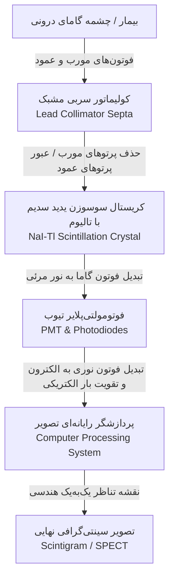

- **کولیماتور (Collimator):** صفحه ضخیم سربی حاوی کانال‌های موازی؛ تنها به فوتون‌های عمود بر کریستال اجازه گذر داده و پرتوهای مایل را جذب تیغه‌ها (Septa) می‌کند تا تناظر یک‌به‌یک ژئومتریک حفظ شود.
    
- **کریستال سدیم یدید فعال‌شده با تالیوم NaI(Tl):** فوتون گاما بر اثر پدیده فوتوالکتریک یا کامپتون به درخشش فوتون‌های نور مرئی تبدیل می‌شود (پدیده Scintillation).
    
- **لامپ تکثیرکننده نور (PMT):** تبدیل جرقه‌های نوری به الکترون، تشدید فوتوالکترون‌ها روی دیودها (Dynodes) متوالی و ایجاد پالس دیجیتال.
    

## ۲. رادیوایزوتوپ‌های تیروئید: تولید، فیزیک و فارماکوکینتیک

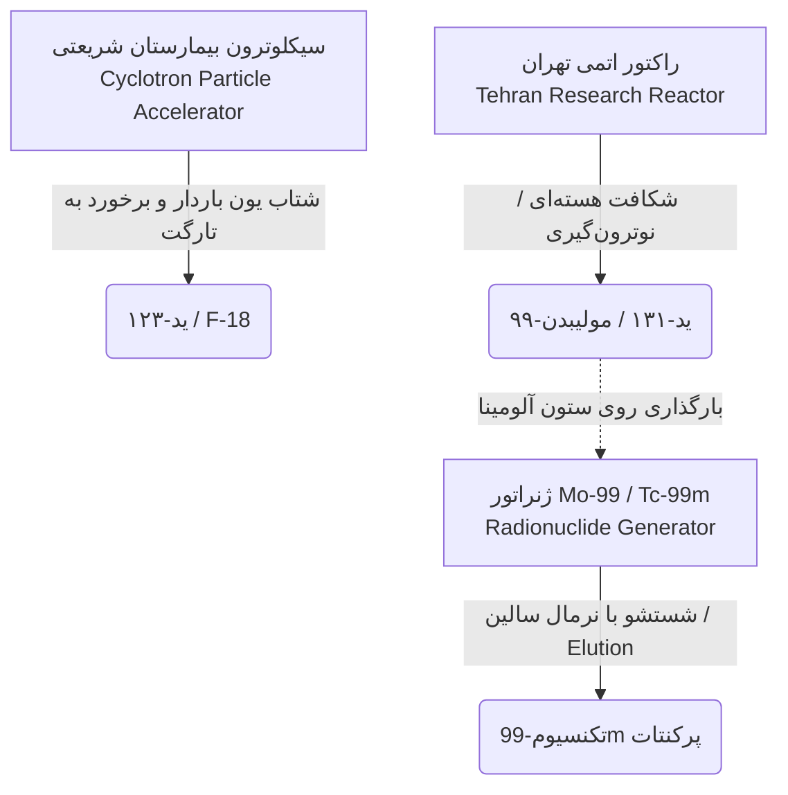

### ویژگی‌های فیزیکی و بیولوژیک ایزوتوپ‌های اصلی تیروئید

| **ویژگی / رادیودارو**                      | **ید-۱۲۳ (I-123)**                   | **ید-۱۳۱ (I-131)**                            | **تکنسیم-99m پرکنتات (Tc-99m)**           |
| ------------------------------------------ | ------------------------------------ | --------------------------------------------- | ----------------------------------------- |
| **منبع اصلی تولید**                        | **شتاب‌دهنده سیکلوترون**             | **راکتور تحقیقاتی اتمی**                      | **ژنراتور متصل به ستون آلومینا**          |
| **پرتوهای ساطع‌شونده**                     | **گامای خالص** (ایده‌آل تصویربرداری) | **گاما** (تصویربرداری) + **ذره بتا** (درمانی) | **گامای خالص** (انرژی $140\text{ keV}$)   |
| **مکانیسم برداشت سلولی**                   | انتقال فعال توسط سیمپورتر **NIS**    | انتقال فعال توسط سیمپورتر **NIS**             | انتقال فعال توسط سیمپورتر **NIS**         |
| **ارگانیفیکاسیون (اتصال به تیروگلوبولین)** | **دارد** (اکسیداسیون با TPO)         | **دارد** (تخریب درون‌سلولی با بتا)            | **ندارد** (Washout بدون ارگانیفیه شدن)    |
| **کاربرد بالینی اصلی**                     | اسکن تشخیصی دقیق تیروئید و کودکان    | درمان پرکاری و کنسر تیروئید / اسکن کل بدن     | شایع‌ترین ابزار تصویربرداری روتین تیروئید |

> [!danger] نکته امتحانی: تفاوت تکنسیم و ید در مسیر سنتز هورمونی
> 
> تکنسیم پرکنتات ($TcO_4^-$) با وزن و بار مشابه یدید ($I^-$) توسط پمپ **NIS** وارد سلول فولیکولار تیروئید می‌شود؛ ولی _فاقد توانایی ارگانیفیکاسیون_ توسط آنزیم **TPO** است و هرگز وارد ترکیب با تیروگلوبولین نمی‌شود.

## ۳. الگوریتم تشخیصی تیروتوکسیکوز و تفسیر الگوهای اسکن

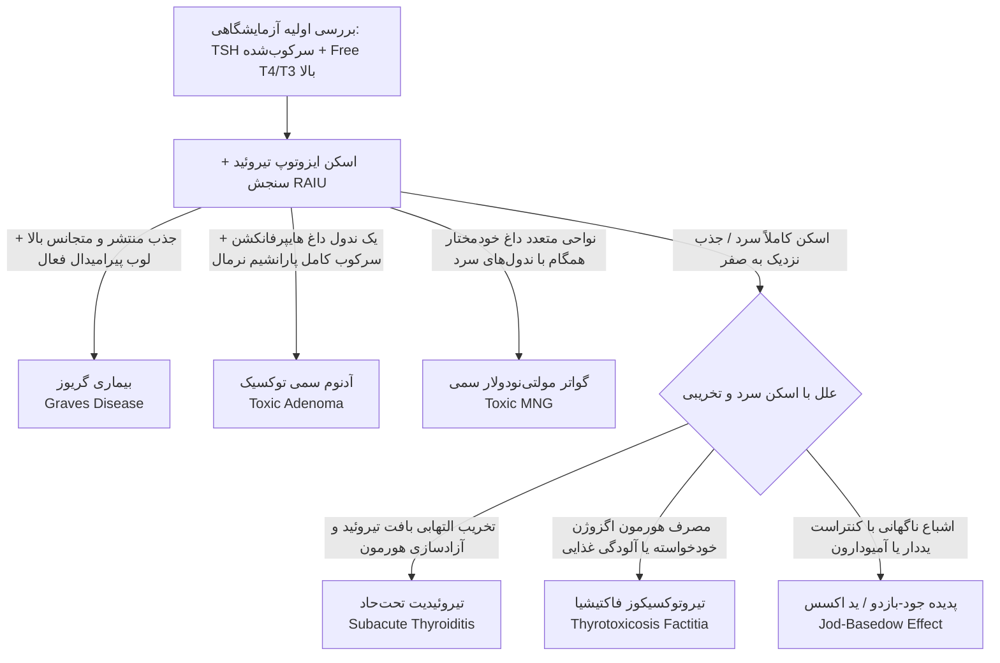

### مقایسه تفکیکی اتیولوژی‌های تیروتوکسیکوز

| **بیماری**                            | **پاتوفیزیولوژی برداشت ایزوتوپ**                                  | **الگوی سینتی‌گرافی تیروئید**                                           | **میزان برداشت ید رادیواکتیو (RAIU)**                    |
| ------------------------------------- | ----------------------------------------------------------------- | ----------------------------------------------------------------------- | -------------------------------------------------------- |
| **بیماری گریوز (Graves)**             | تحریک مستقیم سیمپورتر NIS توسط آنتی‌بادی **TSI** مستقل از TSH     | **جذب هموژن و یکنواخت بالا** در تمام لوب‌ها؛ برجستگی _لوب پیرامیدال_    | بسیار بالا (معمولاً بالای $40\%$ و گاهی فراتر از $50\%$) |
| **آدنوم توکسیک (Toxic Adenoma)**      | جهش فعال‌کننده گیرنده TSH در سلول‌های کلونال ندول                 | **یک ندول منفرد داغ (Hot)**؛ خاموشی و سرکوب کامل سایر نواحی تیروئید     | متغیر، جذب متمرکز در ندول و صفر در بافت سالم اطراف       |
| **گواتر مولتی‌نودولار سمی (TMNG)**    | تکثیر خودمختار کانون‌های ندولار متعدد بدون وابستگی به TSH         | زمینه چندندولی؛ **حداقل یک ندول هیپرفانکشنال داغ** در کنار ندول‌های سرد | متغیر (طبیعی بالا یا مختصر افزایش‌یافته)                 |
| **تیروئیدیت تحت‌حاد (Subacute)**      | لیز سلول فولیکولار در اثر التهاب، نشت T4/T3 و سرکوب کامل محور TSH | **اسکن کاملاً سرد و خاموش (Absent Uptake)**؛ عدم تفکیک تیروئید از زمینه | به شدت سرکوب‌شده و نزدیک به **صفر درصد**                 |
| **تیروتوکسیکوز فاکتیشس (Factitious)** | مصرف نابجای لووتیروکسین، مهار TSH و سرکوب کارکرد سلول فولیکولار   | **اسکن خاموش و سرد (Cold Scan)** به دلیل فقدان تحریک NIS                | نزدیک به **صفر درصد**؛ تیروگلوبولین سرمی بسیار پایین     |

> [!important] پروتکل دقیق سنجش Uptake ید رادیواکتیو (RAIU)
> 
> - تجویز دوز ناچیز ید (در حد $20\ \mu Ci$ یا کمتر).
>     
> - دوز مرجع در داخل یک استوانه پلاستیکی موسوم به **فانتوم (Phantom)** نگهداری می‌شود.
>     
> - ۲۴ ساعت بعد، شمارش فوتون‌ها توسط دستگاه **پروب تیروئیدی (Thyroid Probe)** بدون ایجاد تصویر و صرفاً با شمارش گاما سنجیده می‌شود.
>     
> - کانت تیروئید بیمار و کانت ران بیمار (به عنوان شاخص **بلاد پول و کانت زمینه**) اندازه‌گیری می‌شود:
>     
>       
>     
>     $$ \text{RAIU (\%)} = \frac{\text{Thyroid count} - \text{Thigh count}}{\text{Standard phantom count}}\times 100 $$

> [!tip] تله تستی: پدیده‌های خودتنظیمی ید (Autoregulation)
> 
> - **پدیده جود-بازدو (Jod-Basedow Effect ⇦ فلش رو به بالا):** تجویز بار سنگین ید (نظیر سی‌تی‌اسکن با کنتراست یددار تزریقی) به فرد دارای گواتر کمبود ید مزمن، موجب **تیروتوکسیکوز حاد ناشی از سنتز بیش‌از‌حد** می‌شود.
>     
> - **اثر ولف-چایکوف (Wolff-Chaikoff Effect ⇦ فلش رو به پایین):** مواجهه ناگهانی تیروئید طبیعی با مقادیر مازاد ید، موجب **خاموشی موقت و مهار ارگانیفیکاسیون و رهایش هورمون** می‌شود؛ این مکانیسم پایه تجویز پرلورات یا ید لوگول قبل از اعمال جراحی جهت کاهش خونریزی و پیشگیری از طوفان تیروئیدی است.
>     

## ۴. درمان رادیوایزوتوپ تیروتوکسیکوز با ید-۱۳۱

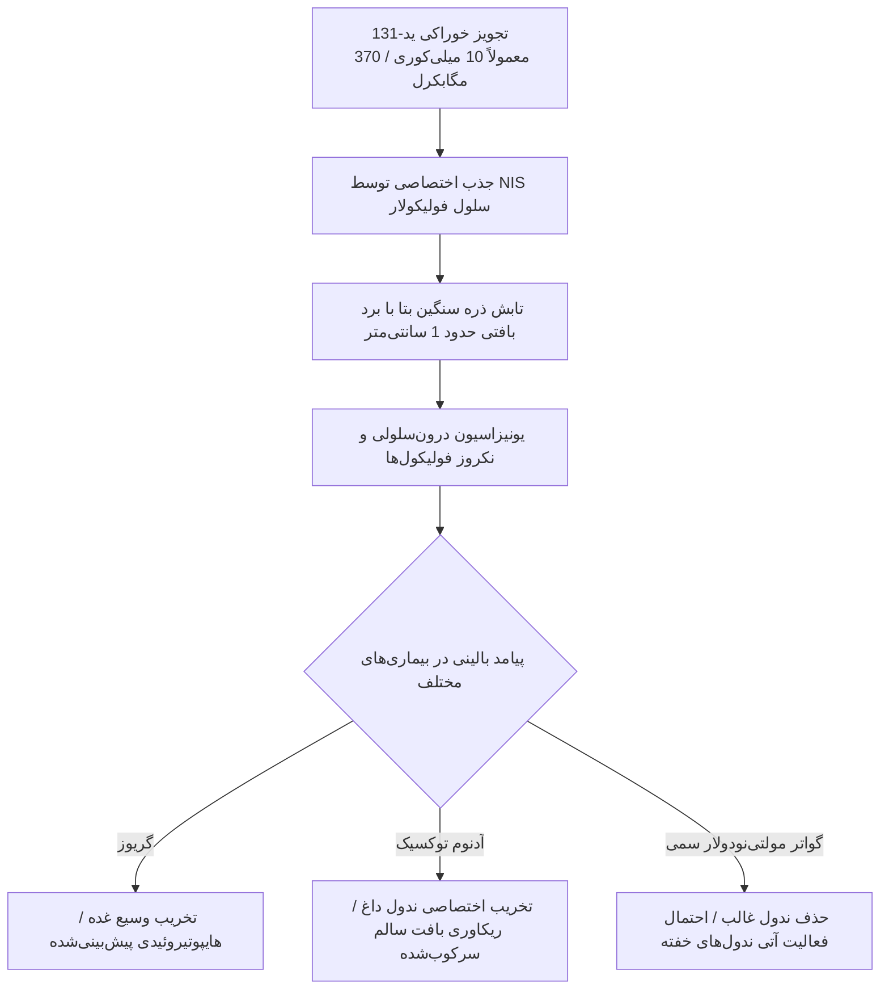

- **دوزاژ رادیواکتیویته:** دوز استاندارد گریوز معمولاً 10mCi (معادل $370\text{ MBq}$؛ در محدوده ۷ تا ۸ الی ۱۵ میلی‌کوری).
    
    - تعریف بکرل (Bq): یک فروپاشی هسته‌ای در ثانیه ($1\text{ disintegration/sec}$). هر میلی‌کوری برابر با ۳۷ مگابکرل است.
        
- **فاکتورهای تنظیم دوز:** شدت تیروتوکسیکوز بالینی، حجم و قوام غده تیروئید، و درصد جذب پایه ید (هرچه جذب غده بالاتر باشد، نیاز به دوز کمتری برای تخریب است).
    
- **موارد منع مطلق:** بارداری و شیردهی.
    
- **کودکان:** منع مطلق علمی ندارد و مطالعات بلندمدت خطر بدخیمی ثانویه نشان نداده‌اند؛ اما در بالین اکراه عمومی وجود دارد.
    
- **گواتر مولتی‌نودولار غیرسمی (Non-toxic MNG):** در صورت رد بدخیمی با سونوگرافی و FNA در زنان سالمند دارای ریسک بیهوشی بالا، ید-۱۳۱ می‌تواند **حجم گواتر را تا 50% کاهش دهد**.
    

> [!danger] پروتکل حیاتی: افتالموپاتی گریوز و کورتیکواستروئید
> 
> تخریب رادیواکتیو فولیکول‌ها موجب آزادسازی مقادیر فراوان آنتی‌ژن و تحریک ترشح **TSI** شده که فیبروبلاست‌ها و عضلات اکسترااکولار پشت چشم را دچار ادم و هایپرتروفی می‌کند.
> 
> - در افتالموپاتی شدید و فعال: تجویز ید رادیواکتیو **ممنوع** است و ابتدا باید پروتکل‌های درمان افتالموپاتی انجام شود.
>     
> - در فرم‌های خفیف یا در معرض خطر تشدید: پوشش **پردنیزولون با دوز 30 mg/day** تجویز شده و ظرف مدت ۲ تا ۳ ماه به‌صورت تدریجی تیپر (Taper) می‌گردد.
>     

## ۵. اپروچ نوین به ندول منفرد تیروئید و تله‌های تشخیصی

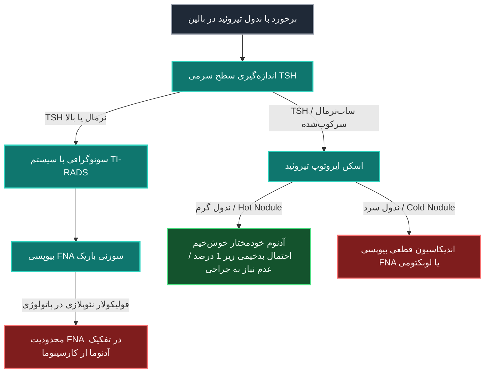

- **علائم سونوگرافیک با ریسک بدخیمی بالا:** میکروکلسیفیکاسیون داخلی، حاشیه‌های نامنظم یا انفیلتراتیو، واسکولاریتی سانترال و وضعیت **بزرگ‌تر بودن ارتفاع نسبت به پهنا (Taller-than-wide)**.
    
- **ریسک بدخیمی بر پایه اسکن ایزوتوپ:**
    
    - ندول سرد (Cold): بین **5% تا 10%** (طبق رفرنس هریسون) الی 15% ریسک بدخیمی دارند.
        
    - ندول داغ (Hot): ریسک بدخیمی **کمتر از ۱ در ۱۰۰۰ بیمار (<1%)** است (مگر ناهماهنگی دیسکوردنس بین ید و تکنسیم رخ دهد).
        
- **کاربرد اختصاصی اسکن سستامیبی (Tc-99m MIBI):** سستامیبی به کاتیون‌های میتوکندری متصل می‌شود؛ ندول تیروئیدی که در اسکن پرکنتات سرد باشد اما در اسکن MIBI جذب داغ نشان دهد، **احتمال بدخیمی فراتر از 95%** دارد (هرچند روش استاندارد بالینی همچنان سونوگرافی و FNA است).
    

## ۶. کانسر تمایزیافته تیروئید (DTC): پاتولوژی، متاستاز و مانیتورینگ

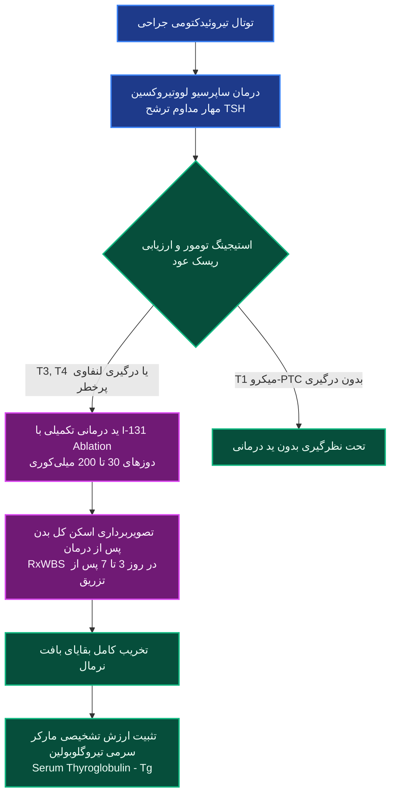

### مقایسه انواع ساب‌تایپ‌های کانسر تیروئید

| **نوع کارسینوما**            | **ویژگی‌های بافت‌شناسی و بیولوژیک**                                                                                                              | **الگوی شایع متاستاز و پیش‌آگهی**                                        | **گیرنده NIS و برداشت ید**                                     |
| ---------------------------- | ------------------------------------------------------------------------------------------------------------------------------------------------ | ------------------------------------------------------------------------ | -------------------------------------------------------------- |
| **کارسینوم پاپیلاری (PTC)**  | شایع‌ترین کانسِر تیروئید؛ دارای هسته‌های شفاف شبیه چشم آنی یتیم (_Orphan Annie Eyes_)، شیار هسته‌ای و **سندروم اجسام پساموما (Psammoma Bodies)** | انتشار **لوکورجیونال به لنف‌نودهای گردنی**؛ بقای ۲۰ ساله در حدود 99% است | **دارد**؛ پاسخ درمانی بسیار عالی به رادیوایوداین               |
| **کارسینوم فولیکولار (FTC)** | تهاجم به کپسول و عروق بافت تیروئید؛ نیازمند بررسی نمونه پاتولوژی جراحی                                                                           | انتشار **هماتوژنیک (عروقی) به ریه، استخوان، احشا و مغز**                 | **دارد**؛ پاسخ درمانی مناسب به رادیوایوداین                    |
| **ساب‌تایپ‌های تهاجمی PTC**  | سلول بلند (_Tall-cell_)، انسیولار (_Insular_)، ستونی (_Columnar_) و هاب‌نیل (_Hobnail_)                                                          | پیش‌آگهی نامناسب، عود موضعی و متاستاز زودرس بافتی                        | **کاهش‌یافته یا از دست رفته**                                  |
| **کارسینوم آناپلاستیک**      | تمایزنیافته، تهاجم وسیع ساختارهای راه هوایی و نکروز گسترده                                                                                       | بسیار کشنده با مورتالیتی نزدیک به ۱۰۰٪ ظرف چند ماه                       | **فاقد برداشت ید**؛ اندیکاسیون شیمی‌درمانی یا رادیوتراپی خارجی |

### قوانین ایزولاسیون و حفاظت پرتویی

- **ضوابط ترخیص در ایران:** بستری برای دوزهای بالای 29.9mCi (یعنی ≥30mCi) الزامی است؛ بیمار تا زمانی که دوز تابشی ساطع‌شده در فاصله ۱ متری قفسه سینه به کمتر از $70\ \mu Sv/h$ برسد (معمولاً ۲۴ تا ۴۸ ساعت)، در اتاق ایزوله سربی بستری می‌ماند.
    
- **مقایسه با سایر کشورها:** ایالات متحده ترخیص سرپایی تا سقف 175mCi را مجاز دانسته؛ در حالی که آلمان سخت‌گیرانه‌ترین قوانین را داشته و حتی دوزهای تشخیصی 5mCi را بستری کامل می‌کند.
    
- **عوارض دیررس ید رادیواکتیو:** خشکی دهان (Xerostomia) به علت تخریب غدد بزاقی در یک‌سوم بیماران (و پایدار شدن در یک‌سوم از این موارد یعنی **۱ نفر از هر ۹ نفر**)، تخریب مجرای نازولکریمال و خشکی چشم، پوسیدگی دندان‌ها، تغییر در درک چشایی و کاهش گذرا در رده‌های خونی.
    

## ۷. آزمون‌های داینامیک و فانکشنال تاریخی تیروئید

### ۱. تست مهار تری‌یدوتیرونین (T3 Suppression Test)

- **پروتکل:** سنجش RAIU پایه ⇦ تجویز خوراکی روزانه $100\ \mu g$ تری‌یدوتیرونین (T3) به مدت **۷ روز متوالی** ⇦ تکرار سنجش RAIU.
    
- **تفسیر:** در تیروئید نرمال، TSH مهار شده و جذب **حداقل 50% کاهش** می‌یابد؛ در گریوز یا ندول اتونوم خودمختار، میزان افت جذب **کمتر از 50%** خواهد بود.
    

### ۲. تست تحریک هورمون محرک تیروئید (TSH Stimulation Test)

- **پروتکل:** تجویز ۲ دوز تزریقی TSH نوترکیب انسانی ($0.1\text{ mg}$).
    
- **تفسیر:** غده نرمال افزایش جذب نشان می‌دهد؛ گریوز پاسخ جدیدی نمی‌دهد؛ در آدنوم توکسیک، بافت سرکوب‌شده اطراف تحریک شده و ندول داغ قبلی به ظاهر _کمرنگ‌تر_ می‌شود.
    

### ۳. تست چالش پرکلرات (Perchlorate Discharge Test)

- **پروتکل:** اندازه‌گیری RAIU بیست و چهار ساعت پس از تجویز ید ⇦ تجویز پرکلرات پتاسیم خوراکی ⇦ ارزیابی مجدد پس از ۱.۵ ساعت.
    
- **تفسیر:** پرکلرات آنیون‌های یدید غیرارگانیفیه را به بیرون می‌راند. در افراد سالم، تخلیه ناچیز و retention فراتر از $90\%$ است؛ در اختلالات دیس‌هورمونوژنز یا نقایص آنزیمی TPO، تخلیه سریع رخ داده و **RAIU بیش از 15% افت می‌کند**.
    

## ۸. تصویربرداری گیرنده‌های سوماتوستاتین (SSRI) و پپتیدها در تومورهای نورواندوکرین

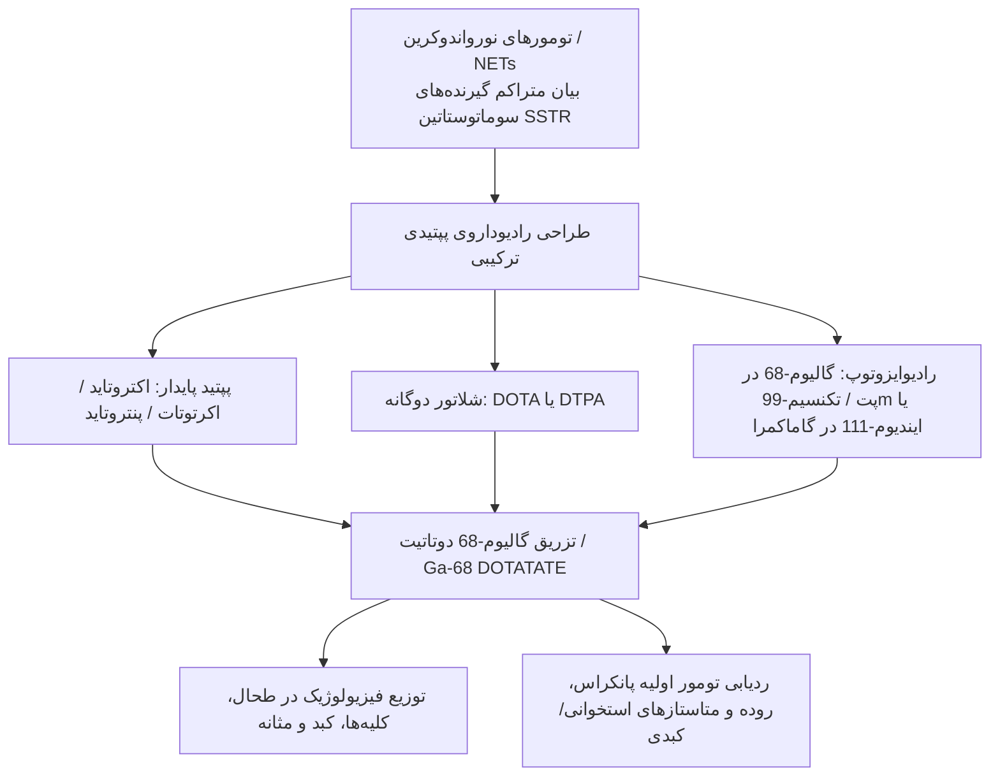

### مقایسه تطبیقی مدالیته‌های تشخیصی در نئوپلاسم‌های نورواندوکرین (NETs)

| **نوع تومور / مدالیته**           | **حساسیت ردیابی گیرنده سوماتوستاتین**                                          | **مدالیته انتخابی لوکالیزاسیون اولیه**                                       | **مکانیسم مولکولی اتصال رادیودارو**        |
| --------------------------------- | ------------------------------------------------------------------------------ | ---------------------------------------------------------------------------- | ------------------------------------------ |
| **تومور کارسینوئید و گاسترینوما** | **بسیار بالا** ($>80-90\%$)؛ نمایان‌سازی دقیق تومور و متاستازهای استخوان و کبد | پت‌اسکن با **Ga-68 DOTATATE** یا سینتی‌گرافی اکتروتاید                       | پیوند لیگاند-گیرنده پپتیدی در سطح غشا      |
| **انسولینوما (Insulinoma)**       | **پایین** (حدود $50\%$ در متون هاریسون و گاهاً ۲۰ تا ۳۰ درصد در گزارش‌ها)      | **اندوسونوگرافی (EUS)** دقیق‌ترین اپروچ اولیه است                            | بیان پایین گیرنده‌های تیپ ۲ سوماتوستاتین   |
| **تومورهای مترشحه نابجای ACTH**   | متوسط تا بالا؛ در موارد شکست سی‌تی و ام‌آر‌آی گردن، قفسه سینه و شکم            | گام نخست CT اسکن شکم و توراکس ⇦ گام دوم MRI ⇦ سپس SSRI | ردیابی بافت نابجا در توراکس یا پاراتیروئید |

## ۹. پروتکل تصویربرداری آدنوم پاراتیروئید با سستامیبی دوفازی

> [!abstract] پدیده جذب و واش‌اوت اختصاصی در پاراتیروئید
> 
> ترکیب لیپوفیلیک کاتیونی **تکنسیم سستامیبی (Tc-99m MIBI)** به دلیل پتانسیل الکتریکی غشا وارد سلول شده و در میتوکندری‌ها تجمع می‌یابد. هم سلول‌های فولیکولار تیروئید و هم سلول‌های اکسی‌فیل آدنوم پاراتیروئید غنی از میتوکندری هستند؛ اما _تیروئید نرمال پاک‌سازی سریع و پاراتیروئید نگهداری طولانی‌مدت_ دارد.

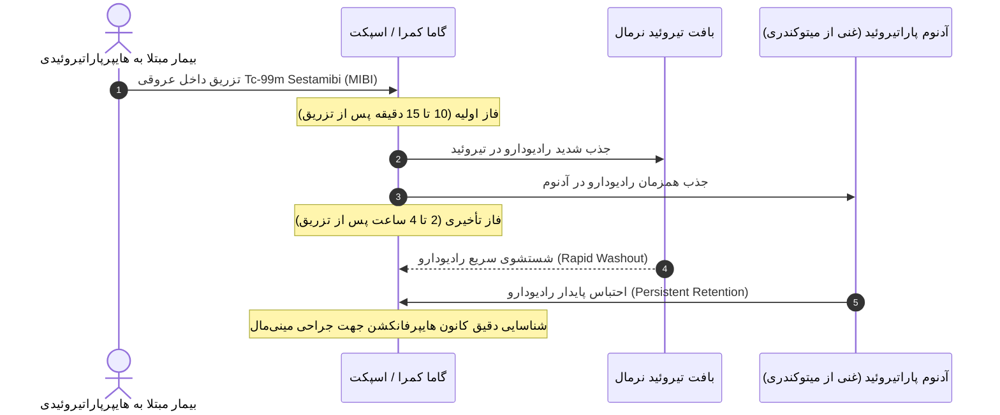

> [!important] سندروم‌های نئوپلازی متعدد اندوکرین (MEN) در تصویربرداری هسته‌ای
> 
> - **سندروم MEN-1:** همراهی **تومور هیپوفیز** (مشاهده در ام‌آر‌آی سلاتورسیکا) + **هایپرپاراتیروئیدی** (مشاهده آدنوم در اسکن سستامیبی) + **تومور نورواندوکرین پانکراس** (آشکارسازی در اسکن اکتروتاید / Ga-68 DOTATATE).
>     
> - **سندروم MEN-2A:** همراهی کارسینوم مدولاری تیروئید (MTC) + فئوکروموسیتوم + هایپرپلازی پاراتیروئید.
>     

## ۱۰. فئوکروموسیتوم و پاراگانگلیوما: ترارسان‌ها و حفاظت تیروئیدی

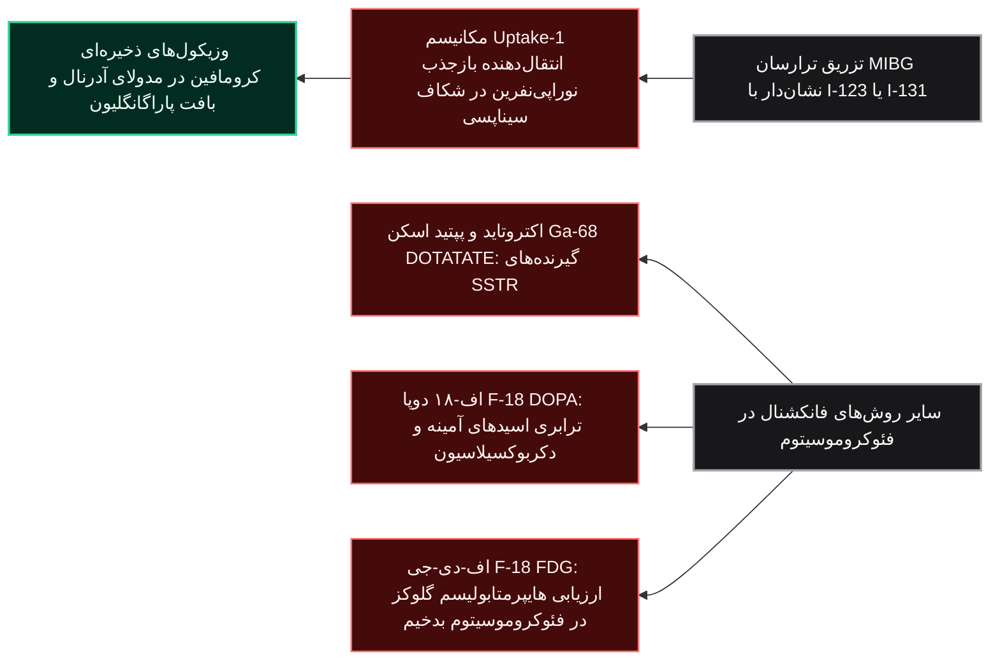

> [!warning] خطای تکنیکی: عدم بلاک تیروئید قبل از اسکن MIBG
> 
> ید رادیواکتیو پیوند‌یافته با مولکول MIBG می‌تواند در خون هیدرولیز شده و به فرم ید آزاد درآید؛ در صورتی که پیش از تزریق، تیروئید بیمار با **محلول لوگول، یدید پتاسیم یا پرکلرات** اشباع نشود (مهار ولف-چایکوف)، ید رادیواکتیو در بافت نرمال تیروئید تجمع یافته و تصویر را مخدوش و تیروئید را تحت تابش پرتوهای مخرب قرار می‌دهد.

- **تصویربرداری کورتکس آدرنال:** برخلاف فئوکروموسیتوم که منشأ مدولاری دارد، تصویربرداری قشر آدرنال با آنالوگ‌های کلسترول نظیر **NP-59 (I-131 Iodocholesterol)** صورت می‌پذیرد که به دلیل کارایی پایین در حال حاضر در ایران در دسترس نیست.
    

## ۱۱. بیماری‌های متابولیک استخوان و اسکن استخوان

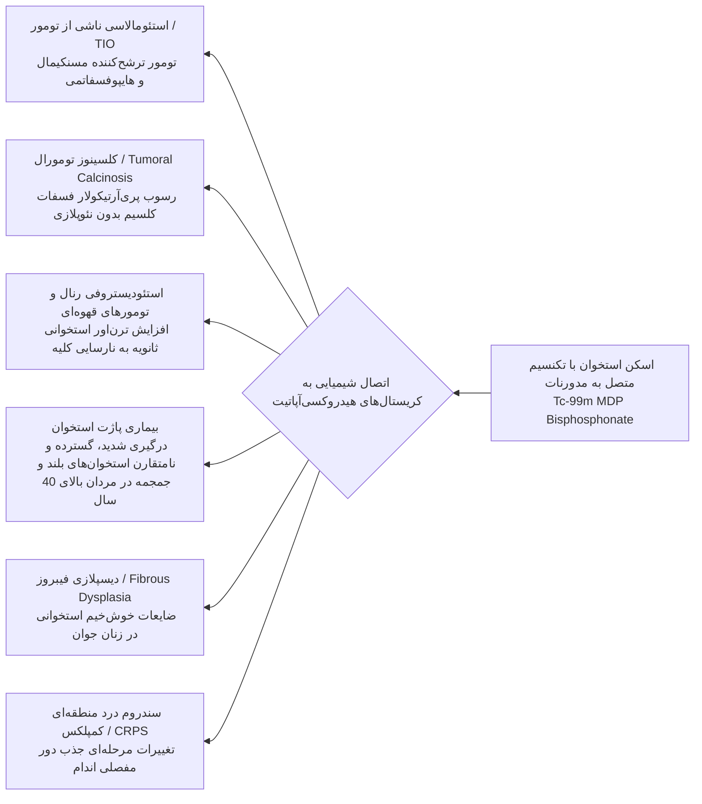

### سنجش تراکم استخوان (BMD) با روش DXA

- **پایه‌های فیزیکی:** در گذشته متکی بر چشمه‌های گادولینیوم-۱۵۳ پزشکی هسته‌ای بود و اکنون بر پایه اشعه ایکس دوانرژی مونوکروماتیک‌شده انجام می‌شود.
    
- **شاخص T-score:** انحراف معیار مقایسه تراکم استخوانی بیمار با **میانگین جمعیت جوان و سالم هم‌جنس**.
    
    - استئوپنی: $-1.0 > \text{T-score} > -2.5$  
        
    - استئوپروز قطعی: $\text{T-score} \le -2.5$  
        
- **شاخص Z-score:** انحراف معیار مقایسه تراکم استخوان بیمار با **افراد هم‌سن و هم‌جنس**.
    
- **نرم‌افزار محاسباتی FRAX:** تخمین ریسک مطلق ۱۰ ساله شکستگی‌های ناشی از پوکی استخوان جهت آغاز درمان بیس‌فسفونات‌ها.
    

## ۱۲. عوارض گوارشی دیابت: اسکن تخلیه معده (GES)

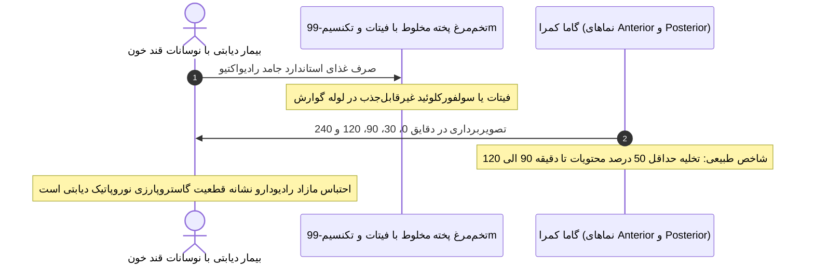

- **علت ایجاد اختلال:** نوروپاتی اتونوم عصب واگ ناشی از هیپرگلیسمی طولانی‌مدت دیابت.
    
- **تظاهر بالینی گمراه‌کننده:** نوسانات شدید قند خون به‌صورت هایپوگلیسمی‌های ناگهانی یا هایپرگلیسمی مقاوم علی‌رغم مصرف صحیح داروها.
    

## ۱۳. فیزیک سیستم پت (PET) و رادیوداروی فلورودزوکسی‌گلوکز (F-18 FDG)

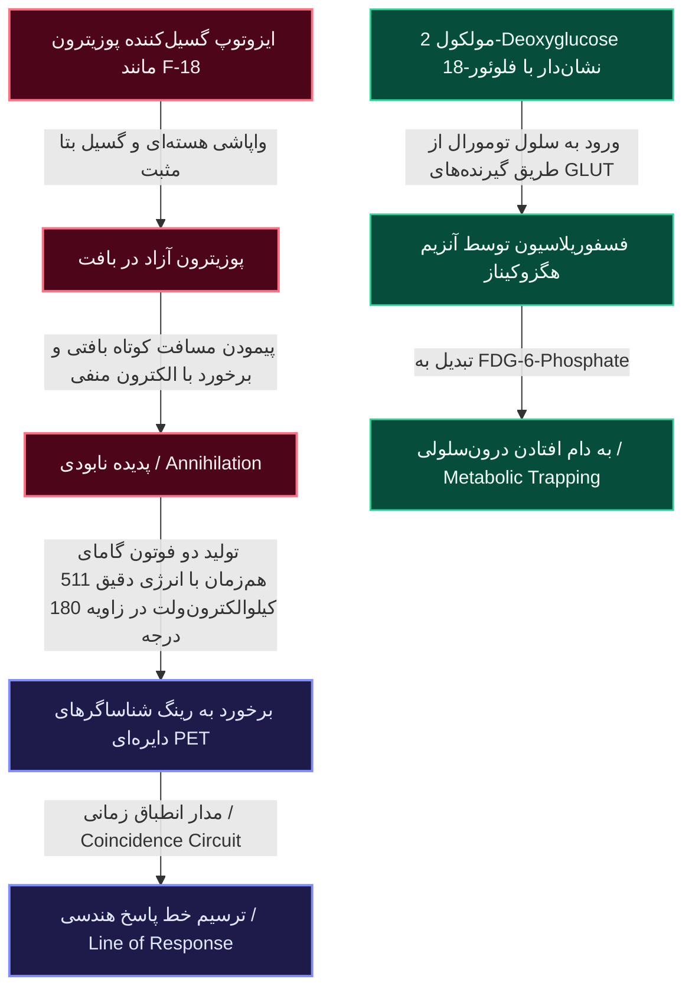

> [!danger] تله تشخیصی پت‌اسکن با F-18 FDG در هپاتوسلولار کارسینوما (HCC)
> 
> بیشتر سلول‌های بدخیم با اتکا بر اثر واربورگ گلوکز فراوانی برمی‌دارند و به دلیل فقدان آنزیم **گلوکز-۶-فسفاتاز**، متابولیت FDG-6-P در درون سلول محبوس می‌شود؛ اما سلول‌های تمایزیافته کارسینوم هپاتوسلولار (HCC) مقادیر فراوانی از آنزیم گلوکز-۶-فسفاتاز بیان می‌کنند و می‌توانند این مولکول را دفسفوریله کرده و به خارج سلول پمپ کنند؛ در نتیجه بسیاری از تومورهای اولیه HCC در پت‌اسکن با FDG **سرد و منفی کاذب** می‌شوند.

- **جذب‌های فیزیولوژیک شدید پت با FDG:** کورتکس مغز، میوکارد بطن چپ، و سیستم دفع ادراری (کلیه‌ها، حالب‌ها و مثانه).
    
- **تصویربرداری پت استخوان:** استفاده از **پت‌اسکن سدیم فلوراید ($Na[^{18}F]F$)** به جای تکنسیوم مدورنات؛ دارای کلیرانس خونی بسیار بالاتر و رزولوشن فضایی شفاف‌تر به همراه تصحیح تضعیف سی‌تی‌اسکن.
    

## ۱۴. ترانوستیک (Theranostics) و افق‌های نوین پژوهشی

> [!abstract] مفهوم پایه ترانوستیک
> 
> ترکیب دو واژه درمان (Therapeutics) و تشخیص (Diagnostics)؛ استراتژی مبتنی بر استفاده از یک نشانگر زیستی یا لیگاند هدف‌گیرنده یکسان با دو رادیوایزوتوپ مختلف؛ یکی برای تصویربرداری و مکان‌یابی و دیگری با تابش پرتوهای مخرب بتا یا آلفا جهت انهدام کانون‌های بدخیمی.

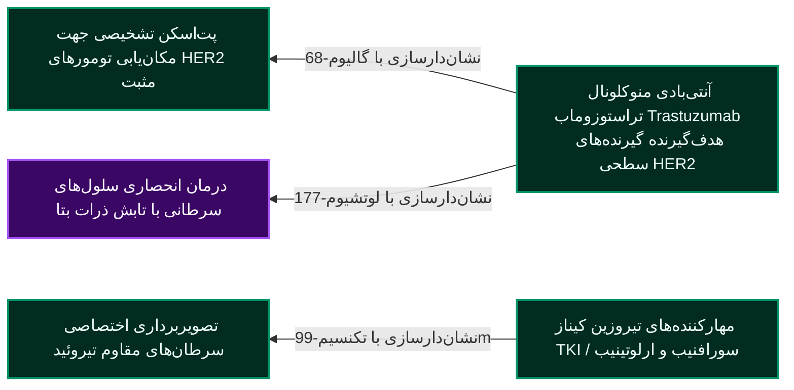

## ۱۵. حفاظت پرتویی و اصل آلارا (ALARA)

> [!important] اصل بنیادین ALARA در مواجهه با پرتوها
> 
> مخفف عبارت **As Low As Reasonably Achievable**؛ به معنای نگه داشتن سطح پرتوگیری در پایین‌ترین حد ممکن که با اصول عقلی و منطق پزشکی سازگار باشد.

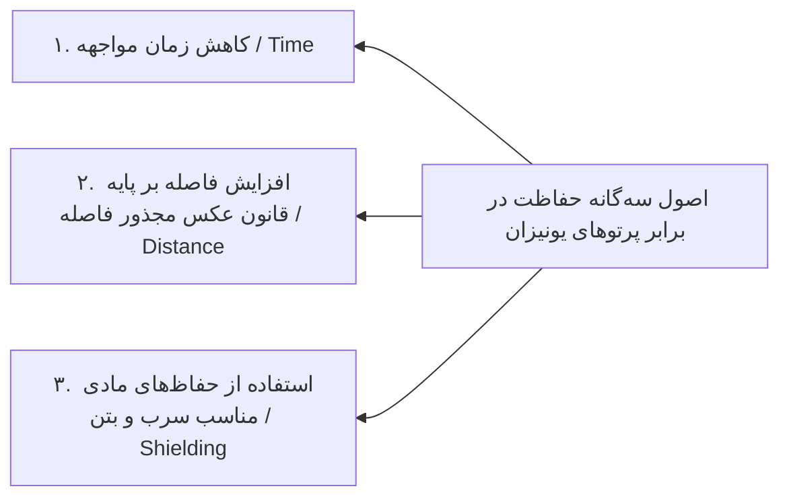

- **رویکرد اخلاق بالینی:** بیمار ترخیص‌شده از بخش پزشکی هسته‌ای منبع آسیب ثابت‌شده‌ای برای اطرافیان و جامعه نیست؛ لذا نباید خدمات پزشکی حیاتی و ضروری به خاطر هراس غیرعلمی از پرتوها از بیمار دریغ شود. مراقبت‌های محدودکننده صرفاً مبتنی بر پیشگیری حداکثری و اجتناب از تماس نزدیک با _زنان باردار و خردسالان زیر ۱۰ سال_ است.